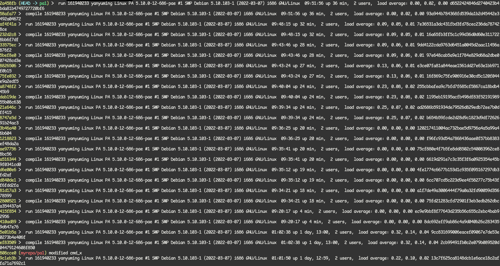
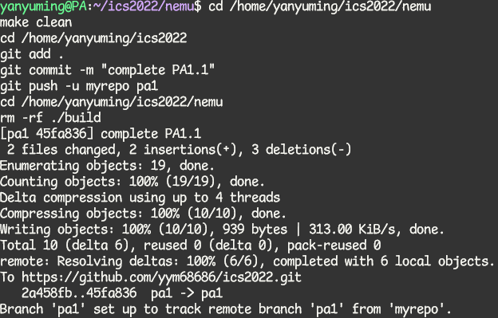
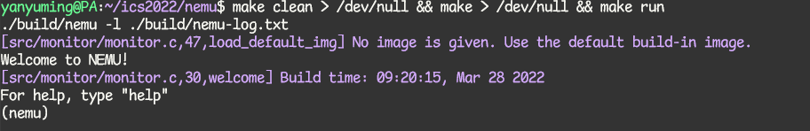
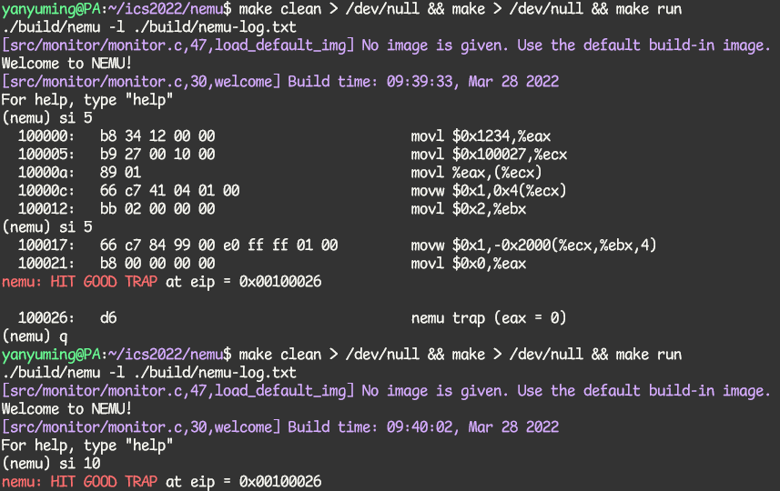
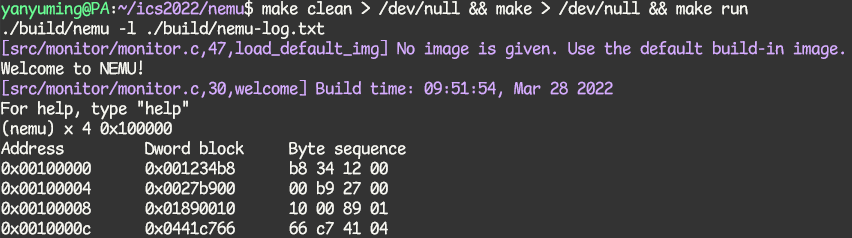

# 南京航空航天大学《计算机组成原理Ⅱ课程设计》报告

* 姓名：颜宇明
* 班级：1819001
* 学号：161940233
* 报告阶段：PA1.1
* 完成日期：2022.3.28
* 本次实验，我完成了所有内容。

## 目录

[TOC]

## 思考题

1. 存放的是什么？

    为什么是存放指令的存放地址而不是指令本身呢？

    因为除了程序计数器PC外还有个指令寄存器IR。IR是放当前执行指令的，PC指向下条执行指令地址，用地址取指的方式便于执行跳转指令。

2. 贵圈真乱

    NEMU 是一款运行在 Linux 系列操作系统上的经过简化的 x86 全系统模拟器，如果告诉你，NEMU 之上也可以运行一个 helloworld 小程序，那么这个时候的层级关系又是什么样子的呢？请你仿照上图，试着画出这个层级关系。

    ```
    +---------------------+
    |    "Hello World"    |
    +---------------------+
    |      Simulated      |
    |       hardware      |
    +---------------------+
    |        NEMU         |
    +---------------------+
    |      GNU/Linux      |
    +---------------------+
    |    Real hardware    |
    +---------------------+
    ```

3. 虚拟机和模拟器的区别

    我们说 NEMU 是一款经过简化的 x86 全系统模拟器，那么跟我们平时用的虚拟机有什么区别呢？你可以从模拟器和虚拟机的区别着手思考这个问题。这跟问题非常开放，你可以根据自己的理解进行回答。

    虚拟机的目的在于提供一种虚拟界面或接口，对真实机器的资源进行抽象。模拟器的目的在于完整模拟真品的内部状态，它是为了展现真品是如何工作的，是通过软件实现的。

4. 从哪开始阅读代码呢

    大致了解上述的目录树之后，你就可以开始阅读代码了。至于从哪里开始，回忆程序设计课的内容， 一个程序从哪里开始执行呢？

    一般程序从main开始运行，但也可以自定义。nemu从nemu/src/monitor/monitor.c中的init_monitor()函数开始执行。

5. 究竟要执行多久

    在 `cmd_c()` 函数中，调用 `cpu_exec()` 的时候传入了参数 `-1`，你知道为什么要这么做吗，并说明理由。提示：注意函数传参类型和数据类型转换。

    uint64_t是无符号数，传入-1，就是传入uint64_t表示的最大的数，所以相当于无限大，程序可以一直执行下去，直到结束。

6. 谁来指示程序的结束?

    在程序设计课上老师告诉你，当程序执行到 `main()` 函数返回处的时候,程序就退出了,你对此深信不疑。但你是否怀疑过，凭什么程序执行到 `main()` 函数的返回处就结束了？如果有人告诉你，程序设计课上老师的说法是错的，你有办法来证明/反驳吗？如果你对此感兴趣，请在互联网上搜索相关内容。

    程序退出main()函数之后，还可以执行代码，可以用atexit()来实现，如果将一组指向函数的指针传递给atexit()函数，那么在程序退出main()后，就能自动调用该函数。

7. 为什么会这样？

    经过任务 4.1 和 4.2，你发现本来是顺序存储的数据，为何以 4 字节为单位打印和以 1 字节为单位打印时相比，顺序会不一样？结合你在理论课上所学到的知识，解释一下。（提示：数据的存储）

    nemu使用小端存储。数据存储在内存和磁盘，或者寄存器上的格式是不同的，具体表现在存储顺序不同，通常分为两种方式，大端Big-Endian和小端Little-Endian方式，大端方式即将数据中高位的字节存放在内存中的低地址处，数据中低位的字节存放在内存中的高地址处，小端方式则相反，高位字节存放在高地址，低位字节存放在低地址。

8. Git Log截图

    

9. Git Branch截图

    

10. 远程git仓库提交截图

    

## 实验内容

实验开始前：

```bash
cd /home/yanyuming/ics2022/nem
git    commit --allow-empty -am "before starting pa1" 
git    checkout -b    pa1
```

使用vim打开文件：

```bash
cd /home/yanyuming/ics2022/nemu
vim -p src/cpu/reg.c src/monitor/debug/ui.c src/monitor/cpu-exec.c include/cpu/reg.h
```

### 实现寄存器结构体

编写include/cpu/reg.h文件：

```c++
typedef struct {
	union{
    	struct {
        	union{
            	uint32_t _32;
            	uint16_t _16;
            	uint8_t _8[2];
        	};
    	} gpr[8];
    	struct {
    	    rtlreg_t eax, ecx, edx, ebx, esp, ebp, esi, edi;
    	};
	};
     /* Do NOT change the order of the GPRs' definitions. */
     /* In NEMU, rtlreg_t is exactly uint32_t. This makes RTL instructions
      * in PA2 able to directly access these registers.
      */
     vaddr_t eip;
} CPU_state;
```

运行：



### 实现`si`单步执⾏

编写src/monitor/debug/ui.c文件：

```c++
static int cmd_si(char *args){
    char *arg = strtok(NULL, " ");
    if (arg == NULL) cpu_exec(1);
    else cpu_exec(atoi(arg));
    return 0;
}
```

运行si 1，si ，si -1，si 10命令：


### 修改⼀次打印步数上限

运行两次si 5和一次si 10：



运行si 15和si 1000000：


### 实现打印寄存器功能

编写src/monitor/debug/ui.c文件：

```c++
static int cmd_info(char *args){
    char *arg = strtok(NULL, " ");
    // 分割字符
    if (arg == NULL){
        puts("Missing parameter.");
        return 0;
    }
    if (strcmp(arg, "r") == 0)
    {
        // 依次打印所有寄存器
        // 这里给个例子：打印出 eax 寄存器的值
        for (int i = 0; i < 8; i++){
            printf("%s:\t0x%08x\t%d\n", regsl[i], cpu.gpr[i]._32, cpu.gpr[i]._32);
        }
    }
    else if (strcmp(arg, "w") == 0)
    {
        // 这里我们会在 PA1.3 中实现
    }
    return 0;
}
```

先执⾏命令`info r` ， `si 5` 后再次执⾏`info r`：


### 实现扫描内存功能、扫描内存字节单位显示

编写src/monitor/debug/ui.c文件：

```c++
static int cmd_x(char *args){
    //分割字符串，得到起始位置和要读取的次数
    char *arg1 = strtok(NULL, " ");
    if (arg1 == NULL){
        puts("Missing parameter.");
        return 0;
    }
    char *s = strtok(NULL, " ");
    if (s == NULL){
        puts("Missing parameter.");
        return 0;
    }
    uint32_t n = 0;
    for (int i = 2; (s[i] >= '0' && s[i] <= '9') || (s[i] >= 'a' && s[i] <= 'z') || (s[i] >='A' && s[i] <= 'Z'); i++){
        if (s[i] > '9')
            n = 16 * n + (10 + s[i] - 'a');
        else
            n = 16 * n + (s[i] - '0');
    }
    //循环使用 vaddr_read 函数来读取内存
    puts("Address         Dword block\tByte sequence");
    for(int i = 0; i < atoi(arg1); i++){
        uint32_t instr = vaddr_read(n, 4);    //如何调用，怎么传递参数，请阅读代码
        uint8_t *p_instr = (void *)&instr;
        printf("0x%08x\t0x%08x\t", n, instr);
        for (int i = 0; i < 4; i++)
            printf("%02x ", p_instr[i]);
        n += 4;
        puts("");
    }
    return 0;
}
```

执⾏命令 `x 4 0x100000`：



## 遇到的问题及解决办法

1. 遇到问题：git push 报错 gnutls_handshake() failed: Error in the pull function. 

    解决方案：使用代理：

    ```bash
    git config --global http.proxy http://192.168.200.1:10809
    git config --global https.proxy https://192.168.200.1:10809
    ```

## 实验心得

经过本次的实验，我学会了编写模拟的寄存器，理清了计算机执行指令的过程，自己实践写了几个指令。其中遇到了各种问题，不过我都解决了，很开心。
