# 南京航空航天大学《计算机组成原理Ⅱ课程设计》报告

* 姓名：颜宇明
* 班级：1819001
* 学号：161940233
* 报告阶段：PA1.2&&PA1.3
* 完成日期：2022.4.12
* 本次实验，我完成了所有内容。

## 目录

[TOC]

## 思考题

1. 有什么办法？

    表达式求值有许多方法，你能想到比较常见的哪些方法呢？在这里你可以尽情发挥自己的想象，充分运用已经学过的知识，也可以通过查阅相关资料来简单描述一下你的想法。

    - 可以用两个栈来求解表达式，一个维护数值，一个维护运算符，通过运算符优先级求值。
    - 也可以用后缀表示法的逆波兰表达式来求解数值，不需要记忆运算符优先级。

2. 一些简单的正则表达式

    以 `0x` 开头的 `32` 位十六进制整数

    - `0x[0-9A-Za-z]{32}`

    英文字母和数字组成的字符串

    - `[0-9A-Za-z]+`

    C 语言中的变量名或函数名

    - `[A-Za-z][0-9A-Za-z]*`

    161722222 - 张三 - PA1.1.pdf

    - `[0-9]{9}\s-\s[\u4e00-\u9fa5]{2,}\s-\sPA\d\.\d\.pdf`

3. 这是为什么？

    请注意，如果你需要使用正则表达式中的转义字符 `\`，你应该在定义规则的字符串中输入两个 `\` 才能代表一个 `\`，想一想，这是为什么？

    - 转义字符后面的字符是它原本的意思，所以如果想要`\`字符本身的话，需要用`\`转义，所以是`\\`表示`\`。

4. 如何处理以上的问题

    需要注意的是, `str`成员的长度是有限的, 当你发现缓冲区将要溢出的时候, 要进行相应的处理(思考一下, 你会如何进行处理?)

    - 判断字符串长度再存到str里面，超过长度则发出警告，跳到下一个循环。

5. 递归求值的过程？

    你可以自学一下算术表达式的 BNF 的表达，画一个简单的图示说明你对递归求值过程的理解。

    ```
                                                                        +
                                                   +                   / \
                            +                     / \                 /   \
    4+3*(2-1)  ───────►    / \         ───────►  /   \      ───────► 4     *
                          /   \                 4     +                   / \
                         4     3+(2-1)               / \                 3   -
                                                    3   (2-1)               / \
                                                                           2   1
    
                                                                          │
                                                                          │
                                                                          │
                                                                          │
                                                                          ▼
    
                                                                          +
                                                    +                    / \
                                                   / \                  /   \
                                    7 ◄───────    /   \    ◄───────    4     *
                                                 4     3                    / \
                                                                           3   1
    ```

6. 体验监视点

    创建c文件：

    ```c
    #include <stdio.h>
    int main() {
        int sum = 0;
        int n = 1;
        while (n <= 100) {
            sum += n;
            n++;
        }
    }
    ```

     先生成gdb文件：

    ```bash
    gcc hello.c -g -o hello
    gdb hello
    ```

    创建监视点：

    ```bash
    watch sum
    watch n
    ```

    查看监视点：

    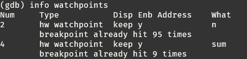

    命中监视点：

    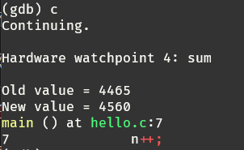

    删除监视点：

    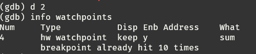

    不退出 GDB，重新运行程序，使程序不能在被删除的监视点上命中：

    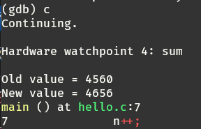

7. 科学起名

    上述的池管理中，对于空闲监视点的管理，使用 `free_` 作为头指针，那此处可否使用 `free` 来作为头指针的名字呢？如果使用 `free` 作为头指针名，从语法上看起来好像没错，但是到编译运行的时候，还能一帆风顺吗？(hint: 符号名撞车)

    - free是c语言关键字，是释放指针空间的函数，不能用作变量名。

8. 温故而知新

    框架代码中定义 `wp_pool` 等变量的时候使用了关键字 `static`，`static` 在此处的含义是什么？为什么要在此处使用它？

    - 函数前缀如果加了 static，就会对其它源文件隐藏。利用这一特性可以在不同的文件中定义同名函数和同名变量，而不必担心命名冲突。static 可以用作函数和变量的前缀，对于函数来讲，static 的作用仅限于隐藏，而对于变量，static 还有下面两个作用：保持变量内容的持久，默认初始化为 0。

9. 一点也不能长？

    我们知道 `int3` 指令不带任何操作数，操作码为 1 个字节，因此指令的长度是 1 个字节。这是必须的吗？假设有一种 x86 体系结构的变种 my-x86，除了 `int3` 指令的长度变成了 2 个字节之外，其余指令和 x86 相同。在 my-x86 中，文章中的断点机制还可以正常工作吗？为什么？

    - 是必须的
    - 不能正常工作
    - int3可以替换只有一个字节的指令，如果超过一个字节，对于原来只有一个字节的指令，就会覆写下一条指令的内容，会引发错误。

10. “随心所欲”的断点

    如果把断点设置在指令的非首字节（中间或末尾），会发生什么？你可以在 GDB 中尝试一下，然后思考并解释其中的缘由。

    - 程序继续执行，没有触发断点
    - 程序是一条一条取指令的，判断是否与断点地址相同，如果断点地址不在首字节，则不会触发断点。

11. NEMU的前世今生

     你已经对 NEMU 的工作方式有所了解了。事实上在 NEMU 诞生之前，NEMU 曾经有一段时间并不叫 NEMU，而是叫 NDB(NJU Debugger)，后来由于某种原因才改名为 NEMU。如果你想知道这一段史前的秘密，你首先需要了解这样一个问题：模拟器 (Emulator) 和调试器 (Debugger) 有什么不同？更具体地，和 NEMU 相比，GDB 到底是如何调试程序的？

     - 模拟器是一种允许一个计算机系统像另一个计算机系统一样工作的工具，作为目标系统的替代品，可以完全替代目标系统，完成其对外的功能，即仿真器系统只需要保证呈现给外部的行为跟目标系统一致（不需要保证内部运行原理一致）。而调试器是一种帮助测试和调试计算机程序的工具。
     - 模拟器为软件运行提供一个模拟的计算机环境，调试器将软件转换为可执行代码，嵌入到目标机中，是主机的一个应用程序，可以找到程序错误。

12. 尝试通过目录定位关注的问题

     - 查阅96页，5.1.3 selectors 
     - 查阅263页 Adjust RPL Field of Selector

13. 理解基础设施

     - `500 * 90% * 20 * 30 / 60 / 60 = 75H`，一共75小时。
     - `500 * 90% * 20 * 10 / 60 / 60 = 25H, 75 - 25 = 50H`，一共节约五十小时。

14. 查阅i386手册

      理解了科学查阅手册的方法之后, 请你尝试在i386手册中查阅以下问题所在的位置, 把需要阅读的范围写到你的实验报告里面:

      - EFLAGS寄存器中的CF位是什么意思?
          - p50 如果有进位，则置一
      - ModR/M字节是什么?
          - p38 不是所有的指令都是定长指令，当指令中出现内存操作对象的时候，就需要在操作码后面附加一个字节来进行补充说明，这个字节被称为ModR/M。
      - mov指令的具体格式是怎么样的?
          - p45-p46

15. shell 命令

     完成PA1的内容之后, `nemu/`目录下的所有.c和.h和文件总共有多少行代码? 你是使用什么命令得到这个结果的? 和框架代码相比, 你在PA1中编写了多少行代码? (Hint: 目前`master`分支中记录的正好是做PA1之前的状态, 思考一下应该如何回到"过去"?) 你可以把这条命令写入`Makefile`中, 随着实验进度的推进, 你可以很方便地统计工程的代码行数, 例如敲入`make count`就会自动运行统计代码行数的命令. 再来个难一点的, 除去空行之外, `nemu/`目录下的所有`.c`和`.h`文件总共有多少行代码?

     - ```bash
         find /home/yanyuming/ics2022/nemu/ -name "*.c" -or -name "*.h"|xargs cat|wc -l
         ```

         一共有4034行代码。

     - 切换分支：

         ```bash
         git checkout master
         find /home/yanyuming/ics2022/nemu/ -name "*.c" -or -name "*.h"|xargs cat|wc -l
         ```

         一共3497行代码。

     - 编写makefile增加：

         ```makefile
         count:
                 find /home/yanyuming/ics2022/nemu/ -name "*.c" -or -name "*.h"|xargs cat|wc -l
         ```

     - 去除空行：

         ```bash
         find /home/yanyuming/ics2022/nemu/ -name "*.c" -or -name "*.h"|xargs cat|egrep -v '^\s*$'|wc -l
         ```

         一共3364行代码。

16. 使用`man`

     打开工程目录下的`Makefile`文件, 你会在`CFLAGS`变量中看到gcc的一些编译选项. 请解释gcc中的`-Wall`和`-Werror`有什么作用? 为什么要使用`-Wall`和`-Werror`?

     - -Wall选项意思是编译后显示所有警告。
     - -Werror，它要求gcc将所有的警告当成错误进行处理。
     - 可以帮助简化代码找到代码不符合逻辑的地方。

17. `git log`和远程git仓库提交截图

    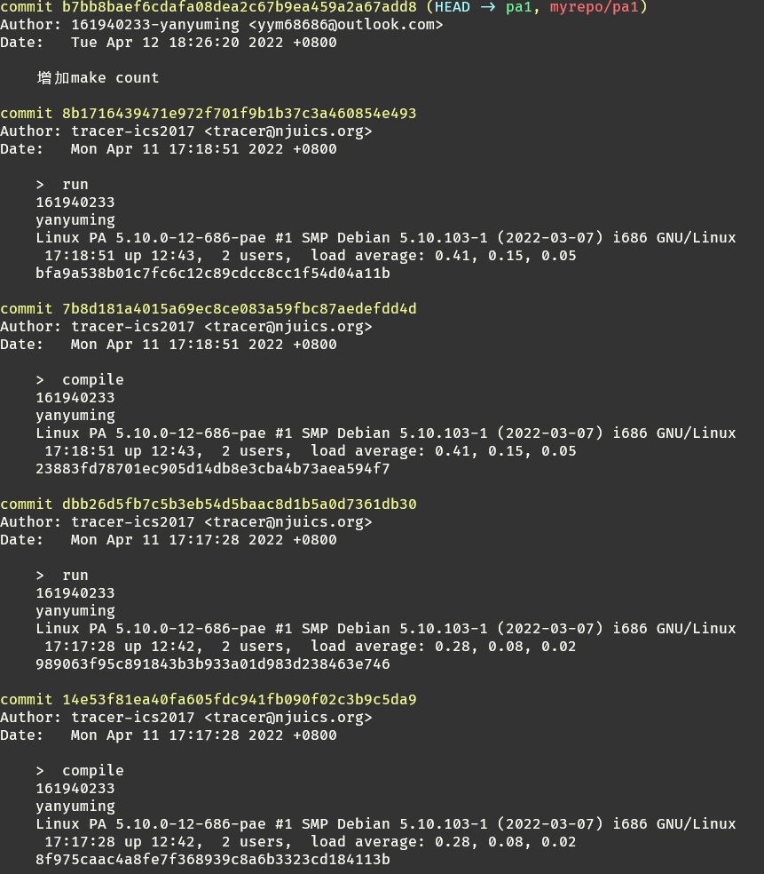

     

## 实验内容

### 编写匹配规则

修改src/monitor/debug/expr.c文件：

```c
static struct rule {
  char *regex;
  int token_type;
} rules[] = {

  /* TODO: Add more rules.
   * Pay attention to the precedence level of different rules.
   */
  {" +", TK_NOTYPE},    // spaces
  {"==", TK_EQ},        // equal
  {"!=", TK_NEQ},       // not equal
  {"&&", TK_AND},       // and
  {"\\|\\|", TK_OR},    // or
  {"!", TK_NOT},        // not
  {"0x[0-9a-zA-Z]+", TK_HEX},
  {"[1-9][0-9]*|0", TK_DEC},
  {"\\$e..", TK_REG},
  {"\\(", LeftBracket},
  {"\\)", RightBracket},
  {"\\+", PLUS},         // plus
  {"\\-", MINUS},
  {"\\*", TIMES},
  {"\\/", DIVIDE}
};
```

思路：

- [0-9]表示识别一个数字，所以一个数字可以表示为`[1-9][0-9]*|0`
- \是转义字符，`\\`才能表示一个真正的转义字符，所以表示一个加号应该是`\\+`

### 添加 p 命令

增加p指令：

```c
static struct {
  char *name;
  char *description;
  int (*handler) (char *);
} cmd_table [] = {
  { "help", "Display informations about all supported commands", cmd_help },
  { "c", "Continue the execution of the program", cmd_c },
  { "q", "Exit NEMU", cmd_q },
  { "si", "Single step execution", cmd_si },
  { "info", "Print program status", cmd_info },
  { "x", "Scan memory", cmd_x },
  { "p", "Expression evaluation", cmd_p },

  /* TODO: Add more commands */

};
```

编写`cmd_p()`函数：

```c
static int cmd_p(char *args){
    bool success = true;
    uint32_t result = expr(args, &success);
    if (success == true && result != -1162167624) printf("%d\n", result);
    return 0;
}
```

思路：

- 定义一个是否求值成功的变量
- 调用expr函数
- 如果求值成功则打印数值，否则到下一个循环

### 识别并存储 token

完善`make_token()`函数：

```c
static bool make_token(char *e) {
  int position = 0;
  int i;
  regmatch_t pmatch;

  nr_token = 0;

  while (e[position] != '\0') {
    /* Try all rules one by one. */
    for (i = 0; i < NR_REGEX; i ++) {
      if (regexec(&re[i], e + position, 1, &pmatch, 0) == 0 && pmatch.rm_so == 0) {
        char *substr_start = e + position;
        int substr_len = pmatch.rm_eo;

        Log("match rules[%d] = \"%s\" at position %d with len %d: %.*s",
            i, rules[i].regex, position, substr_len, substr_len, substr_start);

        /* TODO: Now a new token is recognized with rules[i]. Add codes
         * to record the token in the array `tokens'. For certain types
         * of tokens, some extra actions should be performed.
         */

        int flag = 0;
        switch (rules[i].token_type) {
         case TK_EQ:
             tokens[nr_token].type = TK_EQ;
             break;
         case TK_NEQ:
             tokens[nr_token].type = TK_NEQ;
             break;
         case TK_AND:
             tokens[nr_token].type = TK_AND;
             break;
         case TK_OR:
             tokens[nr_token].type = TK_OR;
             break;
         case TK_NOT:
             tokens[nr_token].type = TK_NOT;
             break;
         case TK_HEX:
             tokens[nr_token].type = TK_HEX;
             break;
         case TK_DEC:
             tokens[nr_token].type = TK_DEC;
             break;
         case TK_REG:
             tokens[nr_token].type = TK_REG;
             break;
         case LeftBracket:
             tokens[nr_token].type = LeftBracket;
             break;
         case RightBracket:
             tokens[nr_token].type = RightBracket;
             break;
         case PLUS:
             tokens[nr_token].type = PLUS;
             break;
         case MINUS:
             tokens[nr_token].type = MINUS;
             break;
         case TIMES:
             tokens[nr_token].type = TIMES;
             break;
         case DIVIDE:
             tokens[nr_token].type = DIVIDE;
             break;
         default: flag = 1;
        }
        if (!flag)
            strncpy(tokens[nr_token++].str, e + position, substr_len);
        position += substr_len;
        break;
      }
    }

    if (i == NR_REGEX) {
      printf("no match at position %d\n%s\n%*.s^\n", position, e, position, "");
      return false;
    }
  }

  return true;
}
```

思路：

- 正则匹配所有的token，每识别到一个token，就记录它的属性和内容。
- 定义一个flag变量，记录是否成功匹配到token，flag为0，则不记录其内容。

### 实现括号匹配

编写`check_parentheses()`函数：

```c
bool check_parentheses(int p, int q){
    int sta = 0, pos = 0;
    while (p + pos != q + 1){
        if (tokens[p + pos].str[0] == '(') sta++;
        else if (tokens[p + pos].str[0] == ')') sta--;
        else if (p + pos == q || pos == 0)
            return false;
        if (((p + pos++) != q && sta <= 0) || sta < 0)
            return false;
    }
    return true;
}
```

思路：

- 定义一个栈，记录括号匹配情况。
- 遇到（，栈就加一，遇到）就减一，一旦栈小于0，则匹配失败，匹配到字符串末尾，但栈还是大于0，匹配还是失败
- 第一个字符不是（，匹配失败
- 最后一个字符不是），匹配失败

### 实现子表达式拆分

编写`find_dominated_op()`函数：

```c
int find_dominated_op(int p, int q){
    int pos = q, stack = 0;
    while (pos != p){
        if(tokens[pos].str[0] == ')')
            stack++;
        else if (tokens[pos].str[0] == '(')
            stack--;
        else if ((tokens[pos].str[0] == '+' \
               || tokens[pos].str[0] == '-' \
               || !strcmp(tokens[pos].str, "==") \
               || !strcmp(tokens[pos].str, "!=") \
               || !strcmp(tokens[pos].str, "||") \
               || !strcmp(tokens[pos].str, "!") \
               || !strcmp(tokens[pos].str, "&&"))\
               && !stack)
            return pos;
        pos--;
    }
    pos = q, stack = 0;
    while (pos != p){
        if(tokens[pos].str[0] == ')')
            stack++;
        else if (tokens[pos].str[0] == '(')
            stack--;
        else if ((tokens[pos].type == TIMES || tokens[pos].str[0] == '/') && !stack)
            return pos;
        pos--;
    }
    return 0;
}
```

思路：

- 从后往前匹配，如果遇到加或减等其他符号，则返回位置
- 遇到括号就跳过，一整个括号
- 第一轮加减号没有匹配到，则第二轮扫描，直到扫描到乘除号

### 实现表达式求值

编写`eval()`函数：

```c
uint32_t eval(int p, int q) {
    if (p > q) {
        /* Bad expression */
        printf("Invalid expression: ");
        int len = 0;
        for (int i = 0; i < nr_token; i++){
            printf("%s", tokens[i].str);
            if (i < q)
                len += strlen(tokens[i].str);
        }
        printf("\n%*c\n", len + 21, '^');
        return 0x3f3f3f3f;
    }
    else if (p == q) {
        if (tokens[p].type == TK_DEC)
            return atoi(tokens[p].str);
        if (tokens[p].type == TK_REG){
            char *reg = strtok(NULL, "$");
            for (int i = 0; i < nr_token; i++)
                if (!strcmp(reg, regsl[i]))
                    return cpu.gpr[i]._32;
        }
        if (tokens[p].type == TK_HEX){
            uint32_t n = 0;
            for (int i = 2; (tokens[p].str[i] >= '0' && tokens[p].str[i] <= '9') || (tokens[p].str[i] >= 'a' && tokens[p].str[i] <    = 'z') || (tokens[p].str[i] >='A' && tokens[p].str[i] <= 'Z'); i++){
                if (tokens[p].str[i] > '9')
                    n = 16 * n + (10 + tokens[p].str[i] - 'a');
                else
                    n = 16 * n + (tokens[p].str[i] - '0');
            }
            return n;
        }
        /* Single token.
        * For now this token should be a number.
        * Return the value of the number.
        */
    }
    else if (check_parentheses(p, q) == true) {
        /* The expression is surrounded by a matched pair of parentheses.
        * If that is the case, just throw away the parentheses.
        */
        return eval(p + 1, q - 1);
    }
    else {
        int op = find_dominated_op(p, q);
        int val1 = 0, val2 = 0;
        if (tokens[op].type != TK_NOT && tokens[op].type != DEREF)
            val1 = eval(p, op - 1);
        val2 = eval(op + 1, q);
        switch (tokens[op].type) {
            case TK_EQ: return val1 == val2;
            case TK_NEQ: return val1 != val2;
            case TK_AND: return val1 && val2;
            case TK_OR: return val1 || val2;
            case TK_NOT: return !val2;
            case DEREF: return vaddr_read(val2, 4);
            case PLUS: return val1 + val2;
            case MINUS: return val1 - val2;
            case TIMES: return val1 * val2;
            case DIVIDE: return val1 / val2;
            default: assert(0);
        }
    }
    return 0;
}
```

思路：

- 使用递归下降法解析表达式
- 先找到首要运算符
- 再分别计算两部分的表达式的结果
- 最后根据运算符的类型计算结果

测试结果：

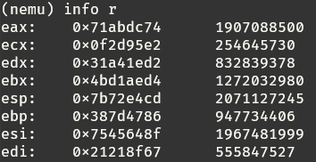

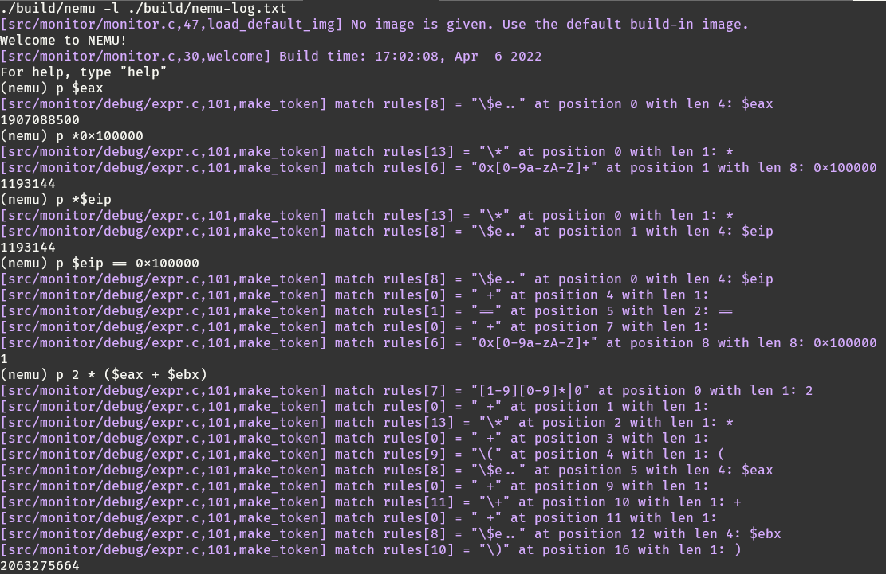

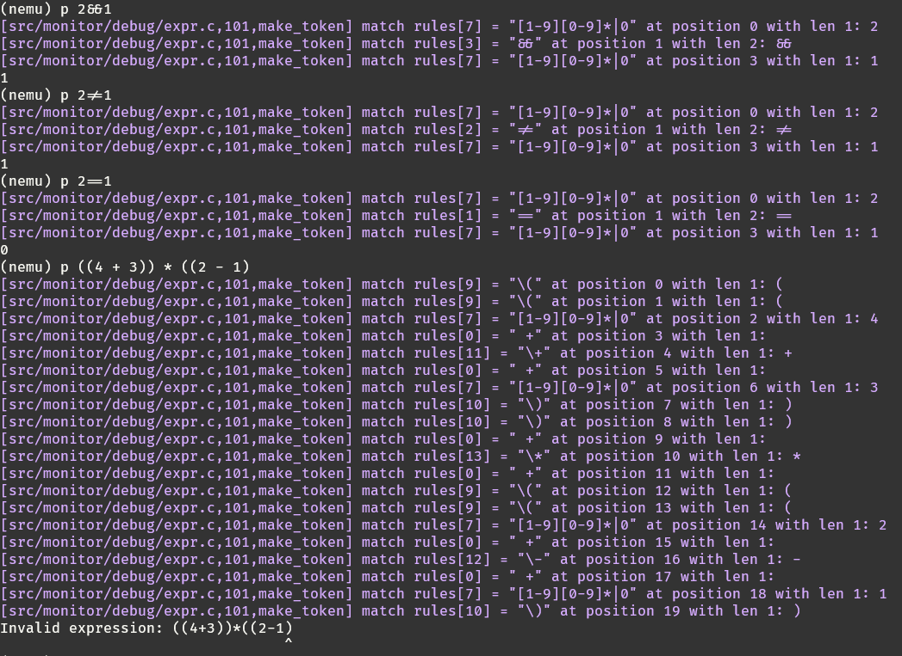

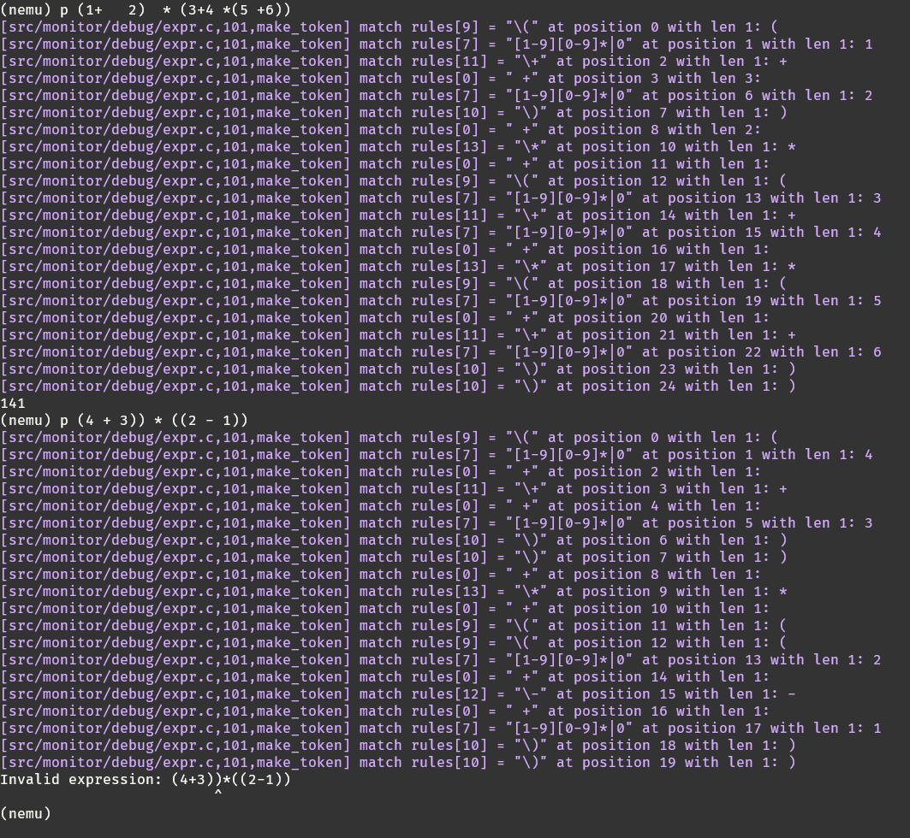

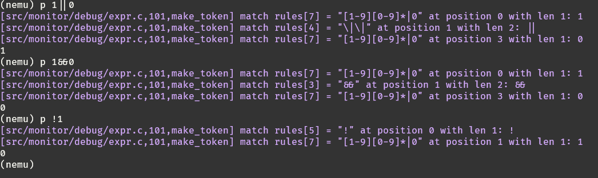

### 实现指针解引用

编写`expr()`函数：

```c
uint32_t expr(char *e, bool *success) {
  if (!make_token(e)) {
    *success = false;
    return 0;
  }
  for (int i = 0; i < nr_token; i++) {
    if (tokens[i].str[0] == '*' && (i == 0 \
                || tokens[i - 1].type == DIVIDE \
                || tokens[i - 1].type == LeftBracket \
                || tokens[i - 1].type == PLUS \
                || tokens[i - 1].type == MINUS \
                || tokens[i - 1].type == TIMES) ) {
      tokens[i].type = DEREF;
    }
  }
  if (!check_error(0, nr_token - 1)) {
      *success = false;
      return 0;
  }
  /* TODO: Insert codes to evaluate the expression. */
  //   TODO();
  return eval(0, nr_token - 1);
}
```

编写`eval()`函数：

```c
switch (tokens[op].type) {
    case TK_EQ: return val1 == val2;
    case TK_NEQ: return val1 != val2;
    case TK_AND: return val1 && val2;
    case TK_OR: return val1 || val2;
    case TK_NOT: return !val2;
    case DEREF: return vaddr_read(val2, 4);
    case PLUS: return val1 + val2;
    case MINUS: return val1 - val2;
    case TIMES: return val1 * val2;
    case DIVIDE: return val1 / val2;
    default: assert(0);
}
```

思路：

- 把表达式开头的`*`号标为解引用类型
- 如果`*`在表达式内，则判断前一个token是什么，如果是`+-*/(`，则把乘号变为解引用类型。
- 最后在eval函数中读取对应地址的4字节

### 实现负数

编写`expr()`函数：

```c
for (int i = 0; i < nr_token; i++) {
        if (tokens[i].str[0] == '-' && (i == 0 \
                 || tokens[i - 1].type == DIVIDE \
                 || tokens[i - 1].type == LeftBracket \
                 || tokens[i - 1].type == PLUS \
                 || tokens[i - 1].type == MINUS \
                 || tokens[i - 1].type == TIMES) ) {
            tokens[i].type = TK_NEG;
        }
}
```

编写`eval()`函数：

```c
switch (tokens[op].type) {
        case TK_EQ: return val1 == val2;
        case TK_NEQ: return val1 != val2;
        case TK_AND: return val1 && val2;
        case TK_OR: return val1 || val2;
        case TK_NOT: return !val2;
        case TK_NEG: return 0 - val2;
        case DEREF: return vaddr_read(val2, 4);
        case PLUS: return val1 + val2;
        case MINUS: return val1 - val2;
        case TIMES: return val1 * val2;
        case DIVIDE: return val1 / val2;
        default: assert(0);
}
```

思路：

- 跟解引用思路一样。
- 把表达式开头的`-`号标为负号类型
- 如果`-`在表达式内，则判断前一个token是什么，如果是`+-*/(`，则把乘号变为负号类型。
- 最后在eval函数中返回负数。

测试：


### 实现x命令使用表达式求值

修改cmd_x()函数：

```diff
static int cmd_x(char *args){
    //分割字符串，得到起始位置和要读取的次数
    char *arg1 = strtok(NULL, " ");
    if (arg1 == NULL){
        puts("Missing parameter.");
        return 0;
    }
    char *s = strtok(NULL, " ");
    if (s == NULL){
        puts("Missing parameter.");
        return 0;
    }
    uint32_t n = 0;

+    if (s[0] == '0' && s[0] == 'x'){
        for (int i = 2; (s[i] >= '0' && s[i] <= '9') || (s[i] >= 'a' && s[i] <= 'z') || (s[i] >='A' && s[i] <= 'Z'); i++){
            if (s[i] > '9')
                n = 16 * n + (10 + s[i] - 'a');
            else
                n = 16 * n + (s[i] - '0');
        }
+   }
+    else {
+        bool success = true;
+        n = expr(s, &success);
+        if (!success || n == -1162167624){
+            puts("Missing parameter.");
+            return 0;
+        }
+    }
    //循环使用 vaddr_read 函数来读取内存
    puts("Address         Dword block\tByte sequence");
    for(int i = 0; i < atoi(arg1); i++){
        uint32_t instr = vaddr_read(n, 4);    //如何调用，怎么传递参数，请阅读代码
        uint8_t *p_instr = (void *)&instr;
        printf("0x%08x\t0x%08x\t", n, instr);
        for (int i = 0; i < 4; i++)
            printf("%02x ", p_instr[i]);
        n += 4;
        puts("");
    }
    return 0;
}
```

思路：

- 先判断第二个参数是不是十六进制，如果是表达式则调用expr()函数，求出值，然后根据地址读取四个字节

测试：

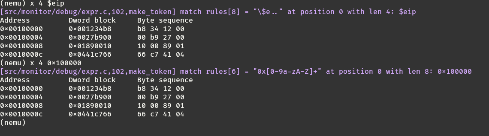

### 监视点结构体

编写include/monitor/watchpoint.h文件：

```c
typedef struct watchpoint {
  int NO;
  struct watchpoint *next;

  /* TODO: Add more members if necessary */
  char expr[32];
  int new_val;
  int old_val;
} WP;
```

思路：

- 按照题目要求填写的。

### 监视点池的管理

实现new_wp()函数：

```c
WP* new_wp(){
    if (free_ == NULL) assert(0);
    if (head == NULL)
        head = free_;
    WP* tmp = free_;
    free_ = free_->next;
    tmp->next = NULL;
    if (head->NO > tmp->NO){
        tmp->next = head;
        head = tmp;
        return tmp;
    }

    WP *temp = head, *last = temp;
    while (temp){
        last = temp;
        temp = temp->next;
        if (temp && temp->NO > tmp->NO){
            last->next = tmp;
            tmp->next = temp;
            break;
        }
        else if(!temp){
            last->next = tmp;
            tmp->next = NULL;
            break;
        }
    }
    return tmp;
}
```

思路：

- 如果head为NULL则直接赋值free_
- 如果head编号比新节点编号大，则调整head到新节点
- 如果新节点编号不大不小，则按编号顺序插到链表里

实现free_wp()函数：

```c
void free_wp(WP *wp){
    if (free_ == NULL) {
        free_ = wp;
        wp->next = NULL;
    }
    if (wp->NO < free_->NO){
        if (head == wp) head = head->next;
        else {
            WP *t = head, *pre = t;
            while (t){
                if (t->NO == wp->NO){
                    pre->next = wp->next;
                    break;
                }
                pre = t;
                t = t->next;
            }
        }
        wp->next = free_;
        free_ = wp;
        if (head && !head->next && head == free_) head = NULL;
        return;
    }

    //这里是为了把想要释放的节点的上一个节点的next指针指向待释放节点的下一个节点
    WP *temp = head, *last = temp;
    while (temp) {
        if (temp->NO == wp->NO){
            last->next = wp->next;
            break;
        }
        last = temp;
        temp = temp->next;
    }


//以下代码功能如图所示：
//    head                      ┌──────────────────────────►...
//     │                        │
//     │            ┌───────────┼─────────────┐
//     │            │           │             │
//     │            │           │             │
//┌────▼───┐   ┌────┴───┐   ┌───┴────┐   ┌────┴───┐
//│        │   │        │   │        │   │        ├────────►...
//└────┬───┘   └────▲───┘   └───┬────┘   └────────┘
//     │            │           │
//     │            │           │
//     │            │           │
//     │           free_        │
//     │                        │
//     │                        │
//     └────────────────────────┘
//                  │
//                  │
//                  │
//                  │
//                  │
//                  │
//                  ▼
//    head
//     │
//     │
//     │
//     │
//┌────▼───┐   ┌────────┐   ┌────────┐   ┌────────┐
//│        │   │        ├───►        ├───►        ├────────►...
//└────┬───┘   └────▲───┘   └────────┘   └────────┘
//     │            │
//     │            │
//     │            │
//     │           free_
//     │
//     │
//     └─────────────────────────►...
    temp = free_, last = temp;
    while (temp->next){
        last = temp;
        temp = temp->next;
        if (temp->NO > wp->NO){
            if (head == wp) head = head->next;
            last->next = wp;
            wp->next = temp;
            break;
        }
        else if (!temp->next){
            temp->next = wp;
            wp->next = NULL;
            break;
        }
    }
    return;
}
```

思路：

- 如果释放节点编号小于free_编号，则调整`free_`到释放节点处
- 如果free_为NULL，则直接赋值
- 如果释放节点编号小于free_节点编号，则按照编号顺序插入链表

### 监视点加入调试器

`cmd_w()`函数：

```c
static int cmd_w(char *args){
    set_watchpoint(args);
    return 0;
}
```

思路：

- 直接调用set_watchpoint(char *e)函数

w命令测试：

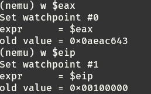

`cmd_d()`函数：

```c
static int cmd_d(char *args){
    int result = delete_watchpoint(atoi(args));
    if (!result) puts("error!");
    return 0;
}
```

思路：

- 直接调用bool delete_watchpoint(int NO);函数，并返回是否删除成功

d命令测试：

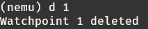

`info w`命令：

```c
static int cmd_info(char *args){
    char *arg = strtok(NULL, " ");
    // 分割字符
    if (arg == NULL){
        puts("Missing parameter.");
        return 0;
    }
    if (strcmp(arg, "r") == 0)
    {
        // 依次打印所有寄存器
        // 这里给个例子：打印出 eax 寄存器的值
        for (int i = 0; i < 8; i++)
            printf("%s:\t0x%08x\t%d\n", regsl[i], cpu.gpr[i]._32, cpu.gpr[i]._32);

    }
    else if (strcmp(arg, "w") == 0)
    {
        // 这里我们会在 PA1.3 中实现
        list_watchpoint();
    }
    return 0;
}
```

思路：

- 直接调用list_watchpoint();函数

`info w` 命令测试：

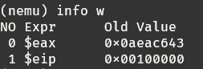

### 监视点主要功能

编写set_watchpoint(char *e)函数：

```c
int set_watchpoint(char *e){
    WP* new = new_wp();
    strcpy(new->expr, e);
    printf("Set watchpoint #%d\n", new->NO);
    printf("expr      = %s\n", e);
    bool success = true;
    uint32_t result = expr(e, &success);
    if (success == true && result != -1162167624){
        printf("old value = 0x%08x\n", result);
        new->old_val = result;
    }
    return new->NO;
}
```

思路：

- 将表达式赋值给结构体
- 输出必要的信息
- 调用函数计算表达式

编写bool delete_watchpoint(int NO)函数：

```c
bool delete_watchpoint(int NO){
    if (!head) return false;
    WP* tmp = head;
    int flag = 0;
    while (tmp) {
        if (tmp->NO == NO) flag = 1;;
        tmp = tmp->next;
    }
    if (!flag) return false;
    tmp = head;
    while (tmp){
        if (tmp->NO == NO){
            free_wp(tmp);
            printf("Watchpoint %d deleted\n", tmp->NO);
            return true;
        }
        tmp = tmp->next;
    }
    puts("");
    return false;
}
```

思路：

- 寻找要删除的节点，若没有则返回
- 找到要删除的节点，调用free_wp函数删除

编写void list_watchpoint(void)函数：

```c
void list_watchpoint(void){
    if (!head) return;
    puts("NO Expr      Old Value");
    WP* tmp = head;
    while (tmp){
        bool success = true;
        uint32_t result = expr(tmp->expr, &success);
        if (success == true && result != -1162167624) printf("%2d %-10s0x%08x\n", tmp->NO, tmp->expr, tmp->old_val);
        else break;
        tmp = tmp->next;
    }
    return;
}
```

思路：

- 打印必要的信息
- 把head链表所有节点打印出来

编写WP* scan_watchpoint(void)函数：

```c
WP* scan_watchpoint(uint32_t eip){
    WP *cur = head;
    while (cur->next){
        bool success = true;
        uint32_t result = expr(cur->expr, &success);
        if (success == true && result != -1162167624) cur->new_val = result;
        else return NULL;
        if (cur->old_val != cur->new_val){
            printf("Hit watchpoint %d at address 0x%08x\n", cur->NO, eip);
            printf("expr      = %s\n", cur->expr);
            printf("old value = 0x%08x\nnew value = 0x%08x\n", cur->old_val, cur->new_val);
            puts("program paused");
            cur->old_val = cur->new_val;
            return cur;
        }
        cur = cur->next;
    }
    return NULL;
}
```

思路：

- 计算监视点新值，若值改变，则返回节点编号
- 打印必要的提示信息

触发监视点测试：

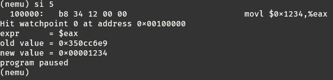


### 实现软件断点

输入`w $eip == 0x10000a`，然后运行得到：

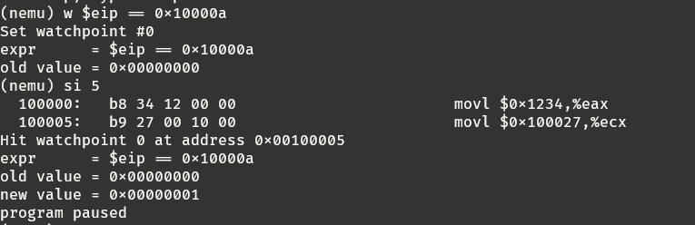

成功在0x10000a处停止。

## 遇到的问题及解决办法

1. 遇到问题：负号首要运算符计算始终会出错

    解决方案：`find_dominated_op()`函数返回值改为p。


## 实验心得

经过本次的实验，我学会了编写模拟的寄存器，理清了计算机执行指令的过程，自己实践写了几个指令。其中遇到了各种问题，不过我都解决了，很开心。