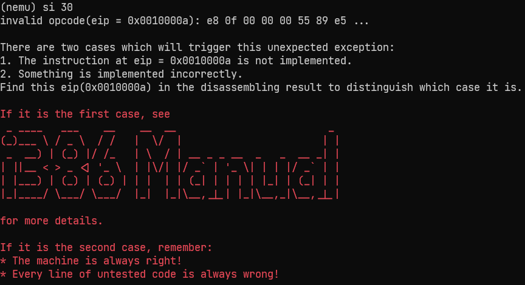
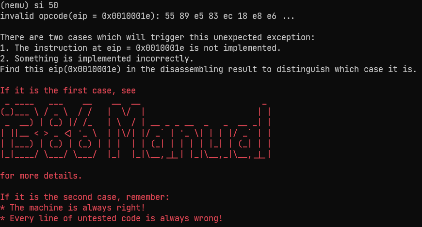
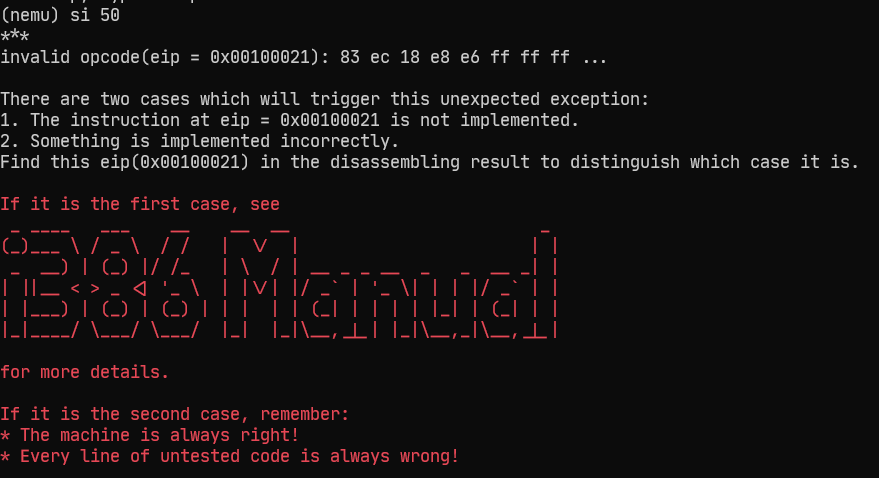
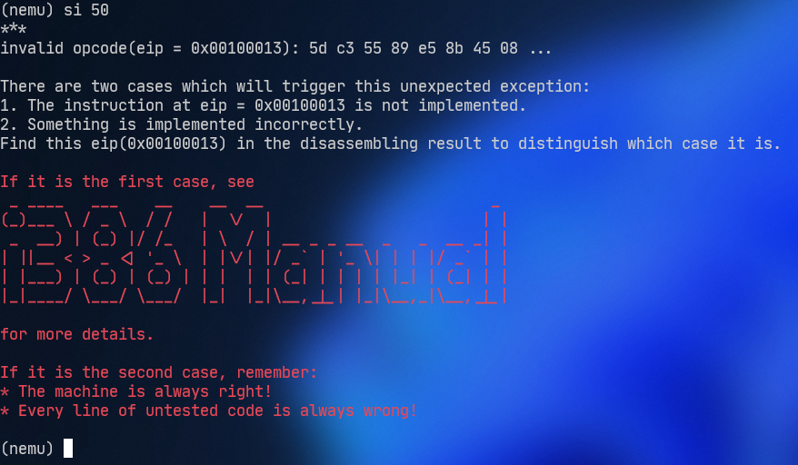

# 南京航空航天大学《计算机组成原理Ⅱ课程设计》报告

* 姓名：颜宇明
* 班级：1819001
* 学号：161940233
* 报告阶段：PA2.1
* 完成日期：2022.4.28
* 本次实验，我完成了所有内容。 

**目录**

[TOC]

## 思考题

1. 增加了多少

   我们说在执行完下一条指令前需要更新 `eip` 的值。设某指令执行前 `eip` 值为 x1，该指令执行后 `eip` 值为 x2，那么 `x2 - x1` 的这个差值都包括了一条指令的哪些组成成分？

   - 操作码，立即数值，源操作数地址，目的操作数，不同的指令有不同的结构。

2. 是什么类型

   `opcode_table` 数组中存放了所有指令的信息，请问表中每个表项是什么类型？NEMU 又是如何通过这个表项得知操作数长度、应该使用哪个译码函数、哪个执行函数等信息的？

   - `opcode_entry`类型
   - 通过查找指令表元素的第三项来获得操作数宽度
   - 通过查找指令表元素的第一项来获得译码函数指针
   - 通过查找指令表元素的第二项来获得执行函数指针

3. 操作数结构体的实现

   阅读 `decode.c` 和 `decode.h`，思考一下**操作数结构体/共同体**中都包括哪些成员，分别存储什么信息？他们是如何实现协同工作的？

   - ```c++
     typedef struct {
       uint32_t type;   //操作数类型
       int width;       //操作数宽度
       union {
         uint32_t reg;  //寄存器操作数
         rtlreg_t addr; //操作数地址
         uint32_t imm;  //立即数
         int32_t simm;  //有符号立即数
       };
       rtlreg_t val;    //存操作数的值
       char str[OP_STR_SIZE]; // 操作数字符串
     } Operand;
     ```
   
   
      - 通过类型判断，分别进行存取等不同的操作
   
4. 复现宏定义

   我们在学习 C 语言时就已经接触过宏定义了，现在我们需要复习一下，便于你更好地理解项目中所使用的宏定义。下面请你算出下列宏定义最终展开以后的样子，即类似于 `type func_name(type arg1, type arg2, ...)` 的我们最常见到的 C 语言函数定义的形式，在展开时，希望你能写出计算步骤，不要直接写出结果。如果你现在无法算出下列的宏定义，你可以先阅读完整个本节内容，再回来思考这个题目。

   - make_EHelper(mov) //mov 指令的执行函数

     - make_EHelper(mov) → void exec_mov(vaddr_t *eip)

   - make_EHelper(push) //push 指令的执行函数

     - make_EHelper(mov) → void exec_push(vaddr_t *eip)

   - make_DHelper(I2r) //I2r 类型操作数的译码函数

     - make_DHelper(I2r) → void decode_I2r(vaddr_t *eip)

   - IDEX(I2a, cmp) //cmp 指令的 opcode_table 表项

     - IDEX(I2a, cmp) → IDEXW(I2a, cmp, 0) → {decode_I2a, exec_cmp, 0}

   - EX(nop) //nop 指令的 opcode_table 表项

     - EX(nop) → EXW(nop, 0) → {NULL, exec_nop, 0}

   - make_rtl_arith_logic(and) //and 运算的 RTL 指令

     - ```c
       make_rtl_arith_logic(and) → 
       static inline void rtl_and(rtlreg_t* dest, const rtlreg_t* src1, const rtlreg_t* src2) {
           *dest = c_and(*src1, *src2);
       }
       static inline void rtl_andi(rtlreg_t* dest, const rtlreg_t* src1, int imm) {
           *dest = c_and(*src1, imm);
       }
       ```

5. ⽴即数背后的故事

   Motorola 68k 系列的处理器都是大端架构的. 现在问题来了, 考虑以下两种情况:

   - 假设我们需要将NEMU运行在Motorola 68k的机器上(把NEMU的源代码编译成Motorola 68k的机器码)
   - 假设我们需要编写一个新的模拟器NEMU-Motorola-68k, 模拟器本身运行在x86架构中, 但它模拟的是Motorola 68k程序的执行

   在这两种情况下, 你需要注意些什么问题? 为什么会产生这些问题? 怎么解决它们?

   - nemu是小端序，在Motorola 68k的机器上读指令会出错
   - 因为Motorola 68k是大端序
   - nemu把小端序解释为大端序

6. 神奇的 eflags

   - `OF` 的作用是判断是否有溢出, 这里的“溢出”是什么意思呢? 如果只用仅为标志位 `CF` 可不可以代替 `OF` 的功能呢？为什么？
     - 溢出的意思是被减数与结果符号不一样，减的时候超过了数字的范围
     - 不可以
     - 因为OF是有符号数下的标志位，CF是对于无符号数而言的，有符号数下没有意义，不能代替OF
   - 在运算的过程中如何获得 `OF` 的值？
     - 当(负数-正数=正数)和(正数-负数=负数)时，判断为为溢出，OF=1

7. git branch 和 git log 截图

   - 

   - 


## 实验内容

### 实现标志寄存器

根据讲义所给 eflags 寄存器结构：

```
 31                  23                  15               7             0
 +-------------------+-------------------+-------+-+-+-+-+-+-+-------+-+-+
 |                                               |O| |I| |S|Z|       | |C|
 |                       X                       | |X| |X| | |   X   |1| |
 |                                               |F| |F| |F|F|       | |F|
 +-------------------+-------------------+-------+-+-+-+-+-+-+-------+-+-+
```

- 在1比特的位置置一，与下文 eflags 初值为2（0x10）有关，暗示 eflags 与各标志寄存器共享内存空间。

用到了位域，wiki 百科的例子是：

```c
struct CHAR 
{
    unsigned int ch   : 8;    //8位
    unsigned int font : 6;    //6位
    unsigned int size : 18;   //18位
};
struct CHAR ch1;
```

无名位域定义为：如果位域的定义没有给出标识符名字，那么这是**无名位域**，无法被初始化。无名位域用于填充（padding）内存布局。只有无名位域的比特数可以为0。这种占0比特的无名位域，用于强迫下一个位域在内存分配边界对齐。

Reference：[位段 - 维基百科，自由的百科全书 (wikipedia.org)](https://zh.wikipedia.org/zh-hans/位段)

所以修改include/cpu/reg.h：

```diff
typedef struct {
  union{
      struct {
        union{
            uint32_t _32;
            uint16_t _16;
            uint8_t _8[2];
        };
      } gpr[8];
      struct {
          rtlreg_t eax, ecx, edx, ebx, esp, ebp, esi, edi;
      };
  };

  /* Do NOT change the order of the GPRs' definitions. */

  /* In NEMU, rtlreg_t is exactly uint32_t. This makes RTL instructions
   * in PA2 able to directly access these registers.
   */
+  union {
+      struct{
+        uint32_t CF : 1;
+        uint32_t    : 5;
+        uint32_t ZF : 1;
+        uint32_t SF : 1;
+        uint32_t    : 1;
+        uint32_t IF : 1;
+        uint32_t    : 1;
+        uint32_t OF : 1;
+        uint32_t    : 20;
+      }
+      rtlreg_t value;
+  } eflags;
  vaddr_t eip;

} CPU_state;
```

- value与标志寄存器共享内存空间，给eflags赋初值就是给这32位空间整体赋初值。根据i386手册第174页，eflags 初值为0x2。

  

在`src/monitor/monitor.c`中增加 eflags 初始化：

```c
static inline void restart() {
  /* Set the initial instruction pointer. */
  cpu.eip = ENTRY_START;
  cpu.eflags.value = 0x2;

#ifdef DIFF_TEST
  init_qemu_reg();
#endif
}
```

### 实现所有 RTL 指令

在include/cpu/rtl.h中完善函数：

```c
static inline void rtl_mv(rtlreg_t* dest, const rtlreg_t *src1) {
  // dest <- src1
  *dest = *src1;
}

static inline void rtl_not(rtlreg_t* dest) {
  // dest <- ~dest
  *dest = ~(*dest);
}

static inline void rtl_sext(rtlreg_t* dest, const rtlreg_t* src1, int width) {
  // dest <- signext(src1[(width * 8 - 1) .. 0])
    int32_t result = (int32_t)*src1;
    switch(width){
        case 1:
            result <<= 24;
            result >>= 24;
            break;
        case 2:
            result <<= 16;
            result >>= 16;
            break;
        case 4:
            break;
        default:
            assert(0);
    }
  *dest = result;
}

static inline void rtl_push(const rtlreg_t* src1) {
  // esp <- esp - 4
  // M[esp] <- src1
  cpu.esp -= 4;
  rtl_sm(&cpu.esp, 4, *src1);
}
static inline void rtl_push(const rtlreg_t* src1) {
  // esp <- esp - 4
  // M[esp] <- src1
  cpu.esp -= 4;
  rtl_sm(&cpu.esp, 4, src1);
}

static inline void rtl_pop(rtlreg_t* dest) {
  // dest <- M[esp]
  // esp <- esp + 4
  rtl_lm(dest, &cpu.esp, 4);
  cpu.esp += 4;
}

static inline void rtl_eq0(rtlreg_t* dest, const rtlreg_t* src1) {
  // dest <- (src1 == 0 ? 1 : 0)
  *dest = *src1 ? 0 : 1;
}

static inline void rtl_eqi(rtlreg_t* dest, const rtlreg_t* src1, int imm) {
  // dest <- (src1 == imm ? 1 : 0)
  *dest = *src1 == imm ? 1 : 0;
}

static inline void rtl_neq0(rtlreg_t* dest, const rtlreg_t* src1) {
  // dest <- (src1 != 0 ? 1 : 0)
  *dest = *src1 != 0 ? 1 : 0;
}

static inline void rtl_msb(rtlreg_t* dest, const rtlreg_t* src1, int width) {
  // dest <- src1[width * 8 - 1]
  *dest = *src1 >> (width * 8 - 1) & 0x1;
}

static inline void rtl_update_ZF(const rtlreg_t* result, int width) {
  // eflags.ZF <- is_zero(result[width * 8 - 1 .. 0])
  if (*result == 0)
      t0 = 1;
  else t0 = 0;
  rtl_set_ZF(&t0);
}
static inline void rtl_update_SF(const rtlreg_t* result, int width) {
  // eflags.SF <- is_sign(result[width * 8 - 1 .. 0])
  t0 = *result >> (width * 8 - 1) & 0x1;
  rtl_set_SF(&t0);
}
```

注意点：

- 基本根据注释写代码
- 各个标志寄存器作用：
  - SF：结果为负，即符号位为1时SF=1，否则为0.
  - ZF：结果为0，ZF=1，否则为0
  - CF：最高位进位，CF=1，不进位为0
  - OF：溢出，OF=1
- rtl_sext函数要根据不同的字长进行不同的处理

### 实现 6 条 x86 指令

本部分需要实现`call`, `push`, `pop`, `sub`, `nop`, `ret`六个指令。

#### call 指令

先运行一次测试程序，看看有哪个指令没有完成，输入命令：

```bash
clear && cd /home/yanyuming/ics2022/nexus-am/tests/cputest && make clean && make ARCH=x86-nemu ALL=dummy run
```



- 提示0xE8，即call指令没有完成。

查看汇编文件`nexus-am/tests/cputest/build/dummy-x86-nemu.txt`：

```apl
00100000 <_start>:
  100000:   bd 00 00 00 00          mov    $0x0,%ebp
  100005:   bc 00 7c 00 00          mov    $0x7c00,%esp
  10000a:   e8 0f 00 00 00          call   10001e <_trm_init>

0010000f <serial_init>:
  10000f:   55                      push   %ebp
  100010:   89 e5                   mov    %esp,%ebp
  100012:   90                      nop
  100013:   5d                      pop    %ebp
  100014:   c3                      ret

00100015 <_halt>:
  100015:   55                      push   %ebp
  100016:   89 e5                   mov    %esp,%ebp
  100018:   8b 45 08                mov    0x8(%ebp),%eax
  10001b:   d6                      (bad)
  10001c:   eb fe                   jmp    10001c <_halt+0x7>

0010001e <_trm_init>:
  10001e:   55                      push   %ebp
  10001f:   89 e5                   mov    %esp,%ebp
  100021:   83 ec 18                sub    $0x18,%esp
  100024:   e8 e6 ff ff ff          call   10000f <serial_init>
  100029:   e8 14 00 00 00          call   100042 <main>
  10002e:   89 45 f4                mov    %eax,-0xc(%ebp)
  100031:   83 ec 0c                sub    $0xc,%esp
  100034:   ff 75 f4                pushl  -0xc(%ebp)
  100037:   e8 d9 ff ff ff          call   100015 <_halt>
  10003c:   83 c4 10                add    $0x10,%esp
  10003f:   90                      nop
  100040:   c9                      leave
  100041:   c3                      ret

00100042 <main>:
  100042:   55                      push   %ebp
  100043:   89 e5                   mov    %esp,%ebp
  100045:   b8 00 00 00 00          mov    $0x0,%eax
  10004a:   5d                      pop    %ebp
  10004b:   c3                      ret
```

- 第一次遇到call指令为`10000a:   e8 0f 00 00 00          call   10001e <_trm_init>`，call的操作数是立即数

查阅i386手册第275页，`call`操作码为`0xE8`，`call`指令部分的伪代码：

```c++
IF rel16 or rel32 type of call
THEN (* near relative call *)
 IF OperandSize = 16
 THEN
 Push(IP);
 EIP ← (EIP + rel16) AND 0000FFFFH;
 ELSE (* OperandSize = 32 *)
 Push(EIP);
 EIP ← EIP + rel32;
 FI;
FI;
```

- call指令先将下一个eip压栈
- 然后eip赋值为跳转地址

首先在操作码表格中加入call指令：

```c
/* 0xe8 */    IDEXW(I, call, 4), EMPTY, EMPTY, EMPTY,
```

- 宏定义展开后为`{decode_I, exec_call, 4}`

- `decode_I`作用是解析`call`指令后的无符号立即数

- 设置操作数宽度为4

- 当调用`decode_I`函数时，即调用`src/cpu/decode/decode.c`中的函数：

  ```c
  make_DHelper(I) {
    decode_op_I(eip, id_dest, true);
  }
  ```

  宏定义展开后为：

  ```c
  decode_I(vaddr_t *eip) {
    decode_op_I(eip, op, true){ // op 就是传进来的 id_dest
        /* eip here is pointing to the immediate */
        op->type = OP_TYPE_IMM;
        op->imm = instr_fetch(eip, op->width); // 取立即数，这里eip指向立即数
        rtl_li(&op->val, op->imm);
    #ifdef DEBUG
        snprintf(op->str, OP_STR_SIZE, "$0x%x", op->imm);
    #endif
    }
  }
  ```

  - `op->imm = instr_fetch(eip, op->width);`这里就是把立即数取出来，这里eip指向立即数，而不是指向整条指令的开始，是因为在exec_real(vaddr_t* eip)函数里执行了一次instr_fetch，把call指令取了出来，这里的eip是exec_real(vaddr_t* eip)传进来的decoding.seq_eip，所以decoding.seq_eip在取完call后自增一，指向call后面的立即数。
  - 但是cpu.eip并没有变，一开始cpu.eip就赋值给了decoding.seq_eip， 所以整个取指过程中，cpu.eip一直指向的是指令的开始字节，只有在指令执行结束后，通过update_eip函数才指向下一条指令。

- 取值译码完成后就要执行指令了

在`src/cpu/exec/control.c`文件中补全call执行流程的指令：

```c
make_EHelper(call) {
  // the target address is calculated at the decode stage
  decoding.is_jmp = 1;
  rtl_push(eip);
  rtl_add(&decoding.jmp_eip, eip, &id_dest->val);
  print_asm("call %x", decoding.jmp_eip);
}
```

- exec_real和decode_op_I(eip, op, true)分别进行了一次instr_fetch操作，所以eip，即decoding.seq_eip已经指向了下一个指令的开始字节，这里可以直接把eip push进寄存器。

在`src/cpu/exec/all-instr.h`加上函数声明：

```diff
#include "cpu/exec.h"

make_EHelper(mov);

make_EHelper(operand_size);

make_EHelper(inv);
make_EHelper(nemu_trap);

+make_EHelper(call);
make_EHelper(push);
```

再次编译程序：

```bash
clear && cd /home/yanyuming/ics2022/nexus-am/tests/cputest && make clean && make ARCH=x86-nemu ALL=dummy run
```



- 成功执行`call`指令
- 提示`0x55`指令，即`push`指令没有实现

#### push 指令

查看i386手册，第367页，push指令伪代码：

```
IF StackAddrSize = 16
THEN
 IF OperandSize = 16 THEN
 SP ← SP - 2;
 (SS:SP) ← (SOURCE); (* word assignment *)
 ELSE
 SP ← SP - 4;
 (SS:SP) ← (SOURCE); (* dword assignment *)
 FI;
ELSE (* StackAddrSize = 32 *)
 IF OperandSize = 16
 THEN
 ESP ← ESP - 2;
 (SS:ESP) ← (SOURCE); (* word assignment *)
 ELSE
 ESP ← ESP - 4;
 (SS:ESP) ← (SOURCE); (* dword assignment *)
 FI;
FI;
```

手册第414页，0x50到0x57都是PUSH指令。我们只需要实现32位，在操作码表中补全指令：

```c
  /* 0x50 */    IDEXW(r, push, 4), IDEXW(r, push, 4), IDEXW(r, push, 4), IDEXW(r, push, 4),
  /* 0x54 */    IDEXW(r, push, 4), IDEXW(r, push, 4), IDEXW(r, push, 4), IDEXW(r, push, 4),
```

- 宏定义展开后为`{decode_r, exec_push, 4}`
- `decode_r`作用是解析`push`指令后的无符号立即数
- 设置操作数宽度为4

在src/cpu/exec/data-mov.c中补全push指令：

```c
make_EHelper(push) {
  rtl_push(&(id_dest->val)); /
  print_asm_template1(push);
}
```

在`src/cpu/exec/all-instr.h`加上函数声明：

```diff
#include "cpu/exec.h"

make_EHelper(mov);

make_EHelper(operand_size);

make_EHelper(inv);
make_EHelper(nemu_trap);

make_EHelper(call);
+make_EHelper(push);
```

再次编译程序：

```bash
clear && cd /home/yanyuming/ics2022/nexus-am/tests/cputest && make clean && make ARCH=x86-nemu ALL=dummy run
```

出错，显示`decode_op_SI: Assertion '0' failed`，说明decode_op_SI没有实现。仔细查看汇编文件：

```diff
  10001e:   55                      push   %ebp
  10001f:   89 e5                   mov    %esp,%ebp
  100021:   83 ec 18                sub    $0x18,%esp
```

此时`push`已经执行完毕了。执行到`0x100021`，遇到0x83指令，查看`src/cpu/exec/exec.c`中的操作码表：

```
/* 0x80 */    IDEXW(I2E, gp1, 1), IDEX(I2E, gp1), EMPTY, IDEX(SI2E, gp1),
```

跟踪`decode_SI2E`到`src/cpu/decode/decode.c`中的`make_DHelper(SI2E)`函数：

```c
make_DHelper(SI2E) {
    puts("***");
  assert(id_dest->width == 2 || id_dest->width == 4);
  decode_op_rm(eip, id_dest, true, NULL, false);
  id_src->width = 1;
  decode_op_SI(eip, id_src, true);
  if (id_dest->width == 2) {
    id_src->val &= 0xffff;
  }
}
```

果然0x83调用了`decode_op_SI`函数。`src/cpu/decode/decode.c`里补全`decode_op_SI`函数：

```c
static inline make_DopHelper(SI) {
  assert(op->width == 1 || op->width == 4);
  op->type = OP_TYPE_IMM;

  /* TODO: Use instr_fetch() to read `op->width' bytes of memory
   * pointed by `eip'. Interpret the result as a signed immediate,
   * and assign it to op->simm.
   *
   op->simm = ???
   */
  op->simm = instr_fetch(eip, op->width);
  rtl_li(&op->val, op->simm);

#ifdef DEBUG
  snprintf(op->str, OP_STR_SIZE, "$0x%x", op->simm);
#endif
}
```

- 跟`decode_op_I`函数差不多，只要把`imm`换成`simm`就行了

保存后再次编译程序：

```bash
clear && cd /home/yanyuming/ics2022/nexus-am/tests/cputest && make clean && make ARCH=x86-nemu ALL=dummy run
```



- 成功执行push函数
- 提示`0x83`指令，查看汇编代码，发现是`sub`指令没有实现

#### sub 指令

在i386手册第414页找到0x83指令，发现是`Grp1 Ev, Iv`，v表示不能确定字长。查看第416页，找到第一个指令组：


发现SUB指令在第六个位置。所以在`src/cpu/exec/exec.c`中修改指令组第六个元素：

```c
/* 0x80, 0x81, 0x83 */
make_group(gp1,
    EMPTY, EMPTY, EMPTY, EMPTY,
    EMPTY, EX(sub), EMPTY, EMPTY)
```

- 指令可以确定字长用EXW，否则用EX
- 不需要译码函数

在手册第404页，找到sub指令的伪代码：

```
IF SRC is a byte and DEST is a word or dword
THEN DEST = DEST - SignExtend(SRC);
ELSE DEST ← DEST - SRC;
FI;
```

在`src/cpu/exec/arith.c`中补全减法逻辑：

```c
make_EHelper(sub) {
    rtl_sub(&t3, &id_dest->val, &id_src->val); // 目的操作数减源操作数
    operand_write(id_dest, &t3);               //将结果写回目的操作数

    // 更新ZF,SF标志位
    rtl_update_ZFSF(&t3, id_dest->width); // rtl_update_ZFSF函数内部临时变量是t0，所以不能用t0传参，否则更新SF会出错，因为更新ZF时，t0会变

    // 更新CF标志位
    rtl_sltu(&t1, &id_dest->val, &t3); //当 被减数<减法结果，CF = 1;
    rtl_set_CF(&t1);

    // 更新OF标志位
    rtl_xor(&t1, &id_dest->val, &id_src->val); //当被减数与减数符号不一样时，t1 = 1;
    rtl_xor(&t2, &id_dest->val, &t3);          //当减法结果与被减数符号不一样时，t2 = 1;
    rtl_and(&t0, &t1, &t2);                    //t0判断是否溢出，就是当(负数-正数=正数)和(正数-负数=负数)时为溢出
    rtl_msb(&t0, &t0, id_dest->width);         //取最高位，即符号位
    rtl_set_OF(&t0);

  print_asm_template2(sub);
}
```

在`src/cpu/exec/all-instr.h`加上函数声明：

```diff
#include "cpu/exec.h"

make_EHelper(mov);

make_EHelper(operand_size);

make_EHelper(inv);
make_EHelper(nemu_trap);

make_EHelper(call);
make_EHelper(push);
+make_EHelper(sub);
```

保存后再次编译程序：

```bash
clear && cd /home/yanyuming/ics2022/nexus-am/tests/cputest && make clean && make ARCH=x86-nemu ALL=dummy run
```


- 成功执行 sub 函数
- 提示`0x90`指令，即`nop`指令没有实现

#### nop 指令

翻到手册第355页，NOP不需要任何操作。使用vim全文搜索nop指令：

```
:vim /nop/ /home/yanyuming/ics2022/nemu/**
```

发现`make_EHelper(nop)`在`src/cpu/exec/special.c`中，不需要额外增加内容。在`src/cpu/exec/all-instr.h`加上函数声明：

```diff
#include "cpu/exec.h"

make_EHelper(mov);

make_EHelper(operand_size);

make_EHelper(inv);
make_EHelper(nemu_trap);

make_EHelper(call);
make_EHelper(push);
make_EHelper(sub);
+make_EHelper(nop);
```

保存后再次编译程序：

```bash
clear && cd /home/yanyuming/ics2022/nexus-am/tests/cputest && make clean && make ARCH=x86-nemu ALL=dummy run
```



- 成功执行 nop 函数
- 提示`0x5d`指令，即`pop`指令没有实现

#### pop 指令

查阅手册第414页，发现0x58到0x5f都是pop指令，补全操作码表：

```c
  /* 0x58 */    IDEXW(r, pop, 4), IDEXW(r, pop, 4), IDEXW(r, pop, 4), IDEXW(r, pop, 4),
  /* 0x5c */    IDEXW(r, pop, 4), IDEXW(r, pop, 4), IDEXW(r, pop, 4), IDEXW(r, pop, 4),
```

在`src/cpu/exec/data-mov.c`中完善执行函数逻辑：

```c
make_EHelper(pop) {
  rtl_pop(&t0); // 将栈中的值放到t0中
  if (id_dest->type == OP_TYPE_REG) rtl_sr(id_dest->reg, id_dest->width, &t0);
  else if (id_dest->type == OP_TYPE_MEM) rtl_sm(&id_dest->addr, id_dest->width, &t0);
  else assert(0);

  print_asm_template1(pop);
}
```

在`src/cpu/exec/all-instr.h`加上函数声明：

```diff
#include "cpu/exec.h"

make_EHelper(mov);

make_EHelper(operand_size);

make_EHelper(inv);
make_EHelper(nemu_trap);

make_EHelper(call);
make_EHelper(push);
make_EHelper(sub);
make_EHelper(nop);
+make_EHelper(pop);
```

保存后再次编译程序：

```bash
clear && cd /home/yanyuming/ics2022/nexus-am/tests/cputest && make clean && make ARCH=x86-nemu ALL=dummy run
```


- 成功执行 pop 函数
- 提示`0xc3`指令，即`ret`指令没有实现

#### ret 指令

查阅手册第414页，`0xc3`的位置是空白，没有译码函数，直接执行。补全操作码表：

```c
/* 0xc0 */ IDEXW(gp2_Ib2E, gp2, 1), IDEX(gp2_Ib2E, gp2), EMPTY, EX(ret),
```

查阅手册第378页，查看ret的执行逻辑是：

```
IF instruction = near RET
THEN;
 IF OperandSize = 16
 THEN
 IP ← Pop();
 EIP ← EIP AND 0000FFFFH;
 ELSE (* OperandSize = 32 *)
 EIP ← Pop();
 FI;
 IF instruction has immediate operand THEN eSP ← eSP + imm16; FI;
FI;
```

在`src/cpu/exec/control.c`补全ret指令的执行逻辑：

```c
make_EHelper(ret) {
  rtl_pop(&decoding.jmp_eip); // 将栈中的值放到jmp_eip中
  decoding.is_jmp = 1;        // 设置可以跳转
  print_asm("ret");
}
```

在`src/cpu/exec/all-instr.h`加上函数声明：

```diff
#include "cpu/exec.h"

make_EHelper(mov);

make_EHelper(operand_size);

make_EHelper(inv);
make_EHelper(nemu_trap);

make_EHelper(call);
make_EHelper(push);
make_EHelper(sub);
make_EHelper(nop);
make_EHelper(pop);
+make_EHelper(ret);
```

保存后再次编译程序：

```bash
clear && cd /home/yanyuming/ics2022/nexus-am/tests/cputest && make clean && make ARCH=x86-nemu ALL=dummy run
```


- 成功执行 ret 函数
- 提示`0xff`指令，即`pushl`指令没有实现

#### pushl 指令

在i386手册第414页找到0xff指令，发现是`Indirct Grp5`。查看第416页，找到第五个指令组，发现pushl指令在第7个位置。所以在`src/cpu/exec/exec.c`中修改指令组第七个元素：

```c
  /* 0xff */
make_group(gp5,
    EMPTY, EMPTY, EMPTY, EMPTY,
    EMPTY, EMPTY, EX(push), EMPTY)
```

- 指令可以确定字长用EXW，否则用EX
- 不需要译码函数

保存后再次编译程序：

```bash
clear && cd /home/yanyuming/ics2022/nexus-am/tests/cputest && make clean && make ARCH=x86-nemu ALL=dummy run
```

### 成功运⾏ dummy


### 实现 Diff-test

根据讲义，在`include/common.h`中删掉`#define DIFF_TEST`注释。在`src/monitor/diff-test/diff-test.c`中补全寄存器对比测试代码：

```c
// TODO: Check the registers state with QEMU.
// Set `diff` as `true` if they are not the same.
if (r.eip != cpu.eip || r.eax != cpu.eax || r.ebx != cpu.ebx || r.ecx != cpu.ecx || \
    r.edx != cpu.edx || r.esp != cpu.esp || r.ebp != cpu.ebp || r.esi != cpu.esi || r.edi != cpu.edi){
    diff = true;
    printf("r.eip:%#x, cpu.eip:%#x\n", r.eip, cpu.eip);
    printf("r.eax:%#x, cpu.eax:%#x\n", r.eax, cpu.eax);
    printf("r.ebx:%#x, cpu.ebx:%#x\n", r.ebx, cpu.ebx);
    printf("r.ecx:%#x, cpu.ecx:%#x\n", r.ecx, cpu.ecx);
    printf("r.edx:%#x, cpu.edx:%#x\n", r.edx, cpu.edx);
    printf("r.esp:%#x, cpu.esp:%#x\n", r.esp, cpu.esp);
    printf("r.ebp:%#x, cpu.ebp:%#x\n", r.ebp, cpu.ebp);
    printf("r.esi:%#x, cpu.esi:%#x\n", r.esi, cpu.esi);
    printf("r.edi:%#x, cpu.edi:%#x\n", r.edi, cpu.edi);
}
if (diff) {
  nemu_state = NEMU_END;
}
```

- 只要一一对比各个寄存器的值就行了

保存后再次编译程序：

```
clear && cd /home/yanyuming/ics2022/nexus-am/tests/cputest && make clean && make ARCH=x86-nemu ALL=dummy run
```


- **在开启 diff-test 的条件下**顺利运行得到 `HIT GOOD TRAP` 的结果

## 遇到的问题及解决办法

1. 遇到问题：ret 返回地址总是出错。

   解决方案：调试发现pop指令里面的pop写成了push。


## 实验心得

经过本次的实验，我学会了编写底层的逻辑代码，理清了计算机执行指令的过程，自己实践写了几个指令。其中遇到了各种问题，不过我都解决了，很开心。