# 南京航空航天大学《计算机组成原理Ⅱ课程设计》报告

* 姓名：颜宇明
* 班级：1819001
* 学号：161940233
* 报告阶段：PA2.2&PA2.3
* 完成日期：2022.5.16
* 本次实验，我完成了所有内容。 

**目录**

[TOC]

## 思考题

### 1.什么是 API

我们经常在各种地方听说过 API 这个词语，那么你能解释一下什么是 API 吗？如果你没有听说过，可以在网络上搜索相关信息并回答这个问题。

- 应用程序接口(`Application Programming Interface`,又称为应用编程接口)是软件系统不同组成部分衔接的约定。
  接口本身指一种规范或者说约定,用于说明供需的具体情况。

### 2.AM 属于硬件还是软件？

相信当你阅读完上面的文字，应该对 AM 的概念有所理解了，那么请你思考一下，AM 属于硬件还是软件呢？经过 PA1，我们了解到 NEMU 的实质是模拟硬件。另外，我们都知道，操作系统（OS）是直接运行在硬件之上的，是一个软件。那么 AM 和你认为的操作系统是否一样？如果一样，请说明他们的共同点；如果不一样，请说明他们之间的区别。

- `AM`即不属于硬件也不属于软件，它只是一个抽象概念，描述了一个计算机应该具备的功能，或者说它描述的就是指令集体系本身。
- AM跟操作系统不一样
- AM是个抽象类，真机和虚拟机是由AM这个抽象类派生出来的两个子类，而x86真机和NEMU则分别是这两个子类的实例化
- 操作系统是一个软件，用来自动执行程序和分配系统资源

### 3.堆和栈在哪⾥?

我们知道代码和数据都在可执行文件里面, 但却没有提到堆(heap)和栈(stack).为什么堆和栈的内容没有放入可执行文件里面?那程序运行时刻用到的堆和栈又是怎么来的? AM 的代码是否能给你带来一些启发?

为什么堆和栈的内容没有放入可执行文件里面?

- 因为堆本身就是运行时分配的内存，

那程序运行时刻用到的堆和栈又是怎么来的?

- 栈也是用来保存运行时环境变量和函数运行时栈帧的。程序运行时操作系统会在其进程空间通过对特定变量赋值来分配堆和栈。

AM 的代码是否能给你带来一些启发?

- 

### 4.回忆运⾏过程

`make ALL=xxx run`运行过程：

* 首先读取`$(AM_HOME)/Makefile.check`中的默认参数，根据设置的`ARCH`指代架构
* 然后通过命令行指定的`ALL`寻找`tests`目录下对应的`*.c`文件
* 根据`AM`中指定`ARCH`提供的编译链接规则编译生成可执行文件
* 将可执行文件作为`nemu`的镜像启动`nemu`，控制权转交给`nemu`

### 5.神奇的eflags（2）

```s
+-----+-----+------------------------------------+
| SF  |  OF |                 实例               |
+-----+-----+------------------------------------+
|  0  |  0  |               2 - 1                |
+-----+-----+------------------------------------+
|  0  |  1  |            (2 ^ 31) - 1            |
+-----+-----+------------------------------------+
|  1  |  0  |               1 - 2                |
+-----+-----+------------------------------------+
|  1  |  1  |         (2 ^ 31 - 1) - (-1)        |
+-----+-----+------------------------------------+
```

当`(OF || SF) == 0`，被减数大于减数。

### 6.这是巧合吗？

* `above`：`op2 > op1`无符号比较.
* `below`：`op2 < op1`无符号比较.
* `greater`：op2 > op1`有符号比较.
* `less`：`op2 < op1`有符号比较.

### 7.nemu的本质

io模块，显示模块等。

### 8.设备是如何⼯作的？

分配端口号给设备，通过命令去访问他们。

### 9. CPU 需要知道设备是如何⼯作的吗？

不需要，只要执行命令就行了。

### 10. 什么是驱动？

驱动是一个允许应用程序与硬件交互的程序，这种程序创建了一个硬件与硬件，或硬件与软件沟通的接口，经由主板上的总线或其它沟通子系统与硬件形成连接的机制，这样的机制使得硬件设备上的数据交换成为可能。

### 11. cpu知道吗？

不需要。

### 12.再次理解volatile

检测不到设备寄存器的变化会进入死循环。

### 13.hello world运⾏在哪⾥？

不一样。前者运行在主机上，后者运行在`nemu`上。

### 14.如何检测很多个键同时被按下？

可以维护一个队列，按下进入队列，松开离开队列。

### 15.编译与链接Ⅰ

- 去掉`static`：无报错，但是产生可执行文件变大
- 去掉`inline`：报错，在`special.c`中定义了但未使用相应`rtl`函数.这是因为`special.c`中`include`了`rtl.h`文件,所以预处理会将函数定义复制到源文件中,又因为没有使用所以报错
- 去掉两者：报错，在所有目标文件中重复定义了相应`rtl`函数,同理是因为预处理

### 16.编译与链接Ⅱ（10分）

- 29
- 有58个，多了29个，每个包含`common.h`和`debug.h`头文件的源文件都会有一个`dummy`变量
- 报错原因是重复定义变量，此前没报错是因为只声明未初始化为弱符号，初始化了的为强符号，多个强符号会发生重复定义错误

### 17.I/O 端⼝与接⼝（10分）

- 系统`I/O`地址的范围是`0000H->8000H`
- 变成16地址编线以后，端口的地址范围是`8001H-FFFFH`.`1k = 0x400`.

最常见的就是与显示器的通讯,`CPU`向显示器传输了数据和地址,而显示器向`CPU`返回状态信息。

### 18. git log截图

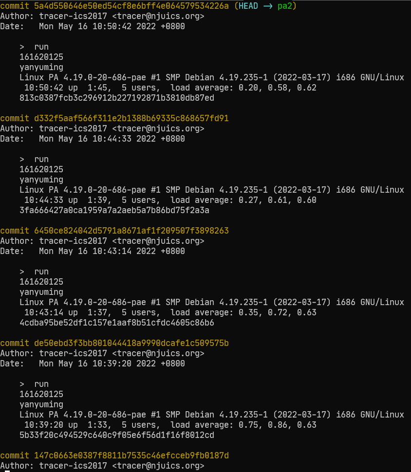

## 实验内容

### 实现剩余所有 x86 指令（40 分）

先测试一下所有样例：

```bash
./runall.sh
```

add-longlong文件的测试没有通过，查看汇编文件`nexus-am/tests/cputest/build/add-longlong-x86-nemu.txt`，编译nemu：

```bash
clear && cd /home/yanyuming/ics2022/nexus-am/tests/cputest && make clean && make ARCH=x86-nemu ALL=add-longlong run
```

#### lea 指令

发现0x8d，即lea指令没有实现，查询i386手册：`LEA Gv,M`，i386手册第327页有具体的伪代码。在`src/cpu/decode/decode.c`中发现`make_DHelper(lea_M2G)`已经完成，直接填表：

```c++
/* 0x8c */    EMPTY, IDEX(lea_M2G, lea), EMPTY, EMPTY,
```

在`src/cpu/exec/all-instr.h`加上函数声明，保存后再次编译程序：

```bash
clear && cd ~/ics2022/nexus-am/tests/cputest && make clean && make ARCH=x86-nemu ALL=add-longlong run
```

成功运行lea指令。

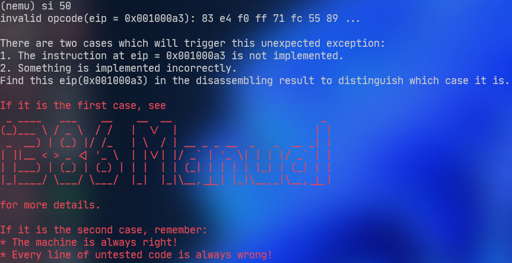

#### 第一个 指令组 and add or adc sbb sub xor cmp 指令

查表是`Grpl Ev,Iv`，在汇编代码里是and，到指令组表里找到and位置在第五个：

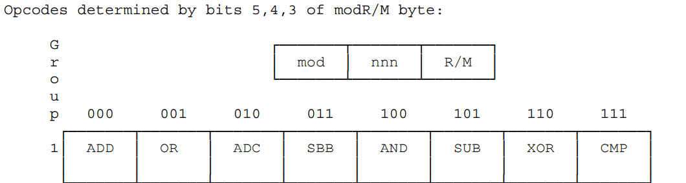

在src/cpu/exec/exec.c里填写第一个指令组，先全部填上：

```c
/* 0x80, 0x81, 0x83 */
make_group(gp1,
    EX(add), EX(or), EX(adc), EX(sbb),
    EX(and), EX(sub), EX(xor), EX(cmp))
```

- adc sbb sub 已经实现好了可以直接填写

查看i386手册第262页伪代码：

```
Operation
DEST ← DEST AND SRC;
CF ← 0;
OF ← 0;
```

使用`vim /make_EHelper(and)/ ~/ics2022/nemu/**`，寻找and执行函数，在`src/cpu/exec/logic.c`补全and执行函数：

```c++
make_EHelper(and) {
  rtl_and(&t1, &id_dest->val, &id_src->val); //目的操作数与源操作数
  operand_write(id_dest, &t1); //写入目的操作数
  rtl_update_ZFSF(&t1, id_dest->width); //更新ZFSF位
  t1 = 0;
  rtl_set_OF(&t1); //设置OF位为0
  rtl_set_CF(&t1); //设置CF位为0

  print_asm_template2(and);
}
```

在`src/cpu/exec/all-instr.h`加上函数声明，保存后再次编译程序：

```bash
clear && cd ~/ics2022/nexus-am/tests/cputest && make clean && make ARCH=x86-nemu ALL=add-longlong run
```

发现nemu与qemu结果不一样，具体是esp本来应该是0x00007bd0，现在却是0x000000d0，单步调试，每次执行指令都把nemu与qemu值输出，执行15条指令后发现：

```apl
1000a3:   83 e4 f0                              andl $0xf0,%esp
```

立即数0xf0没有进行有符号扩展，导致`0x00007bd0 & 0x000000f0 = 0x000000d0`，因此要修改`make_DopHelper(SI)`有符号立即数译码函数，主要是没有考虑到立即数的长度。在src/cpu/decode/decode.c把make_DopHelper(SI)修改为：

```c
/* sign immediate */
static inline make_DopHelper(SI) {
  assert(op->width == 1 || op->width == 4);
  op->type = OP_TYPE_IMM;

  /* TODO: Use instr_fetch() to read `op->width' bytes of memory
   * pointed by `eip'. Interpret the result as a signed immediate,
   * and assign it to op->simm.
   *
   op->simm = ???
   */
  if (op->width == 4)
    op->simm = instr_fetch(eip, op->width);
  else{
    t0 = (uint16_t)instr_fetch(eip, op->width);
    rtl_sext(&t1, &t0, op->width);
    op->simm = t1;
  }
  rtl_li(&op->val, op->simm);

#ifdef DEBUG
  snprintf(op->str, OP_STR_SIZE, "$0x%x", op->simm);
#endif
}
```

在`src/cpu/exec/arith.c`中实现add执行函数，可以抄已经实现好的adc指令：

```c
make_EHelper(add) {
    rtl_add(&t2, &id_dest->val, &id_src->val);
    operand_write(id_dest, &t2);

    // 更新ZF,SF标志位
    rtl_update_ZFSF(&t2, id_dest->width);

    // 更新CF标志位
    rtl_sltu(&t0, &t2, &id_dest->val);
    rtl_set_CF(&t0);

    // 更新OF标志位
    rtl_xor(&t0, &id_dest->val, &id_src->val);
    rtl_not(&t0);
    rtl_xor(&t1, &id_dest->val, &t2);
    rtl_and(&t0, &t0, &t1);
    rtl_msb(&t0, &t0, id_dest->width);
    rtl_set_OF(&t0);
    print_asm_template2(add);
}
```

在/src/cpu/exec/logic.c里补全xor执行函数：

```c
make_EHelper(xor) {
    rtl_xor(&t0, &id_dest->val, &id_src->val);
    operand_write(id_dest, &t0); //写入目的操作数
    t1 = 0;
    rtl_set_OF(&t1);
    rtl_set_CF(&t1);
    rtl_update_ZFSF(&id_dest->val, &id_dest->width);
   print_asm_template2(xor);
}
```

在src/cpu/exec/arith.c补全cmp指令，跟sub指令一摸一样，仅仅少了一个赋值过程：

```c
make_EHelper(cmp) {
    rtl_sub(&t3, &id_dest->val, &id_src->val);

    // 更新ZF,SF标志位
    rtl_update_ZFSF(&t3, id_dest->width); // rtl_update_ZFSF函数内部临时变量是t0，所以不能用t0传参，否则更新SF会出错，因为更新ZF时，t0会变

    // 更新CF标志位
    rtl_sltu(&t1, &id_dest->val, &t3);
    rtl_set_CF(&t1);

    // 更新OF标志位
    rtl_xor(&t1, &id_dest->val, &id_src->val);
    rtl_xor(&t2, &id_dest->val, &t3);
    rtl_and(&t0, &t1, &t2);
    rtl_msb(&t0, &t0, id_dest->width);
    rtl_set_OF(&t0);

    print_asm_template2(cmp);
}
```

保存后再次编译程序：

```bash
clear && cd ~/ics2022/nexus-am/tests/cputest && make clean && make ARCH=x86-nemu ALL=add-longlong run
```

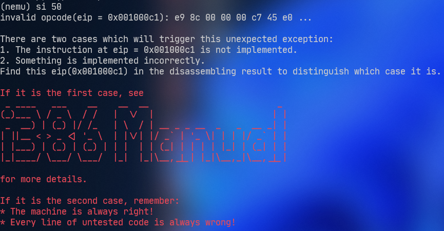

- 成功执行and函数
- 0xe9指令还没有完成

#### jmp 指令

查看汇编文件，0xe9是jmp指令，直接填表：

```c
/* 0xe8 */    IDEXW(I, call, 4), IDEX(J,jmp), EMPTY, EMPTY,
```

在`src/cpu/exec/all-instr.h`加上函数声明，保存后再次编译程序：

```bash
clear && cd ~/ics2022/nexus-am/tests/cputest && make clean && make ARCH=x86-nemu ALL=add-longlong run
```

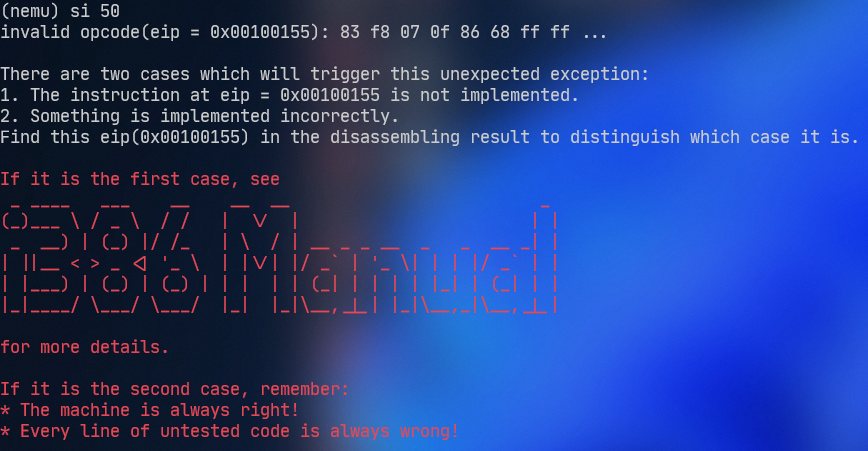

- 成功执行jmp指令
- 0x83指令没有完成

#### jbe 指令 long long

0x0f是扩展操作数，继续向后读一个字节，才能确定是什么指令，查表第415页，0x86代表jbe指令，0x80到0x8f都是跳转指令，而且长度都是四个字节，在src/cpu/exec/control.c里jcc函数已经定义好了。所以直接填表就好了。操作码后面跟了四个字节：

```apl
100158:   0f 86 68 ff ff ff       jbe    1000c6 <main+0x27>
```

默认长度就是4字节，所以直接用IDEX函数就行，补全操作码表：

```c
/* 0x80 */    IDEX(J, jcc), IDEX(J, jcc), IDEX(J, jcc), IDEX(J, jcc),
/* 0x84 */    IDEX(J, jcc), IDEX(J, jcc), IDEX(J, jcc), IDEX(J, jcc),
/* 0x88 */    IDEX(J, jcc), IDEX(J, jcc), IDEX(J, jcc), IDEX(J, jcc),
/* 0x8c */    IDEX(J, jcc), IDEX(J, jcc), IDEX(J, jcc), IDEX(J, jcc),
```

在`src/cpu/exec/all-instr.h`加上函数声明，保存后再次编译程序：

```
clear && cd ~/ics2022/nexus-am/tests/cputest && make clean && make ARCH=x86-nemu ALL=add-longlong run
```

发现rtl_setcc函数没有实现，找到src/cpu/exec/cc.c，补全函数：

```c
 switch (subcode & 0xe) {
    case CC_O:  //0
      rtl_get_OF(dest);
      break;
    case CC_B:  //2
      rtl_get_CF(dest); //小于，判断CF
      break;
    case CC_E:  //4
      rtl_get_ZF(dest);
      break;
    case CC_BE: //6
      rtl_get_CF(&t0);
      rtl_get_ZF(&t1);
      rtl_or(dest, &t0, &t1); //小于等于，CF和ZF至少一个等于1
      break;
    case CC_S:  //8
      rtl_get_SF(dest);
      break;
    case CC_L:  //12
      rtl_get_SF(&t0);
      rtl_get_OF(&t1);
      rtl_xor(dest, &t1, &t0); //带符号小于，SF不等于OF
      break;
    case CC_LE: //14
      rtl_get_ZF(&t0);
      rtl_get_SF(&t1);
      rtl_get_OF(&t2);
      rtl_xor(&t3, &t1, &t2);
      rtl_or(dest, &t0, &t3); //带符号小于等于，ZF=1或SF不等于OF
      break;
    default: panic("should not reach here");
    case CC_P: panic("n86 does not have PF");
  }
```

保存后再次编译程序：

```
clear && cd ~/ics2022/nexus-am/tests/cputest && make clean && make ARCH=x86-nemu ALL=add-longlong run
```

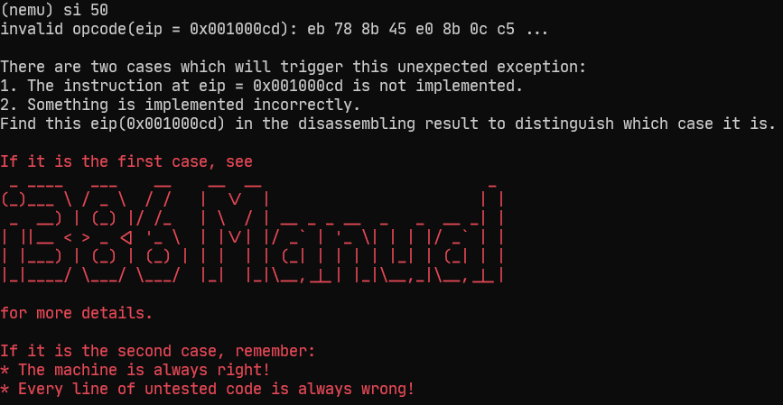

- 成功运行jbe指令
- 0xeb指令还没有实现

#### jmp 指令

0xeb是jmp指令，指令为：

```apl
1000cd:   eb 78                   jmp    100147 <main+0xa8>
```

eb操作码后面只有一个字节，所以在填写操作码表的时候需要指定字节数：

```c
/* 0xe8 */    IDEXW(I, call, 4), IDEX(J, jmp), EMPTY, IDEXW(J, jmp, 1),
```

保存后再次编译程序：

```
clear && cd ~/ics2022/nexus-am/tests/cputest && make clean && make ARCH=x86-nemu ALL=add-longlong run
```

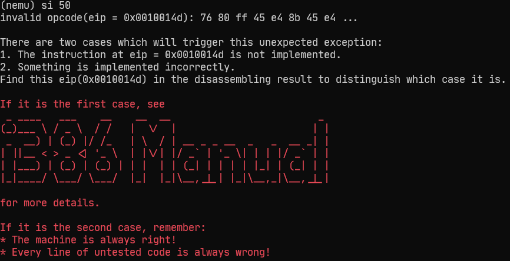

- 成功执行jmp指令
- 0x76指令没有实现

#### jbe 指令 short

操作码后面跟了一个字节：

```apl
 10014d:   76 80                   jbe    1000cf <main+0x30>
```

所以需要用IDEXW函数来指定长度，补全操作码表，查阅i386手册，0x70-0x7f都是jbe short指令：

```c
/* 0x70 */    IDEXW(J, jcc, 1), IDEXW(J, jcc, 1), IDEXW(J, jcc, 1), IDEXW(J, jcc, 1),
/* 0x74 */    IDEXW(J, jcc, 1), IDEXW(J, jcc, 1), IDEXW(J, jcc, 1), IDEXW(J, jcc, 1),
/* 0x78 */    IDEXW(J, jcc, 1), IDEXW(J, jcc, 1), IDEXW(J, jcc, 1), IDEXW(J, jcc, 1),
/* 0x7c */    IDEXW(J, jcc, 1), IDEXW(J, jcc, 1), IDEXW(J, jcc, 1), IDEXW(J, jcc, 1),
```

保存后再次编译程序：

```bash
clear && cd ~/ics2022/nexus-am/tests/cputest && make clean && make ARCH=x86-nemu ALL=add-longlong run
```

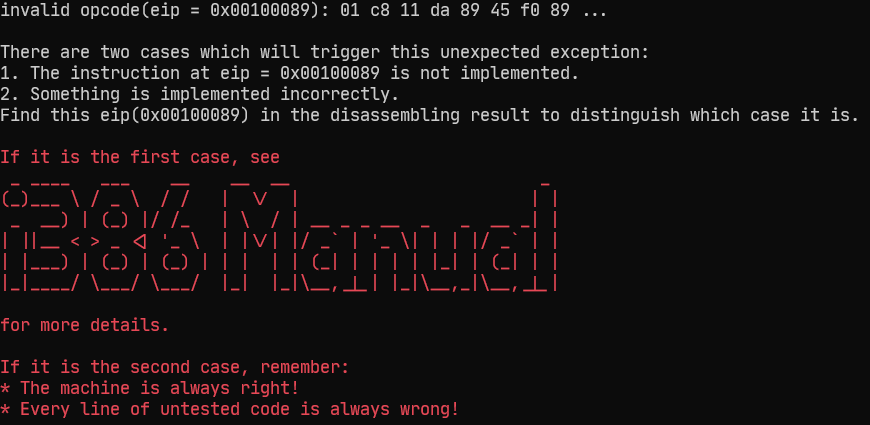

- 成功运行jbe指令
- 0x01指令未实现

#### add 指令

查表可得0x00-0x05都是add指令。

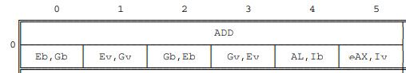

根据表中数据，填写操作码表，因为0x08~0x3d除了指令名字不一样，其他都一样，顺便全补上：

```c
/* 0x00 */    IDEXW(G2E, add, 1), IDEX(G2E, add), IDEXW(E2G, add, 1), IDEX(E2G, add),
/* 0x04 */    IDEXW(I2a, add, 1), IDEX(I2a, add), EMPTY, EMPTY,
/* 0x08 */	  IDEXW(G2E, or, 1), IDEX(G2E, or), IDEXW(E2G, or, 1), IDEX(E2G, or),
/* 0x0c */	  IDEXW(I2a, or, 1), IDEX(I2a, or), EMPTY, EX(2byte_esc),
/* 0x10 */    IDEXW(G2E, adc, 1), IDEX(G2E, adc), IDEXW(E2G, adc, 1), IDEX(E2G, adc),
/* 0x14 */    IDEXW(I2a, adc, 1), IDEX(I2a, adc), EMPTY, EMPTY,
/* 0x18 */    IDEXW(G2E, sbb, 1), IDEX(G2E, sbb), IDEXW(E2G, sbb, 1), IDEX(E2G, sbb),
/* 0x1c */    IDEXW(I2a, sbb, 1), IDEX(I2a, sbb), EMPTY, EMPTY,
/* 0x20 */    IDEXW(G2E, and, 1), IDEX(G2E, and), IDEXW(E2G, and, 1), IDEX(E2G, and),
/* 0x24 */    IDEXW(I2a, and, 1), IDEX(I2a, and), EMPTY, EMPTY,
/* 0x28 */    IDEXW(G2E, sub, 1), IDEX(G2E, sub), IDEXW(E2G, sub, 1), IDEX(E2G, sub),
/* 0x2c */    IDEXW(I2a, sub, 1), IDEX(I2a, sub), EMPTY, EMPTY,
/* 0x30 */    IDEXW(G2E, xor, 1), IDEX(G2E, xor), IDEXW(E2G, xor, 1), IDEX(E2G, xor),
/* 0x34 */    IDEXW(I2a, xor, 1), IDEX(I2a, xor), EMPTY, EMPTY,
/* 0x38 */    IDEXW(G2E, cmp, 1), IDEX(G2E, cmp), IDEXW(E2G, cmp, 1), IDEX(E2G, cmp),
/* 0x3c */    IDEXW(I2a, cmp, 1), IDEX(I2a, cmp), EMPTY, EMPTY,
```

- add adc sbb and sub cmp xor已经实现好了，可以直接填写

在/src/cpu/exec/logic.c完成or执行函数：

```c
make_EHelper(or) {
    rtl_or(&t2, &id_dest->val, &id_src->val);
    operand_write(id_dest, &t2);
    rtl_update_ZFSF(&t2, id_dest->width);
    rtl_set_OF(&tzero);
    rtl_set_CF(&tzero);;

    print_asm_template2(or);
}
```

在`src/cpu/exec/all-instr.h`加上函数声明，保存后再次编译程序：

```bash
clear && cd ~/ics2022/nexus-am/tests/cputest && make clean && make ARCH=x86-nemu ALL=add-longlong run
```

- 成功执行add指令

#### test 指令

查表发现`0x84,0x85,0xa8,0xa9`都是test函数，填写操作码表：

```c
     /* 0x84 */	IDEXW(G2E, test, 1), IDEX(G2E, test), EMPTY, EMPTY,
     /* 0xa8 */	IDEXW(I2a, test, 1), IDEX(I2a, test), EMPTY, EMPTY,
```

在/src/cpu/exec/logic.c里补全test函数：

```c
make_EHelper(test) {
    rtl_and(&t1, &id_dest->val, &id_src->val); 
    rtl_update_ZFSF(&t1, id_dest->width); //千万不要用t0，因为更新ZF时会用到t0，会把一开始的t0值覆盖
    rtl_set_CF(&tzero);
    rtl_set_OF(&tzero);
    print_asm_template2(test);
}
```

在`src/cpu/exec/all-instr.h`加上函数声明，保存后再次编译程序：

```bash
clear && cd ~/ics2022/nexus-am/tests/cputest && make clean && make ARCH=x86-nemu ALL=add-longlong run
```


- 成功执行test函数
- 0x0f指令未完成

#### sete 指令

遇到0f指令说明要看第二个字节，查表找到`Byte Set on condition`，从0x90-0x9f都是set操作，根据汇编代码：

```apl
 100132:   0f 94 c0                sete   %al
```

setcc指令长度为一。填表：

```c
/* 0x90 */    IDEXW(E, setcc, 1), IDEXW(E, setcc, 1), IDEXW(E, setcc, 1), IDEXW(E, setcc, 1),
/* 0x94 */    IDEXW(E, setcc, 1), IDEXW(E, setcc, 1), IDEXW(E, setcc, 1), IDEXW(E, setcc, 1),
/* 0x98 */    IDEXW(E, setcc, 1), IDEXW(E, setcc, 1), IDEXW(E, setcc, 1), IDEXW(E, setcc, 1),
/* 0x9c */    IDEXW(E, setcc, 1), IDEXW(E, setcc, 1), IDEXW(E, setcc, 1), IDEXW(E, setcc, 1),
```

执行函数已经玩好了，不需要再写。在`src/cpu/exec/all-instr.h`加上函数声明，保存后再次编译程序：

```bash
clear && cd ~/ics2022/nexus-am/tests/cputest && make clean && make ARCH=x86-nemu ALL=add-longlong run
```

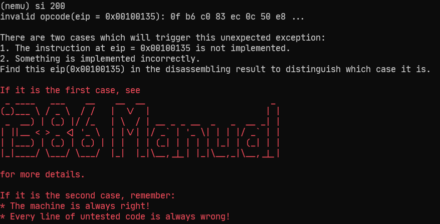

- 成功执行setcc函数
- 0xb6指令没有实现

#### movzbl 指令

查表发现0xb6,0xb7，都movzx指令，一个宽度为1，一个宽度为2，填写操作码表：

```c
 /* 0xb4 */    EMPTY, EMPTY, IDEXW(mov_E2G, movzx, 1), IDEXW(mov_E2G, movzx, 2),
```

执行函数已经完成，在`src/cpu/exec/all-instr.h`加上函数声明，保存后再次编译程序：

```bash
clear && cd ~/ics2022/nexus-am/tests/cputest && make clean && make ARCH=x86-nemu ALL=add-longlong run
```

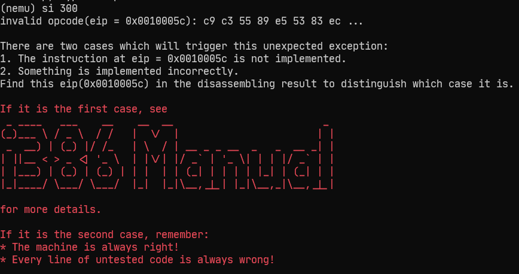

- 成功执行movzx函数
- 0xc9指令未实现

#### leave 函数

填表：

```c
/* 0xc8 */    EMPTY, EX(leave), EMPTY, EMPTY,
```

填写执行函数：

```c
make_EHelper(leave) {
  rtl_mv(&cpu.esp, &cpu.ebp);
  rtl_pop(&cpu.ebp);
  print_asm("leave");
}
```

在`src/cpu/exec/all-instr.h`加上函数声明，保存后再次编译程序：

```bash
clear && cd ~/ics2022/nexus-am/tests/cputest && make clean && make ARCH=x86-nemu ALL=add-longlong run
```


- 成功执行leave指令

#### inc 指令

汇编代码：

```apl
100144:   ff 45 e0                incl   -0x20(%ebp)
```

查表发现是指令组指令`Indirct Grp5`，到第五个指令组找到inc在第一个，顺便补全第二个dec指令，补全操作码表：

```c
  /* 0xff */
 make_group(gp5,
     EX(inc), EX(dec), EMPTY, EMPTY,
     EMPTY, EMPTY, EX(push), EMPTY)
```

同时在src/cpu/exec/arith.c中补全dec函数，可以仿照inc函数：

```c
make_EHelper(dec) {
    rtl_subi(&t3, &id_dest->val, 1);
    operand_write(id_dest, &t3);

    // 更新ZF,SF标志位
    rtl_update_ZFSF(&t3, id_dest->width); // rtl_update_ZFSF函数内部临时变量是t0，所以不能用t0传参，否则更新SF会出错，因为更新ZF时，t0会变

    // 更新OF标志位
    rtl_xor(&t2, &id_dest->val, &t3);
    rtl_msb(&t2, &t2, id_dest->width);
    rtl_set_OF(&t2);
    print_asm_template1(dec);
}
```

在`src/cpu/exec/all-instr.h`加上函数声明，保存后运行runall.sh脚本，add-longlong测试通过。编译bit.c程序：

```bash
clear && cd ~/ics2022/nexus-am/tests/cputest && make clean && make ARCH=x86-nemu ALL=bit run
```

查看汇编代码：

```bash
cat ~/ics2022/nexus-am/tests/cputest/build/bit-x86-nemu.txt
```

运行后：

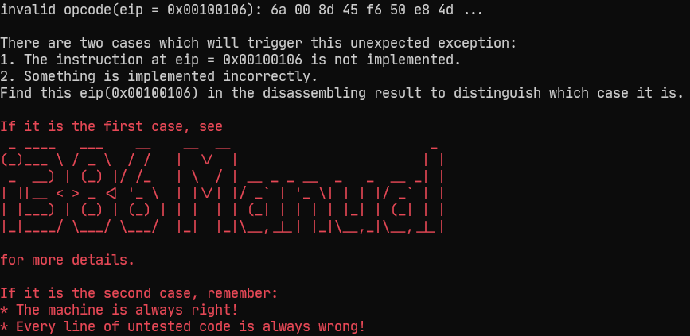

0x6a指令未完成，查看指令表，发现是PUSH指令。

#### push Ib 指令

因为是PUSH Ib，所以填写操作码表，0x68也是这个指令，一起补上：

```c
/* 0x68 */    IDEX(push_SI, push), EMPTY, IDEXW(push_SI, push, 1), EMPTY,
```

这里不能用`IDEX(I, push)`，译码函数应该是有符号数，不然后面coremark跑分测试会报错，保存后再次编译程序：

```
clear && cd ~/ics2022/nexus-am/tests/cputest && make clean && make ARCH=x86-nemu ALL=bit run
```

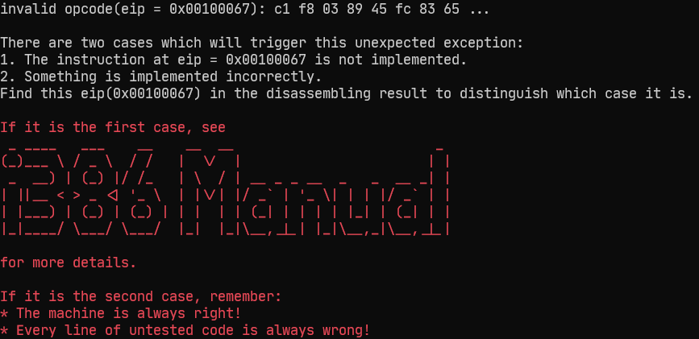

成功执行push指令

#### sar shl shr 指令

0xc1指令通过查表发现是Shift Grp2，查看汇编代码，发现是sar指令。在第二个指令组，sar是第八个，shl，shr在第二个指令组的第六七个，填写操作码表：

```c
/* 0xc0, 0xc1, 0xd0, 0xd1, 0xd2, 0xd3 */
make_group(gp2,
    EMPTY, EMPTY, EMPTY, EMPTY,
    EMPTY, EX(shl), EX(shr), EX(sar))
```

在/src/cpu/exec/logic.c中，补全sar执行代码：

```c
make_EHelper(sar) {
    rtl_sar(&t1, &id_dest->val, &id_src->val);
    operand_write(id_dest, &t1);
    rtl_update_ZFSF(&t1,id_dest->width);
    // unnecessary to update CF and OF in NEMU
    print_asm_template2(sar);
}
```

在/src/cpu/exec/logic.c，仿照sar，补全 shl 执行函数：

```c
make_EHelper(shl) {
    rtl_shl(&t1, &id_dest->val, &id_src->val);
    operand_write(id_dest, &t1);
    rtl_update_ZFSF(&t1, id_dest->width);
    // unnecessary to update CF and OF in NEMU
    print_asm_template2(shl);
}
```

补全执行函数，可以仿照shl函数：

```c
make_EHelper(shr) {
    rtl_shr(&t1, &id_dest->val, &id_src->val);
    operand_write(id_dest, &t1);
    rtl_update_ZFSF(&t1, id_dest->width);

  // unnecessary to update CF and OF in NEMU

  print_asm_template2(shr);
}
```

在`src/cpu/exec/all-instr.h`加上函数声明，保存后再次编译程序：

```bash
clear && cd ~/ics2022/nexus-am/tests/cputest && make clean && make ARCH=x86-nemu ALL=bit run
```

成功执行shl指令。

#### cltd 指令

编译goldbach.c文件：

```bash
clear && cd ~/ics2022/nexus-am/tests/cputest && make clean && make ARCH=x86-nemu ALL=goldbach run
```

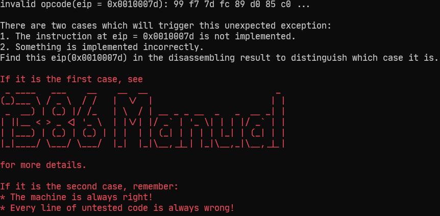

0x99指令没有实现，查看汇编代码，发现是 cltd 指令。

填写操作码表：

```c
  /* 0x98 */    EX(cwtl), EX(cltd), EMPTY, EMPTY,
```

完成执行函数：

```c
make_EHelper(cltd) {
    if (decoding.is_operand_size_16) {
        rtl_lr_w(&t0, R_AX); // 取出 AX 放到t0里
        rtl_sext(&t0, &t0, 2); // 字扩展
        rtl_sari(&t0, &t0, 16); // 右移16位
        rtl_sr_w(R_DX, &t0); // 把高16位放到DX里
    } else {
        rtl_lr_l(&t0, R_EAX);
        rtl_sari(&t0, &t0, 31);
        rtl_sr_l(R_EDX, &t0);
    }
    print_asm(decoding.is_operand_size_16 ? "cwtl" : "cltd");
}

make_EHelper(cwtl) {
  if (decoding.is_operand_size_16) {
      rtl_lr_b(&t0, R_AL); // 取出 AL 放到t0里
      rtl_sext(&t0, &t0, 1);
      rtl_sr_w(R_AX, &t0); // 不能使用 reg_w(R_AX) = t0; 否则coremark跑分时打开diff-test会出问题
  }
  else {
      rtl_lr_w(&t0, R_AX); // 取出 AX 放到t0里
      rtl_sext(&t0, &t0, 2);
      rtl_sr_l(R_EAX, &t0); // 不能使用 reg_l(R_EAX) = t0; 否则coremark跑分时打开diff-test会出问题
  }

  print_asm(decoding.is_operand_size_16 ? "cbtw" : "cwtl");
}
```

在`src/cpu/exec/all-instr.h`加上函数声明，保存后再次编译程序：

```bash
clear && cd ~/ics2022/nexus-am/tests/cputest && make clean && make ARCH=x86-nemu ALL=goldbach run
```

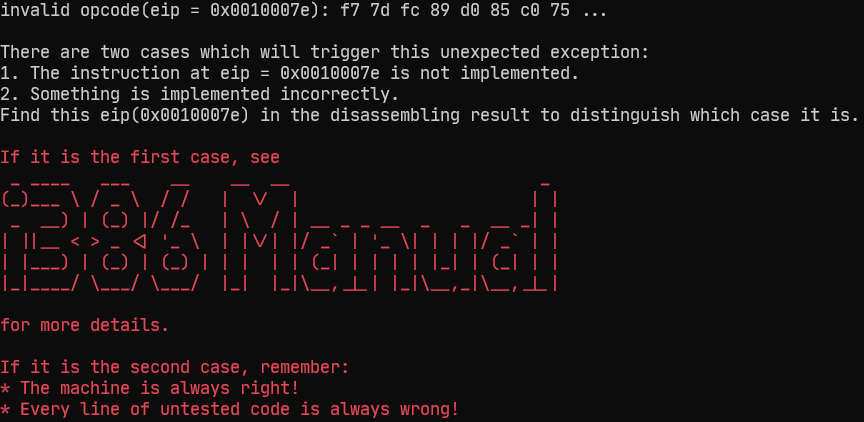

#### not idiv div mul 指令

查表可得第三个指令组的第三条指令是NOT，mul div idiv在第三个指令组的第5，7，8个指令，补全操作码表：

```c
 /* 0xf6, 0xf7 */
make_group(gp3,
    EMPTY, EMPTY, EX(not), EMPTY,
    EX(mul), EMPTY, EX(div), EX(idiv))
```

- idiv div mul 已经实现，直接填表

在/src/cpu/exec/logic.c补全执行函数：

```c
make_EHelper(not) {
    rtl_mv(&t0, &id_dest->val);
    rtl_not(&t0);
    operand_write(id_dest, &t0);
    print_asm_template1(not);
}
```

在`src/cpu/exec/all-instr.h`加上函数声明，保存后再次运行测试程序：

```bash
cd ~/ics2022/nemu/ && ./runall.sh
```

goldbach.c通过测试。

#### inc 指令

编译`bubble-sort.c`程序：

```bash
clear && cd ~/ics2022/nexus-am/tests/cputest && make clean && make ARCH=x86-nemu ALL=bubble-sort run
```

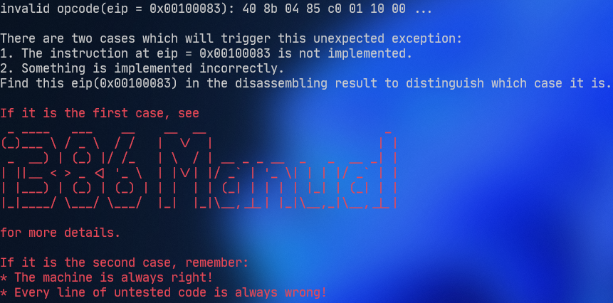

inc的执行函数已经在`src/cpu/exec/arith.c`里实现，直接填表，顺便把dec也给填上：

```c
/* 0x40 */    IDEX(r, inc), IDEX(r, inc), IDEX(r, inc), IDEX(r, inc),
/* 0x44 */    IDEX(r, inc), IDEX(r, inc), IDEX(r, inc), IDEX(r, inc),
/* 0x48 */    IDEX(r, dec), IDEX(r, dec), IDEX(r, dec), IDEX(r, dec),
/* 0x4c */    IDEX(r, dec), IDEX(r, dec), IDEX(r, dec), IDEX(r, dec),
```

在`src/cpu/exec/all-instr.h`加上函数声明，保存后再次运行测试程序：

```bash
cd ~/ics2022/nemu/ && ./runall.sh
```

`bubble-sort.c`运行成功。

#### imul 指令

编译`fact.c`：

```bash
clear && cd ~/ics2022/nexus-am/tests/cputest && make clean && make ARCH=x86-nemu ALL=fact run
```

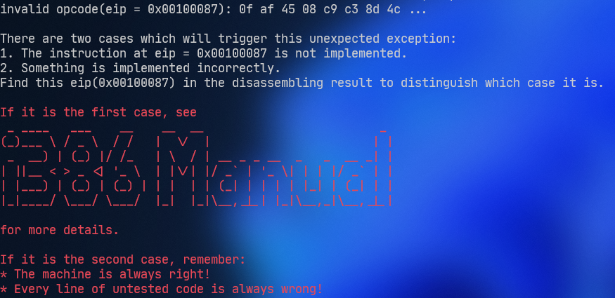

发现是个双字节操作码，0xaf是imul指令，因为有两个操作数，所以用imul2，补全操作码表：

```c
 /* 0xac */    EMPTY, EMPTY, EMPTY, IDEX(E2G, imul2),
```

在`src/cpu/exec/all-instr.h`加上函数声明，保存后再次运行测试程序：

```bash
cd ~/ics2022/nemu/ && ./runall.sh
```

`fact.c`通过测试。

#### MOVSX 指令

编译hello-str.c程序：

```bash
clear && cd ~/ics2022/nexus-am/tests/cputest && make clean && make ARCH=x86-nemu ALL=hello-str run
```

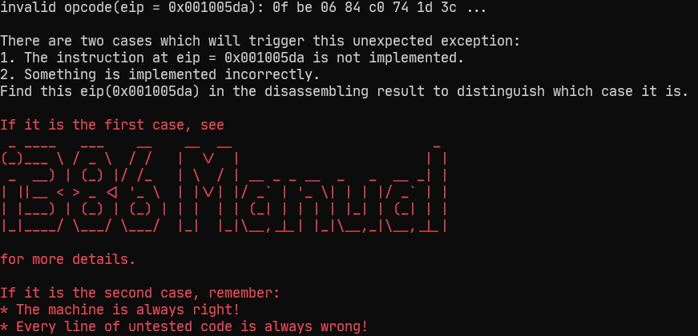

是一个双字节操作码：0xbe 是 MOVSX 指令。补全操作码表：

```c
/* 0xbc */    EMPTY, EMPTY, IDEXW(E2G, movsx, 1), IDEXW(E2G, movsx, 2),
```

`E2G`和`mov_E2G`都可以，执行函数在`src/cpu/exec/data-mov.c`里面已经完成，在`src/cpu/exec/all-instr.h`加上函数声明，保存后编译程序：

```bash
clear && cd ~/ics2022/nexus-am/tests/cputest && make clean && make ARCH=x86-nemu ALL=hello-str run
```

#### jmp_rm call_rm指令

查看汇编代码：

```
10062f:       ff 24 95 a8 08 10 00    jmp    *0x1008a8(,%edx,4)
```

在`src/cpu/exec/control.c`中找到`jmp_rm`，他的执行函数最后一句打印汇编出现了`*`号，所以可以确定这条jmp应该用`jmp_rm`执行，补全操作码表：

```c
  /* 0xff */
 make_group(gp5,
     EX(inc), EX(dec), EX(call_rm), EMPTY,
     EX(jmp_rm), EMPTY, EX(push), EMPTY)
```

补全`call_rm`的执行函数：

```c
make_EHelper(call_rm) {
  decoding.is_jmp = 1;
  decoding.jmp_eip = id_dest->val;
  rtl_push(eip);
  print_asm("call *%s", id_dest->str);
}
```

在`src/cpu/exec/all-instr.h`加上函数声明，保存后再次运行测试程序：

```bash
cd ~/ics2022/nemu/ && ./runall.sh
```

成功运行hello-str。

#### imul1 指令

再次编译程序：

```bash
clear && cd ~/ics2022/nexus-am/tests/cputest && make clean && make ARCH=x86-nemu ALL=recursion run
```

发现imul指令没有完成，补全操作码表：

```c
  /* 0xf6, 0xf7 */
make_group(gp3,
    EMPTY, EMPTY, EX(not), EMPTY,
    EX(mul), EX(imul1), EX(div), EX(idiv))
```

在`src/cpu/exec/all-instr.h`加上函数声明，保存后再次编译程序：

```bash
clear && cd ~/ics2022/nexus-am/tests/cputest && make clean && make ARCH=x86-nemu ALL=recursion run
```

### 通过⼀键回归测试（5 分）

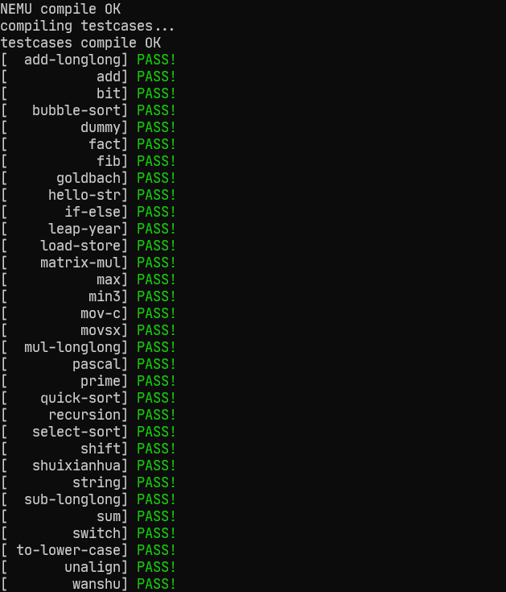

### IN/OUT 指令（10 分）

在`src/cpu/exec/system.c`里补全指令：

```c
make_EHelper(in) {
  t1 = pio_read(id_src->val, id_dest->width);
  operand_write(id_dest, &t1);
  print_asm_template2(in);

#ifdef DIFF_TEST
  diff_test_skip_qemu();
#endif
}

make_EHelper(out) {
  pio_write(id_dest->val, id_dest->width, id_src->val);
  print_asm_template2(out);

#ifdef DIFF_TEST
  diff_test_skip_qemu();
#endif
}
```

补全操作码表：

```c
 /* 0xe4 */	IDEXW(in_I2a, in, 1), IDEX(in_I2a, in), IDEXW(out_a2I, out, 1), IDEX(out_a2I, out),
 /* 0xec */ IDEXW(in_dx2a, in, 1), IDEX(in_dx2a, in), IDEXW(out_a2dx, out, 1), IDEX(out_a2dx, out),
```

在`src/cpu/exec/all-instr.h`加上函数声明，在 `nexus-am/am/arch/x86-nemu/src/trm.c` 中定义宏 `HAS_SERIAL`，保存后编译hello程序：

```bash
clear && cd ~/ics2022/nexus-am/apps/hello && make clean && make run
```

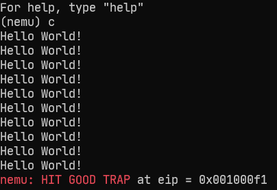

成功输出10行`Hello World!`。

### 实现时钟设备（10 分）

#### 实现 _uptime() 函数

在`nexus-am/am/arch/x86-nemu/src/ioe.c`里补全_uptime()函数：

```c
unsigned long _uptime() {
  return inl(RTC_PORT) - boot_time;
}
```

在`src/cpu/exec/all-instr.h`加上函数声明，保存后再次编译程序：

```bash
clear && cd ~/ics2022/nexus-am/tests/timetest && make clean && make run
```

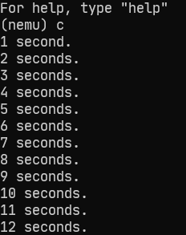

### 运⾏跑分项⽬（10 分）

注释掉 `nemu/include/common.h` 中的 `DEBUG` 和 `DIFF_TEST`宏。修改`src/monitor/cpu-exec.c`：

```diff
void cpu_exec(uint64_t n) {
  if (nemu_state == NEMU_END) {
    printf("Program execution has ended. To restart the program, exit NEMU and run again.\n");
    return;
  }
  nemu_state = NEMU_RUNNING;

  bool print_flag = n < MAX_INSTR_TO_PRINT;

  for (; n > 0; n --) {
+ #ifdef DEBUG
    uint32_t old_eip = cpu.eip;
+ #endif
    /* Execute one instruction, including instruction fetch,
     * instruction decode, and the actual execution. */
    exec_wrapper(print_flag);

#ifdef DEBUG
    /* TODO: check watchpoints here. */
    WP* hit = scan_watchpoint(old_eip);
    if (hit) nemu_state = NEMU_STOP;

#endif

#ifdef HAS_IOE
    extern void device_update();
    device_update();
#endif

    if (nemu_state != NEMU_RUNNING) { return; }
  }

  if (nemu_state == NEMU_RUNNING) { nemu_state = NEMU_STOP; }
}
```

因为把`DEBUG`关了，`old_eip`就不会被用到，编译会出错。

#### 运行dhrystone

```bash
clear && cd ~/ics2022/nexus-am/apps/dhrystone && make clean && make run
```

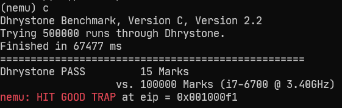

#### 运行coremark

```bash
clear && cd ~/ics2022/nexus-am/apps/coremark && make clean && make run
```

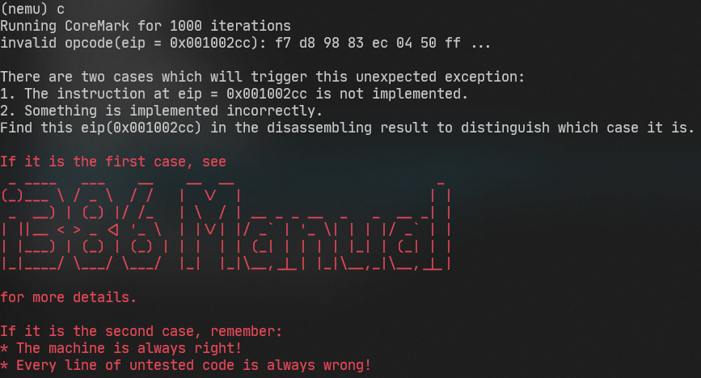

发现neg指令没有实现，`src/cpu/exec/arith.c`执行函数：

```c
make_EHelper(neg) {
    if(!id_dest->val) // 操作数为零
        rtl_set_CF(&tzero);
    else{
        t0 = 1;
        rtl_set_CF(&t0);
    }
    t0= -id_dest->val; // 取反
    operand_write(id_dest, &t0);

    // 更新ZF,SF标志位
    rtl_update_ZFSF(&t3, id_dest->width);

    // 更新OF标志位
    rtl_xor(&t1, &id_dest->val, &id_src->val);
    rtl_xor(&t2, &id_dest->val, &t3);
    rtl_and(&t0, &t1, &t2);
    rtl_msb(&t0, &t0, id_dest->width);
    rtl_set_OF(&t0);
    print_asm_template1(neg);
}
```

补全操作码表：

```c
  /* 0xf6, 0xf7 */
make_group(gp3,
    EMPTY, EMPTY, EX(not), EX(neg),
    EX(mul), EX(imul1), EX(div), EX(idiv))
```

在`src/cpu/exec/control.c`中写入`iret`指令：

```c
make_EHelper(reti) {
  rtl_pop(&decoding.jmp_eip);
  decoding.is_jmp = 1;
  cpu.esp += id_dest->val;
  print_asm("ret");
}
```

填写操作码表：

```c
/* 0xc0 */    IDEXW(gp2_Ib2E, gp2, 1), IDEX(gp2_Ib2E, gp2), IDEXW(I, reti, 2), EX(ret),
```

在`src/cpu/exec/all-instr.h`加上函数声明，保存后再次编译程序：

```bash
clear && cd ~/ics2022/nexus-am/apps/coremark && make clean && make run
```

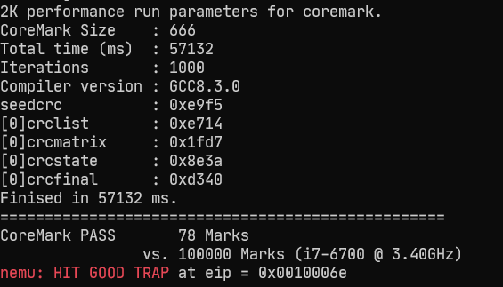

#### 运行microbench

补全rol指令执行函数：

```c
make_EHelper(rol) {
  for(t0 = 0;t0 < id_src->val; t0++)
  {
    rtl_msb(&t1,&id_dest->val,id_dest->width);
    rtl_shli(&id_dest->val,&id_dest->val,1);
    rtl_xor(&id_dest->val,&id_dest->val,&t1);
  }
  rtl_set_CF(&t1);
  operand_write(id_dest,&id_dest->val);

  print_asm_template2(rol);
}
```

填写操作码表：

```c
  /* 0xc0, 0xc1, 0xd0, 0xd1, 0xd2, 0xd3 */
 make_group(gp2,
    EX(rol), EMPTY, EMPTY, EMPTY,
    EX(shl), EX(shr), EMPTY, EX(sar))
```

在`src/cpu/exec/all-instr.h`加上函数声明，保存后再次编译程序：

```bash
clear && cd ~/ics2022/nexus-am/apps/microbench && make clean && make run
```

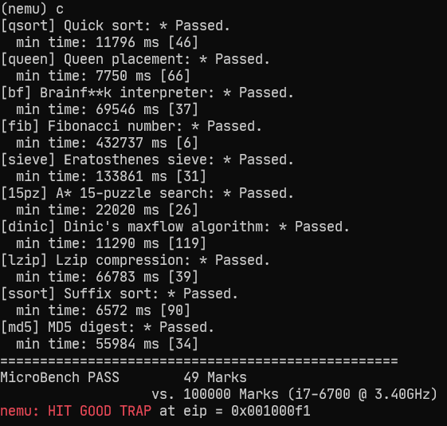

### 实现键盘设备（10 分）

在nexus-am/am/arch/x86-nemu/src/ioe.c实现 _read_key() 函数：

```c
#define I8042_DATA_PORT 0x60
#define I8042_STATUS_PORT 0x64
int _read_key() {
  if (inb(I8042_STATUS_PORT) == 1) {
    return inl(I8042_DATA_PORT);
  }
  return _KEY_NONE;
}
```

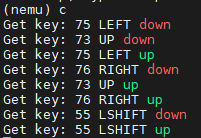

### 添加内存映射 I/O （10 分）

修改`nemu/src/memory/memory.c`的`paddr_read()`和`paddr_write()`函数.

```c
#include "device/mmio.h"

uint32_t paddr_read(paddr_t addr, int len) {
  int mmio_id = is_mmio(addr);
    if (mmio_id != -1) {
    return mmio_read(addr, len, mmio_id);
  }
  return pmem_rw(addr, uint32_t) & (~0u >> ((4 - len) << 3));
}

void paddr_write(paddr_t addr, int len, uint32_t data) {
  int mmio_id = is_mmio(addr);
  if (mmio_id != -1) {
    mmio_write(addr, len, data, mmio_id);
  }
  else {
    memcpy(guest_to_host(addr), &data, len);
  }
}
```

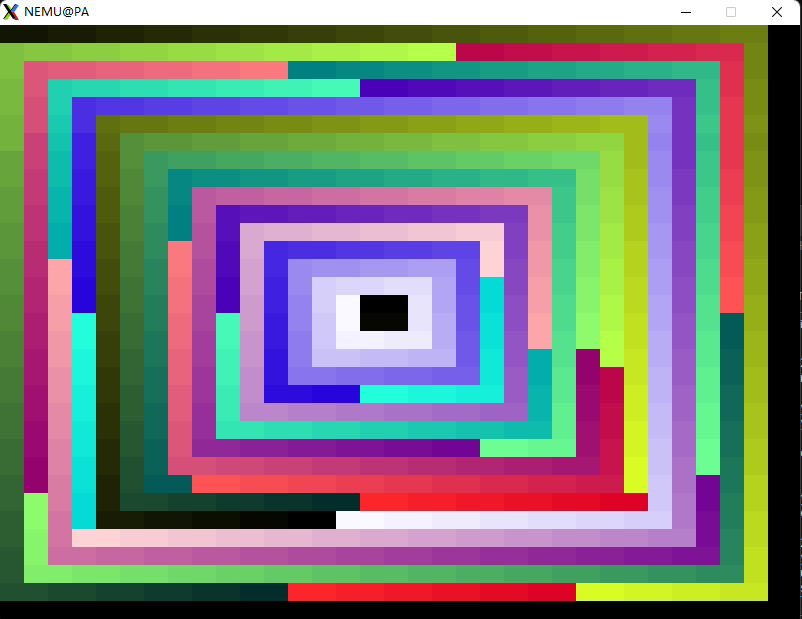

### 运⾏打字⼩游戏（5 分）

运行命令：

```bash
cd ~/ics2022/nexus-am/apps/typing && make clean && make run
```


# References

[PA2.2&PA2.3-物联网技术文章-傲云电气网 (weixiuzhan.cn)](https://www.weixiuzhan.cn/news/show-14913.html)

[PA2.2 PA2.3_qq_42093390的博客-CSDN博客](https://blog.csdn.net/qq_42093390/article/details/89465167)

[2.3 输入输出 · GitBook (gitee.io)](https://zhong-kangwei.gitee.io/ics-pa-gitbook-2022/pa2/2.3.html)

https://github.com/hitworld/NUAA_PA

