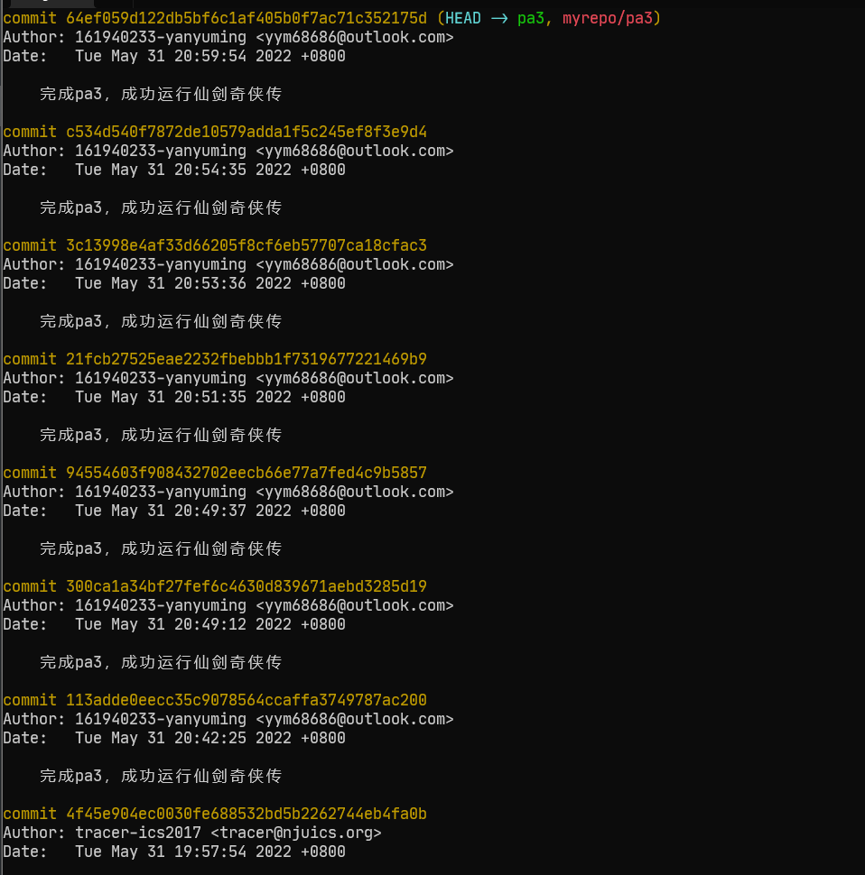
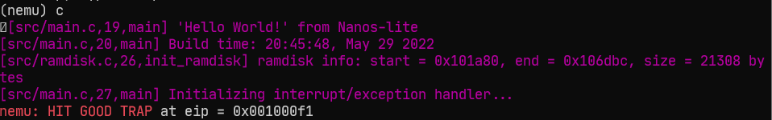
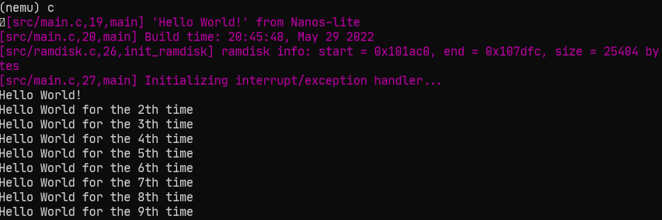
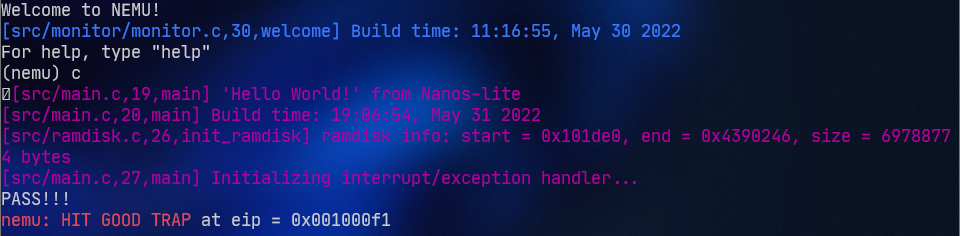
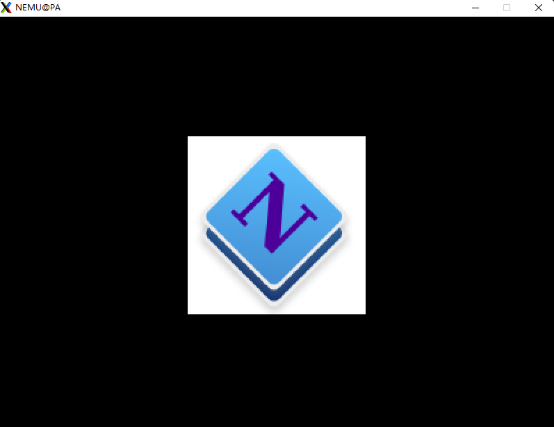

# 南京航空航天大学《计算机组成原理Ⅱ课程设计》报告

* 姓名：颜宇明
* 班级：1819001
* 学号：161940233
* 报告阶段：PA3.1
* 完成日期：2022.5.31
* 本次实验，我完成了所有内容。 

**目录**

[TOC]

# 思考题

## 1. 什么是操作系统？（5）

这可是个大问题，你可以就自己的最初印象简单谈一谈。我们也鼓励你学习完操作系统课程之后再回来重新审视这个问题。

- 操作系统是自动运行程序的软件，负责分配系统资源，让程序有序运行

## 2. 我们不⼀样，吗？（5）

我们在 PA2 中对 cputest 和部分设备测试的程序直接运行在 AM 之上，那么和 `Nanos-lite 是运行在 AM 之上的` 有什么差距呢？我们可以把 Nanos-lite 看作一个和 PA2 中这些测试用例同等地位的一个 AM 程序吗？

- 没有
- 可以

## 3. 操作系统的实质（5）

我们把 PA2 中运行的这些测试用例的运行方式称作“直接运行在硬件上的用户程序”，经过上个思考题的思考，请你总结一下操作系统的实质：操作系统就是一个较为大型的( )，它和直接运行在硬件上的程序( )(有/无)实质差别。

- 操作系统就是一个较为大型的软件
- 它和直接运行在硬件上的程序无实质差别

## 4. 程序真的结束了吗？（10）

我们曾经问过这样一个问题：程序设计课上老师说程序运行到 `main()` 函数的 `return 0;`语句，程序就结束了，是真的吗？现在再回想一下，当时自己的回答是否正确。程序在进入 main 函数前和退出 main 函数后，都做了什么工作？如果你还不能理解，请结合 `_start()` 及其中调用过的函数或过程再思考一下。

main函数执行之前，主要就是初始化系统相关资源：

1. 设置栈指针
2. 初始化static静态和global全局变量，即data段的内容
3. 将未初始化部分的赋初值：数值型short，int，long等为0，bool为FALSE，指针为NULL，等等，即.bss段的内容
4. 运行全局构造器，C++中构造函数
5. 将main函数的参数，argc，argv等传递给main函数，然后才真正运行main函数

main 函数之后会执行相反的工作。

## 5. 触发系统调⽤（10）

请你参考上述内容，通过直接调用系统调用触发一次写屏幕操作。

编写代码：

```c
const char str[] = "Hello world!\n";

int main() {
  asm volatile ("movl $4, %eax;"      // system call ID, 4 = SYS_write
                "movl $1, %ebx;"      // file descriptor, 1 = stdout
                "movl $str, %ecx;"    // buffer address
                "movl $13, %edx;"      // length
                "int $0x80");

  return 0;
}
```

编译运行：

```bash
[ics2022] gcc 1.c -o 1
[ics2022] ./1
Hello world!
```

## 6. 有什么不同？（5）

我们发现，系统调用会根据系统调用号在 IDT 中索引，取得该调用号对应的系统调用服务程序的地址，并跳转过去。在触发系统调用前，会保护用户相关状态寄存器（EFLAGS, EIP等）到栈中，系统调用完毕后再恢复，这和我们所学过的什么的过程非常相似？我们可以将系统调用的服务程序理解为一个比较特殊的“函数”吗？请说明理由。这个“服务程序”和我们的“用户编写的函数”有什么不同？

- 跟函数调用过程类似
- 可以。
- 权限不一样

## 7. 段错误（10）

我们在 GNU/Linux 下编写了带有 bug 的程序，虽然能通过编译，但在运行时却遇到了“Segmentation Fault”（段错误），为什么在编译阶段不能发现这些潜在的段错误呢？段错误通常是由哪些程序行为引起的？

- 访问越界不属于语法错误
- 可能是数组越界引起的，使用了不安全的函数(`gets`)导致的或者野指针的使用

## 8. 对⽐异常与函数调⽤（5）

我们知道进行函数调用的时候也需要保存调用者的状态：返回地址，以及调用约定（calling convention）中需要调用者保存的寄存器。而进行异常处理之前却要保存更多的信息。尝试对比它们，并思考两者保存信息不同是什么原因造成的。

- 异常处理是因为发生了错误，有可能需要重新执行命令，需要保留更多的信息
- 而函数调用是程序正常的执行过程

## 9. 诡异的代码（5）

`trap.S` 中有一行 `pushl %esp` 的代码，乍看之下其行为十分诡异。你能结合前后的代码理解它的行为吗？**Hint:** 不用想太多，其实都是你学过的知识。

- 保留栈顶，以便于函数调用完之后，恢复栈顶

## 10. 注意区分事件号和系统调⽤号（5）

事件号和系统调用号有什么区别？

- 事件号是异常中断的号码
- 系统调用号是当事件号为`80`触发系统调用时`eax`寄存器的值

## 11. 打印不出来？（5）

请你在输入上述程序时，务必不要出现任何手误，确保是原样输入（当然，你无需输入注释内容），否则你将有可能意外地不会出现此处的段错误。请你结合讲义内容和自己的实验，尝试找出解决方案，并解释其中的原因。

修改：

```diff
#include <stdio.h>
int main(){
    int *p = NULL;
-    printf("I am here!");
+    printf("I am here!\n");
    *p = 10; // giving value to a NULL address will cause segmentation fault
    return 0;
}
```

或者使用`fflush(stdout)`：

```diff
#include <stdio.h>
int main(){
    int *p = NULL;
    printf("I am here!");
+    fflush(stdout);
    *p = 10; // giving value to a NULL address will cause segmentation fault
    return 0;
}
```

编译运行：

```bash
[ics2022] gcc 1.c -o 1
[ics2022] ./1
I am here!
[1]    4032 segmentation fault  ./1
```

原因：

printf调用的stdout是按行缓冲的，加个换行符就可以将当前缓冲区先输出，后面遇到错误再说。`fflush(stdout)`也是一样的效果。

## 12. 理解⽂件管理函数（15）

方便起见，我们在更新后的框架代码中替大家实现了几个文件管理函数。那么，请你参考这些 `fs_` 开头的函数，思考一下它们是如何编写出来的

利用

```bash
:vim /fs_close(/ ~/ics2022/** | copen
```

找到这么函数都在`nanos-lite/src/fs.c`内，例如：

```c
ssize_t fs_read(int fd, void *buf, size_t len) {
  assert(fd > 2);
  if (fd == FD_EVENTS) {
    return events_read(buf, len);
  }

  Finfo *f = file_table + fd;
  int remain_bytes = f->size - f->open_offset;
  int bytes_to_read = (remain_bytes > len ? len : remain_bytes);

  if (fd == FD_DISPINFO) {
    dispinfo_read(buf, f->disk_offset + f->open_offset, bytes_to_read);
  }
  else {
    ramdisk_read(buf, f->disk_offset + f->open_offset, bytes_to_read);
  }
  f->open_offset += bytes_to_read;
  return bytes_to_read;
}
```

- `fs_open()`用文件名参数到文件描述符表中匹配并返回下标,没找到则报错
- `fs_read()`通过`fd`参数获取文件偏移和长度,再从`ramdisk`或`dispinfo`中读取数据到`buf`中
- `fs_write()`通过`fd`选择写方式.若是文件写,则计算偏移和读取长度进行文件读写
- `fs_lseek()`通过`whence`选择移动文件偏移的方式,然后将新的偏移赋给对应文件描述符
- `fs_close()`直接返回`0`,因为不需要`close`

## 13. 不再神秘的秘技（5）

网上流传着一些关于仙剑奇侠传的秘技，其中的若干条秘技如下：

1. 很多人到了云姨那里都会去拿三次钱，其实拿一次就会让钱箱爆满！你拿了一次钱就去买剑把钱用到只剩一千多，然后去道士那里，先不要上楼，去掌柜那里买酒，多买几次你就会发现钱用不完了。
2. 不断使用乾坤一掷（钱必须多于五千文）用到财产低于五千文，钱会暴增到上限，如此一来就有用不完的钱了。
3. 当李逍遥等级到达 99 级时，用 5~10 只金蚕王，经验点又跑出来了，而且升级所需经验会变回初期 5~10 级内的经验值，然后去打敌人或用金蚕王升级，可以学到灵儿的法术（从五气朝元开始）；升到 199 级后再用 5~10 只金蚕王，经验点再跑出来，所需升级经验也是很低，可以学到月如的法术（从一阳指开始）；到 299 级后再用 10~30 只金蚕王，经验点出来后继续升级，可学到阿奴的法术（从万蚁蚀象开始）。

假设这些上述这些秘技并非游戏制作人员的本意，请尝试解释这些秘技为什么能生效。

- 游戏bug，可能条件判断并不缜密

## 14. 必答题（5）

文件读写的具体过程 仙剑奇侠传中有以下行为：

- 在 `navy-apps/apps/pal/src/global/global.c` 的 `PAL_LoadGame()` 中通过 `fread()` 读取游戏存档
- 在 `navy-apps/apps/pal/src/hal/hal.c` 的 `redraw()` 中通过 `NDL_DrawRect()` 更新屏幕

请结合代码解释仙剑奇侠传、库函数、libos、Nanos-lite、AM、NEMU 是如何相互协助，来分别完成游戏存档的读取和屏幕的更新。

- 编译后的程序被保存在`ramdisk`文件中
- `make run`先运行`nemu`，然后在`nemu`上运行`Nanos-lite`
- `Nanos-lite`的`main`函数中使用`loader`加载位于`ramdisk`存储区(实际存在与内存中)的`/bin/pal`程序
- `loader`函数从`ramdisk`文件(磁盘)中读取程序到内存区，进行一些初始化操作后，便将控制转到仙剑的`main`入口函数
- 仙剑程序调用库函数和`Nanos-lite`中自定义的库函数完成程序的运行，包括文件的读写和`UI`的显示等等.

## 15. `git log`和`git branch`截图（5）



# 实验内容

实验前：

```bash
git    commit --allow-empty -am "before starting pa3" 
git    checkout -b pa3
```

打开本实验所有涉及到的文件：

```bash
cd ~/ics2022 && vim -p nanos-lite/src/syscall.c nemu/src/cpu/exec/exec.c nemu/src/cpu/exec/all-instr.h nemu/src/cpu/exec/data-mov.c nanos-lite/src/irq.c nemu/src/cpu/exec/system.c nexus-am/am/arch/x86-nemu/include/arch.h navy-apps/libs/libos/src/nanos.c nexus-am/am/arch/x86-nemu/src/trap.S nemu/src/cpu/intr.c nanos-lite/src/main.c nemu/src/monitor/monitor.c nemu/include/cpu/reg.h nanos-lite/src/ramdisk.c nanos-lite/src/loader.c nemu/include/common.h
```


## 实现 loader（10分）

在 `nanos-lite/src/main.c` 中定义宏 `HAS_ASYE`，`loader()` 函数在 `nanos-lite/src/loader.c` 中定义，打开文件：

```bash
vim ~/ics2022/nanos-lite/src/loader.c
```

`ramdisk_read`和获取`ramdisk`长度的`get_ramdisk_size`函数都在`~/ics2022/nanos-lite/src/ramdisk.c`定义。根据讲义ramdisk_read第一个参数为`DEFAULT_ENTRY`，第二个参数偏移量为 0，第三个参数是`ramdisk`的大小，可以用`get_ramdisk_size`函数获取，完成loader函数：

```c
uintptr_t loader(_Protect *as, const char *filename) {
    ramdisk_read(DEFAULT_ENTRY, 0, get_ramdisk_size());
    return (uintptr_t)DEFAULT_ENTRY;
}
```

声明外部函数：

```c
void ramdisk_read(void *, uint32_t, uint32_t);
size_t get_ramdisk_size();
```

编译navy-apps/tests/dummy/dummy.c：

```bash
cd ~/ics2022/navy-apps/tests/dummy/ && make
```

编译 Newlib 时会出现较多 warning，我们可以忽略它们。在 NEMU 上运行带有最新版 ramdisk 的 Nanos-lite：

```bash
cd ~/ics2022/nanos-lite/ && make update && make run
```

按c运行后，发现：

```
invalid opcode(eip = 0x04001ec0): cd 80 5b 5d c3 66 90 90 ...

There are two cases which will trigger this unexpected exception:
1. The instruction at eip = 0x04001ec0 is not implemented.
2. Something is implemented incorrectly.
Find this eip(0x04001ec0) in the disassembling result to distinguish which case it is.

If it is the first case, see
 _ ____   ___    __    __  __                         _
(_)___ \ / _ \  / /   |  \/  |                       | |
 _  __) | (_) |/ /_   | \  / | __ _ _ __  _   _  __ _| |
| ||__ < > _ <| '_ \  | |\/| |/ _` | '_ \| | | |/ _` | |
| |___) | (_) | (_) | | |  | | (_| | | | | |_| | (_| | |
|_|____/ \___/ \___/  |_|  |_|\__,_|_| |_|\__,_|\__,_|_|

for more details.

If it is the second case, remember:
* The machine is always right!
* Every line of untested code is always wrong!
```

0xcd是`int Ib`指令，这说明 loader 已经成功加载 dummy，并且成功地跳转到 dummy 中执行了。与讲义说明一致。

## 添加寄存器和 LIDT 指令（10 分）

i386提供 `int` 指令作为异常指令，整个过程是由 i386 中断机制支撑的，上述跳转目标是通过门描述符（Gate Descriptor）来指示的。门描述符是一个 8 字节的结构体，里面包含着不少细节的信息。i386 把内存中的某一段数据专门解释成一个数组，叫 IDT(Interrupt Descriptor Table, 中断描述符表)，数组的一个元素就是一个门描述符。

为了在内存中找到 IDT，i386 使用 IDTR 寄存器来存放 IDT 的首地址和长度。操作系统的代码事先把 IDT 准备好，然后执行一条特殊的指令 `lidt`(Load Interrupt Descriptor Table)，来在 IDTR 中设置好 IDT 的首地址和长度，这一中断处理机制就可以正常工作了。

- 根据 i386 ⼿册正确添加 IDTR 和 CS 寄存器

IDTR 寄存器的格式可以参考 i386 手册中的第 156 页，其中LIMIT 16位，BASE 32位。i386手册第159页Figure 9-5，提示CS寄存器是16位，所以在`~/ics2022/nemu/include/cpu/reg.h`中增加以下行：

```diff
typedef struct {
   union{
       struct {
         union{
             uint32_t _32;
             uint16_t _16;
             uint8_t _8[2];
         };
       } gpr[8];
       struct {
           rtlreg_t eax, ecx, edx, ebx, esp, ebp, esi, edi;
       };
   };

   /* Do NOT change the order of the GPRs' definitions. */

   /* In NEMU, rtlreg_t is exactly uint32_t. This makes RTL instructions
    * in PA2 able to directly access these registers.
    */
     union {
         struct{
             uint32_t CF : 1;
             uint32_t    : 5;
             uint32_t ZF : 1;
             uint32_t SF : 1;
             uint32_t    : 1;
             uint32_t IF : 1;
             uint32_t    : 1;
             uint32_t OF : 1;
             uint32_t    : 20;
         };
         rtlreg_t value;
     } eflags;
     vaddr_t eip;

+     struct {
+         uint32_t base;  // 32位base
+         uint16_t limit; // 16位limit
+     }idtr;
+     uint16_t cs;
 } CPU_state;
```

然后在 `nanos-lite/src/main.c` 中定义宏 `HAS_ASYE`。

- 在 restart() 中正确设置寄存器初始值

在`ics2022/nemu/src/monitor/monitor.c`修改`restart()`函数：

```c
static inline void restart() {
  /* Set the initial instruction pointer. */
  cpu.eip = ENTRY_START;
  cpu.eflags.value = 0x2;
  cpu.cs = 0x8;

#ifdef DIFF_TEST
  init_qemu_reg();
#endif
}
```

- LIDT 指令细节可在 i386 ⼿册中找到

i386手册第330页，LIDT指令伪代码：

```
IF instruction = LIDT
THEN
 IF OperandSize = 16
 THEN IDTR.Limit:Base ← m16:24 (* 24 bits of base loaded *)
 ELSE IDTR.Limit:Base ← m16:32
 FI;
ELSE (* instruction = LGDT *)
 IF OperandSize = 16
 THEN GDTR.Limit:Base ← m16:24 (* 24 bits of base loaded *)
 ELSE GDTR.Limit:Base ← m16:32;
 FI;
FI;
```

若`OperandSize`是16，则limit读取16位，表示IDT数组长度，base读取24位，表示IDT数组的起始地址，若`OperandSize`是32，则limit读取16位，base读取32位。通过 IDTR 中的地址对 IDT 进行索引的时候，需要使用 `vaddr_read()`，在`nemu/src/cpu/exec/system.c`填写`lidt`函数：

```c
make_EHelper(lidt) {
  cpu.idtr.limit = vaddr_read(id_dest->addr, 2);       //limit 16位
  if (decoding.is_operand_size_16)
      cpu.idtr.base = vaddr_read(id_dest->addr + 2, 3);//base 24位
  else
      cpu.idtr.base = vaddr_read(id_dest->addr + 2, 4);//base 32位
  print_asm_template1(lidt);
}
```

同时在第七个指令组找到LIDT指令，补全操作码表：

```c
 /* 0x0f 0x01*/
make_group(gp7,
    EMPTY, EMPTY, EMPTY, EX(lidt),
    EMPTY, EMPTY, EMPTY, EMPTY)
```

在`src/cpu/exec/all-instr.h`加上函数声明。

## 实现 INT 指令（10 分）

- 实现写在 raise_intr() 函数中

讲义中提到：触发异常后硬件的处理如下：

1. 依次将EFLAGS, CS(代码段寄存器), EIP寄存器的值压栈
2. 从IDTR中读出IDT的首地址
3. 根据异常号在IDT中进行索引, 找到一个门描述符
4. 将门描述符中的offset域组合成目标地址

在`nemu/src/cpu/intr.c`里补全`raise_intr`函数：

```c
void raise_intr(uint8_t NO, vaddr_t ret_addr) {
   /* TODO: Trigger an interrupt/exception with ``NO''.
    * That is, use ``NO'' to index the IDT.
    */

   //获取门描述符
   vaddr_t gate_addr = cpu.idtr.base + 8 * NO;

   //P位校验
   if (cpu.idtr.limit < 0) assert(0);

   //将eflags、cs、返回地址压栈
   t0 = cpu.cs; //cpu.cs 只有16位，需要转换成32位
   rtl_push(&cpu.eflags.value);
   rtl_push(&t0);
   rtl_push(&ret_addr);

   //组合中断处理程序入口点
   uint32_t high, low;
   low = vaddr_read(gate_addr, 4) & 0xffff;
   high = vaddr_read(gate_addr + 4, 4) & 0xffff0000;

   //设置eip跳转
   decoding.jmp_eip = high | low;
   decoding.is_jmp = true;
}
```

- 使⽤ INT 的 helper 函数调⽤ raise_intr()

```c
void raise_intr(uint8_t NO, vaddr_t ret_addr); // 补上声明
make_EHelper(int) {
  raise_intr(id_dest->val, decoding.seq_eip);
  print_asm("int %s", id_dest->str);

#ifdef DIFF_TEST
  diff_test_skip_nemu();
#endif
}
```

1. 跳转到目标地址

补全操作码表

```c
/* 0xcc */	EX(int3), IDEXW(I,int,1), EMPTY, EMPTY,
```

在`src/cpu/exec/all-instr.h`加上函数声明，保存后再次编译程序：

```bash
clear && cd ~/ics2022/nanos-lite/ && make update && make run
```

## 实现其他相关指令和结构体（15 分）

- 组织 _RegSet 结构体，需要说明理由

讲义中提到：触发异常后硬件处理第一步是依次将EFLAGS，CS(代码段寄存器)，EIP寄存器的值压栈，程序运行后会触发vecsys函数，`vecsys()` 会压入错误码和异常号 `#irq`，然后跳转到 `asm_trap()`。在 `asm_trap()` 中，代码将会把用户进程的通用寄存器保存到堆栈上。由此形成了 trap frame（陷阱帧）的数据结构。因此我们可以知道trap frame结构为：

```
            ┌────────────┐high address
            │    eflag   │ │
            ├────────────┤ │
┌───┐       │    cs      │ │
│EAX│\      ├────────────┤ │
├───┤ \     │    eip     │ │
│ECX│  \    ├────────────┤ │ Direction of stack growth
├───┤   \   │ error trap │ │
│EDX│    \  ├────────────┤ │
├───┤     \ │    irq     │ │
│EBX│      \├────────────┤ │
├───┤       │    gpr     │ ▼
│ESP│      /└────────────┘low address
├───┤     /
│EBP│    /
├───┤   /
│ESI│  /
├───┤ /
│EDI│/
└───┘
```

题目要求是：重新组织 `nexus-am/am/arch/x86-nemu/include/arch.h` 中定义的 `_RegSet` 结构体的成员，使得这些成员声明的顺序和 `nexus-am/am/arch/x86-nemu/src/trap.S` 中构造的 trap frame 保持一致。恢复寄存器的时候只要把顺序倒过来就行了，因为栈后进去的先出来，重新组织`_RegSet`结构体的成员：

```c
struct _RegSet {
  uintptr_t edi,esi,ebp,esp,ebx,edx,ecx,eax;
  int irq;
  uintptr_t error_code,eip,cs,eflags;
};
```

- pusha, popa, iret

在操作码表补全指令：

```c
/* 0x60 */    EX(pusha), EX(popa), EMPTY, EMPTY,
...
/* 0xcc */	EMPTY, IDEXW(I,int,1), EMPTY, EX(iret),
```

在i386手册第369，364页找到pusha，popa指令，根据伪代码在`nemu/src/cpu/exec/data-mov.c`补全执行函数：

```c
make_EHelper(pusha) {
    t0 = cpu.esp;
    if(decoding.is_operand_size_16) {
        rtl_lr_w(&t1, R_AX); rtl_push(&t1);
        rtl_lr_w(&t1, R_CX); rtl_push(&t1);
        rtl_lr_w(&t1, R_DX); rtl_push(&t1);
        rtl_lr_w(&t1, R_BX); rtl_push(&t1);
        rtl_push(&t0);
        rtl_lr_w(&t1, R_BP); rtl_push(&t1);
        rtl_lr_w(&t1, R_SI); rtl_push(&t1);
        rtl_lr_w(&t1, R_DI); rtl_push(&t1);
        
    }
    else {
        rtl_lr_l(&t1, R_EAX); rtl_push(&t1);
        rtl_lr_l(&t1, R_ECX); rtl_push(&t1);
        rtl_lr_l(&t1, R_EDX); rtl_push(&t1);
        rtl_lr_l(&t1, R_EBX); rtl_push(&t1);
        rtl_push(&t0);
        rtl_lr_l(&t1, R_EBP); rtl_push(&t1);
        rtl_lr_l(&t1, R_ESI); rtl_push(&t1);
        rtl_lr_l(&t1, R_EDI); rtl_push(&t1);
    }
    print_asm("pusha");
}

make_EHelper(popa) {
    if(decoding.is_operand_size_16) {
        rtl_pop(&t1); rtl_sr_w(R_DI, &t1);
        rtl_pop(&t1); rtl_sr_w(R_SI, &t1);
        rtl_pop(&t1); rtl_sr_w(R_BP, &t1);
        rtl_pop(&t1);
        rtl_pop(&t1); rtl_sr_w(R_BX, &t1);
        rtl_pop(&t1); rtl_sr_w(R_DX, &t1);
        rtl_pop(&t1); rtl_sr_w(R_CX, &t1);
        rtl_pop(&t1); rtl_sr_w(R_AX, &t1);
    }
    else {
        rtl_pop(&t1); rtl_sr_l(R_EDI, &t1);
        rtl_pop(&t1); rtl_sr_l(R_ESI, &t1);
        rtl_pop(&t1); rtl_sr_l(R_EBP, &t1);
        rtl_pop(&t1);
        rtl_pop(&t1); rtl_sr_l(R_EBX, &t1);
        rtl_pop(&t1); rtl_sr_l(R_EDX, &t1);
        rtl_pop(&t1); rtl_sr_l(R_ECX, &t1);
        rtl_pop(&t1); rtl_sr_l(R_EAX, &t1);
    }
    print_asm("popa");
}
```

根据i386手册第311页伪代码，`iret` 指令用于从异常处理过程中返回，它将栈顶的三个元素来依次解释成 EIP, CS, EFLAGS，并恢复它们。在`nemu/src/cpu/exec/system.c`补全iret函数：

```c
make_EHelper(iret) {
    rtl_pop(&decoding.jmp_eip);
    decoding.is_jmp = 1;
    rtl_pop(&t0);
    cpu.cs = (uint16_t)t0;
    rtl_pop(&cpu.eflags.value);
    print_asm("iret");
}
```

在`src/cpu/exec/all-instr.h`加上函数声明，保存后再次编译程序：

```bash
clear && cd ~/ics2022/navy-apps/tests/dummy/ && make && cd ~/ics2022/nanos-lite/ && make update && make run
```

按c后执行结果：

```c
(nemu) c
[src/main.c,19,main] 'Hello World!' from Nanos-lite
[src/main.c,20,main] Build time: 03:46:30, May 29 2022
[src/ramdisk.c,26,init_ramdisk] ramdisk info: start = 0x101980, end = 0x106cbc, size = 21308 bytes
[src/main.c,27,main] Initializing interrupt/exception handler...
[src/irq.c,5,do_event] system panic: Unhandled event ID = 8
nemu: HIT BAD TRAP at eip = 0x001000f1
```

如果出现n86 does not have PF，可能在 `nanos-lite/src/main.c` 中没打开宏定义 `HAS_ASYE`。最终正确实现的话运行结果应当是触发8号事件。

## 完善事件分发和 do_syscall（15 分）

- 完善 do_event，⽬前阶段仅需要识别出系统调⽤事件即可

讲义要求为：在 `do_event()` 中识别出 8 号系统调用事件 `_EVENT_SYSCALL`，然后调用 `do_syscall()`，`do_syscall()` 首先通过宏 `SYSCALL_ARG1()` 从现场 `r` 中获取用户进程之前设置好的系统调用参数，通过第一个参数（系统调用号）进行分发。查看`nanos-lite/src/syscall.c`中的`do_syscall`的定义：

```c
_RegSet* do_syscall(_RegSet *r) {
  uintptr_t a[4];
  a[0] = SYSCALL_ARG1(r);

  switch (a[0]) {
    default: panic("Unhandled syscall ID = %d", a[0]);
  }

  return NULL;
}
```

在`nanos-lite/src/irq.c`中完善`do_event`函数：

```c
_RegSet* do_syscall(_RegSet *r);
static _RegSet* do_event(_Event e, _RegSet* r) {
  switch (e.event) {
    case _EVENT_SYSCALL:
        do_syscall(r);
        break;
    default: panic("Unhandled event ID = %d", e.event);
  }

  return NULL;
}
```

- 添加整个阶段中的所有系统调⽤（none, exit, brk, open, write, read, lseek, close）

系统调用有两层处理，需要先通过switch-case识别出这是系统调用事件，再调用do_syscall函数识别出是哪个系统调用。x86_32系统调用通过中断`int 0x80`来实现，寄存器 eax 中存放系统调用号，同时系统调用返回值也存放在 eax 中。

1. 当系统调用参数小于等于6个时，参数则必须按顺序放到寄存器 ebx，ecx，edx，esi，edi ，ebp中
2. 当系统调用参数大于6个时，全部参数应该依次放在一块连续的内存区域里，同时在寄存器 ebx 中保存指向该内存区域的指针

所以系统调用参数顺序是eax，ebx，ecx，edx。在`nexus-am/am/arch/x86-nemu/include/arch.h`补全`SYSCALL_ARGx`：

```c
#define SYSCALL_ARG1(r) r->eax
#define SYSCALL_ARG2(r) r->ebx
#define SYSCALL_ARG3(r) r->ecx
#define SYSCALL_ARG4(r) r->edx
```

完善`do_syscall()`，在`nanos-lite/src/syscall.c`添加如下代码：

```c
  a[0] = SYSCALL_ARG1(r);
  a[1] = SYSCALL_ARG2(r);
  a[2] = SYSCALL_ARG3(r);
  a[3] = SYSCALL_ARG4(r);
```

- 添加 `SYS_none` 系统调用

根据讲义：回过头来看 `dummy` 程序，它触发了一个号码为 `0` 的 `SYS_none` 系统调用。我们约定，这个系统调用什么都不用做，直接返回 `1`。在`nanos-lite/src/syscall.h`中发现了系统调用的枚举类型：

```c
 enum {
  SYS_none,
  SYS_open,
  SYS_read,
  SYS_write,
  SYS_exit,
  SYS_kill,
  SYS_getpid,
  SYS_close,
  SYS_lseek,
  SYS_brk,
  SYS_fstat,
  SYS_time,
  SYS_signal,
  SYS_execve,
  SYS_fork,
  SYS_link,
  SYS_unlink,
  SYS_wait,
  SYS_times,
  SYS_gettimeofday
};
```

在`nanos-lite/src/syscall.c`补全`do_systell`函数：

```diff
_RegSet* do_syscall(_RegSet *r) {
  uintptr_t a[4];
  a[0] = SYSCALL_ARG1(r);
  a[1] = SYSCALL_ARG2(r);
  a[2] = SYSCALL_ARG3(r);
  a[3] = SYSCALL_ARG4(r);
  switch (a[0]) {
+    case SYS_none:  r->eax = 1; break;
    default: panic("Unhandled syscall ID = %d", a[0]);
  }
```

- 添加 `SYS_exit`系统调用

在`nanos-lite/src/syscall.c`补全`do_systell`函数：

```diff
_RegSet* do_syscall(_RegSet *r) {
  uintptr_t a[4];
  a[0] = SYSCALL_ARG1(r);
  a[1] = SYSCALL_ARG2(r);
  a[2] = SYSCALL_ARG3(r);
  a[3] = SYSCALL_ARG4(r);
  switch (a[0]) {
    case SYS_none:  r->eax = 1; break;
+   case SYS_exit:  _halt(a[1]); break;
    default: panic("Unhandled syscall ID = %d", a[0]);
  }
```

再次运行dummy程序：

```bash
clear && cd ~/ics2022/navy-apps/tests/dummy/ && make && cd ~/ics2022/nanos-lite/ && make update && make run
```

运行结果：

```c
(nemu) c
[src/main.c,19,main] 'Hello World!' from Nanos-lite
[src/main.c,20,main] Build time: 20:45:48, May 29 2022
[src/ramdisk.c,26,init_ramdisk] ramdisk info: start = 0x101a80, end = 0x106dbc, size = 21308 bytes
[src/main.c,27,main] Initializing interrupt/exception handler...
nemu: HIT GOOD TRAP at eip = 0x001000f1
```



- 添加 `SYS_brk` 系统调用
- 添加 `SYS_open` 系统调用
- 添加 `SYS_write` 系统调用

修改`nanos-lite/Makefile`：

```diff
NAME = nanos-lite
SRCS = $(shell find -L ./src/ -name "*.c" -o -name "*.cpp" -o -name "*.S")
LIBS = klib
include $(AM_HOME)/Makefile.app

FSIMG_PATH = $(NAVY_HOME)/fsimg
RAMDISK_FILE = build/ramdisk.img

OBJCOPY_FLAG = -S --set-section-flags .bss=alloc,contents -O binary
- OBJCOPY_FILE = $(NAVY_HOME)/tests/dummy/build/dummy-x86
+ OBJCOPY_FILE = $(NAVY_HOME)/tests/hello/build/hello-x86

.PHONY: update update-ramdisk-objcopy update-ramdisk-fsimg update-fsimg

update-ramdisk-objcopy:
    $(OBJCOPY) $(OBJCOPY_FLAG) $(OBJCOPY_FILE) $(RAMDISK_FILE)
    touch src/files.h

update-fsimg:
    $(MAKE) -s -C $(NAVY_HOME) ISA=$(ISA)

update-ramdisk-fsimg: update-fsimg
    $(eval FSIMG_FILES := $(shell find $(FSIMG_PATH) -type f))
    @for f in $(FSIMG_FILES); do \
        if $(READELF) -h $$f 2> /dev/null > /dev/null; then \
            $(OBJCOPY) $(OBJCOPY_FLAG) $$f; \
        fi \
    done
    @cat $(FSIMG_FILES) > $(RAMDISK_FILE)
    @wc -c $(FSIMG_FILES) | grep -v 'total$$' | sed -e 's+ $(FSIMG_PATH)+ +' | awk -v sum=0     '{print "\x7b\x22" $$2 "\x22\x2c " $$1 "\x2c " sum "\x7d\x2c";sum += $$1}' > src/files.h

src/syscall.h: $(NAVY_HOME)/libs/libos/src/syscall.h
    ln -sf $^ $@

update: update-ramdisk-objcopy src/syscall.h
    @touch src/initrd.S

```

根据讲义实现`sys_write`步骤：

1. 在 `do_syscall()` 中识别出系统调用号是 `SYS_write` 之后，检查 `fd` 的值，如果 `fd` 是 `1` 或 `2`（分别代表 `stdout` 和 `stderr`），则将 `buf` 为首地址的 `len` 字节输出到串口（使用 `_putc()` 即可）
2. 设置正确的返回值，否则系统调用的调用者会认为 `write` 没有成功执行，从而进行重试
3. 在 `navy-apps/libs/libos/src/nanos.c` 的 `_write()` 中调用系统调用接口函数

可以使用`fs_write`函数检查`fd` 的值，将给定缓冲区的指定长度个字节写入指定文件号的文件中，`fs_write`原型：

```c
ssize_t fs_write(int fd, uint8_t *buf, size_t len){
    
    Finfo *fp = &file_table[fd];

    ssize_t delta_len = fp->size - fp->open_offset;
    ssize_t write_len = delta_len < len?delta_len:len;

    size_t i = 0;
    switch(fd){
        //case FD_STDIN: return -1;
        
        case FD_STDOUT: case FD_STDERR:
            while(i++ < len) _putc(*buf++);
            return len;
        
        case FD_FB:
            fb_write(buf, fp->open_offset, len);
            break;

        default:
            if(fd < 6 || fd >= NR_FILES) return -1;
            ramdisk_write(buf, fp->disk_offset + fp->open_offset, write_len);
            break;
    }

    fp->open_offset += write_len;
    return write_len;
}
```

补全`sys_write()`：

```c
static inline uintptr_t sys_write(uintptr_t fd, uintptr_t buf, uintptr_t len) {
   return fs_write(fd, (uint8_t *)buf, len);
}
```

在`navy-apps/libs/libos/src/nanos.c`修改`_write()`：

```c
int _write(int fd, void *buf, size_t count){
  _syscall_(SYS_write, fd, (uintptr_t)buf, count);
}
```

补全do_syscall函数：

```diff
_RegSet* do_syscall(_RegSet *r) {
  uintptr_t a[4];
  a[0] = SYSCALL_ARG1(r);
  a[1] = SYSCALL_ARG2(r);
  a[2] = SYSCALL_ARG3(r);
  a[3] = SYSCALL_ARG4(r);
  switch (a[0]) {
    case SYS_none:  r->eax = 1; break;
    case SYS_exit:  _halt(a[1]); break;
+    case SYS_write: r->eax = sys_write(a[1], a[2], a[3]); break;
    default: panic("Unhandled syscall ID = %d", a[0]);
  }
```

运行：

```bash
clear && cd ~/ics2022/navy-apps/tests/hello/ && make && cd ~/ics2022/nanos-lite/ && make update && make run
```

运行后有指令没实现：

```
Hello World!
invalid opcode(eip = 0x04000d2f): f6 46 0c 08 74 3f 8b 46 ...

There are two cases which will trigger this unexpected exception:
1. The instruction at eip = 0x04000d2f is not implemented.
2. Something is implemented incorrectly.
Find this eip(0x04000d2f) in the disassembling result to distinguish which case it is.

If it is the first case, see
 _ ____   ___    __    __  __                         _
(_)___ \ / _ \  / /   |  \/  |                       | |
 _  __) | (_) |/ /_   | \  / | __ _ _ __  _   _  __ _| |
| ||__ < > _ <| '_ \  | |\/| |/ _` | '_ \| | | |/ _` | |
| |___) | (_) | (_) | | |  | | (_| | | | | |_| | (_| | |
|_|____/ \___/ \___/  |_|  |_|\__,_|_| |_|\__,_|\__,_|_|

for more details.

If it is the second case, remember:
* The machine is always right!
* Every line of untested code is always wrong!
```

在`~/ics2022/nemu/src/cpu/exec/exec.c`添加test指令：

```c
  /* 0xf6, 0xf7 */
make_group(gp3,
    IDEX(test_I, test), EMPTY, EX(not), EX(neg),
    EX(mul), EX(imul1), EX(div), EX(idiv))
```

运行：

```bash
clear && cd ~/ics2022/navy-apps/tests/hello/ && make && cd ~/ics2022/nanos-lite/ && make update && make run
```

成功实现：

```
(nemu) c
[src/main.c,19,main] 'Hello World!' from Nanos-lite
[src/main.c,20,main] Build time: 20:45:48, May 29 2022
[src/ramdisk.c,26,init_ramdisk] ramdisk info: start = 0x101ac0, end = 0x107dfc, size = 25404 bytes
[src/main.c,27,main] Initializing interrupt/exception handler...
Hello World!
Hello World for the 2th time
Hello World for the 3th time
Hello World for the 4th time
Hello World for the 5th time
Hello World for the 6th time
Hello World for the 7th time
Hello World for the 8th time
Hello World for the 9th time
Hello World for the 10th time
...
```



## 实现堆区管理（10 分）

- 堆区管理相关系统调⽤和封装函数，如 sys_brk，mm_brk， _sbrk()， brk()， sbrk()

讲义提示：因此我们只需要让 `SYS_brk` 系统调用总是返回 `0` 即可，表示堆区大小的调整总是成功。 所以在`nanos-lite/src/syscall.c`修改`do_syscall`函数：

```diff
_RegSet* do_syscall(_RegSet *r) {
  uintptr_t a[4];
  a[0] = SYSCALL_ARG1(r);
  a[1] = SYSCALL_ARG2(r);
  a[2] = SYSCALL_ARG3(r);
  a[3] = SYSCALL_ARG4(r);
  switch (a[0]) {
    case SYS_none:  r->eax = 1; break;
    case SYS_exit:  _halt(a[1]); break;
    case SYS_write: r->eax = sys_write(a[1], a[2], a[3]); break;
+    case SYS_brk:   r->eax = 0; break;
    default: panic("Unhandled syscall ID = %d", a[0]);
  }
```

在`navy-apps/libs/libos/src/nanos.c`实现`_sbrk()`.

```c
extern char _end;
intptr_t program_break = (intptr_t)&_end; //记录开始位置

void *_sbrk(intptr_t increment){
  intptr_t old_program_break = program_break;
  if (_syscall_(SYS_brk, program_break + increment, 0, 0) == 0) { //系统调用
    program_break = program_break + increment; //记录增加后的位置
    return (void *)old_program_break; //若成功，则返回原位置
  }
  else
    return (void *)-1;
}
```

先对 `nanos-lite/Makefile` 作如下修改：

```diff
-update: update-ramdisk-objcopy src/syscall.h
+update: update-ramdisk-fsimg src/syscall.h
```

讲义提示：使用文件读写函数打开要让 loader 读取的文件，并读取相应大小的内容到指定内存地址上，读取完毕后关闭文件。修改`nanos-lite/src/loader.c`实现`loader`，注意增加头文件：

```c
#include "fs.h"
uintptr_t loader(_Protect *as, const char *filename) {
  int fd = fs_open(filename, 0, 0);
  size_t f_size = fs_filesz(fd);
  fs_read(fd, DEFAULT_ENTRY, f_size);
  fs_close(fd);
  return (uintptr_t)DEFAULT_ENTRY;
}
```

以后更换用户程序只需要修改传入 `loader()` 函数的文件名即可，无需更新 ramdisk 的内容。
修改`nanos-lite/src/main.c`中`loader`函数的参数：

```c
uint32_t entry = loader(NULL, "/bin/text");
```

## 实现系统调⽤（10 分）

- 添加 `SYS_open`、 `SYS_read` 、 `SYS_lseek` 、 `SYS_close` 系统调用

```diff
_RegSet* do_syscall(_RegSet *r) {
  uintptr_t a[4];
  a[0] = SYSCALL_ARG1(r);
  a[1] = SYSCALL_ARG2(r);
  a[2] = SYSCALL_ARG3(r);
  a[3] = SYSCALL_ARG4(r);
  switch (a[0]) {
    case SYS_none:  r->eax = 1; break;
    case SYS_exit:  _halt(a[1]); break;
    case SYS_write: r->eax = sys_write(a[1], a[2], a[3]); break;
    case SYS_brk:   r->eax = 0; break;
+    case SYS_read:  r->eax = fs_read(a[1], (uint8_t *)a[2], a[3]); break;
+    case SYS_open:  r->eax = fs_open((char *)a[1], a[2], a[3]); break;
+    case SYS_close: r->eax = fs_close(a[1]); break;
+    case SYS_lseek: r->eax = fs_lseek(a[1], a[2], a[3]); break;
    default: panic("Unhandled syscall ID = %d", a[0]);
  }
```

修改`navy-apps/libs/libos/src/nanos.c`中的相应接口函数：

```c
int _open(const char *path, int flags, mode_t mode) {
  return _syscall_(SYS_open, (uintptr_t)path, flags, mode);
}

int _write(int fd, void *buf, size_t count){
  return _syscall_(SYS_write, fd, (uintptr_t)buf, count);
}

int _read(int fd, void *buf, size_t count) {
  return _syscall_(SYS_read, fd, (uintptr_t)buf, count);
}

int _close(int fd) {
  return _syscall_(SYS_close, fd, 0, 0);
}

off_t _lseek(int fd, off_t offset, int whence) {
  return _syscall_(SYS_lseek, fd, offset, whence);
}
```

测试/bin/text：

```bash
cd ~/ics2022/nanos-lite/ && make update && make run
```

成功实现：

```
Welcome to NEMU!
[src/monitor/monitor.c,30,welcome] Build time: 11:16:55, May 30 2022
For help, type "help"
(nemu) c
[src/main.c,19,main] 'Hello World!' from Nanos-lite
[src/main.c,20,main] Build time: 19:06:54, May 31 2022
[src/ramdisk.c,26,init_ramdisk] ramdisk info: start = 0x101de0, end = 0x4390246, size = 69788774 bytes
[src/main.c,27,main] Initializing interrupt/exception handler...
PASS!!!
nemu: HIT GOOD TRAP at eip = 0x001000f1
```



## 成功运⾏各测试⽤例（20 分）

- /bin/bmptest

修改`nanos-lite/src/main.c`中`loader`函数的参数：

```c
uint32_t entry = loader(NULL, "/bin/bmptest");
```

测试/bin/bmptest：

```bash
cd ~/ics2022/nanos-lite/ && make update && make run
```

提示：

```
invalid opcode(eip = 0x0400274c): a4 39 d7 75 fb 5e 5f 5d ...

There are two cases which will trigger this unexpected exception:
1. The instruction at eip = 0x0400274c is not implemented.
2. Something is implemented incorrectly.
Find this eip(0x0400274c) in the disassembling result to distinguish which case it is.

If it is the first case, see
 _ ____   ___    __    __  __                         _
(_)___ \ / _ \  / /   |  \/  |                       | |
 _  __) | (_) |/ /_   | \  / | __ _ _ __  _   _  __ _| |
| ||__ < > _ <| '_ \  | |\/| |/ _` | '_ \| | | |/ _` | |
| |___) | (_) | (_) | | |  | | (_| | | | | |_| | (_| | |
|_|____/ \___/ \___/  |_|  |_|\__,_|_| |_|\__,_|\__,_|_|

for more details.

If it is the second case, remember:
* The machine is always right!
* Every line of untested code is always wrong!
```

运行`/bin/bmptest`时，遇到提示`a4`这条指令没有实现的情况，在`navy-apps/Makefile.compile`修改`o2`为`o0`即可，这是关闭了代码优化，避免了⼀些数据未保存。然后运行下面的命令：

```bash
cd ~/ics2022 && make clean && cd ~/ics2022/nanos-lite/ && make update && make run
```

必须在项目目录下`make clean`，否则还是出现`a4`指令未实现。运行成功：



- /bin/events

修改`nanos-lite/src/main.c`中`loader`函数的参数：

```c
uint32_t entry = loader(NULL, "/bin/events");
```

测试/bin/events：

```bash
cd ~/ics2022/nanos-lite/ && make update && make run
```

在出现的窗口中按键盘，运行成功：

```
(nemu) c
[src/main.c,19,main] 'Hello World!' from Nanos-lite
[src/main.c,20,main] Build time: 19:37:54, May 31 2022
[src/ramdisk.c,26,init_ramdisk] ramdisk info: start = 0x101de0, end = 0x43a38ee, size = 69868302 bytes
[src/main.c,27,main] Initializing interrupt/exception handler...
receive event: t 760
receive event: t 2292
receive event: t 2930
receive event: kd W
receive event: ku W
receive event: kd D
receive event: ku D
receive event: kd S
receive event: ku S
receive event: kd F
receive event: ku F
```

- 仙剑奇侠传

修改`nanos-lite/src/main.c`中`loader`函数的参数：

```c
uint32_t entry = loader(NULL, "/bin/pal");
```

下载pal文件，可以在https://github.com/yym68686/ics2022.git下载`pal.tar.bz2`，解压到指定目录：

```bash
mkdir -p ~/ics2022/navy-apps/fsimg/share/games && tar -xjf pal.tar.bz2 -C ~/ics2022/navy-apps/fsimg/share/games
```

测试/bin/pal：

```bash
cd ~/ics2022/nanos-lite/ && make update && make run
```

运行成功：


# 遇到的问题及解决办法

1. 遇到问题：ret 返回地址总是出错。

   解决方案：调试发现pop指令里面的pop写成了push。

# 实验心得

经过本次的实验，我学会了编写底层的逻辑代码，理清了计算机执行指令的过程，自己实践写了几个指令。其中遇到了各种问题，不过我都解决了，很开心。