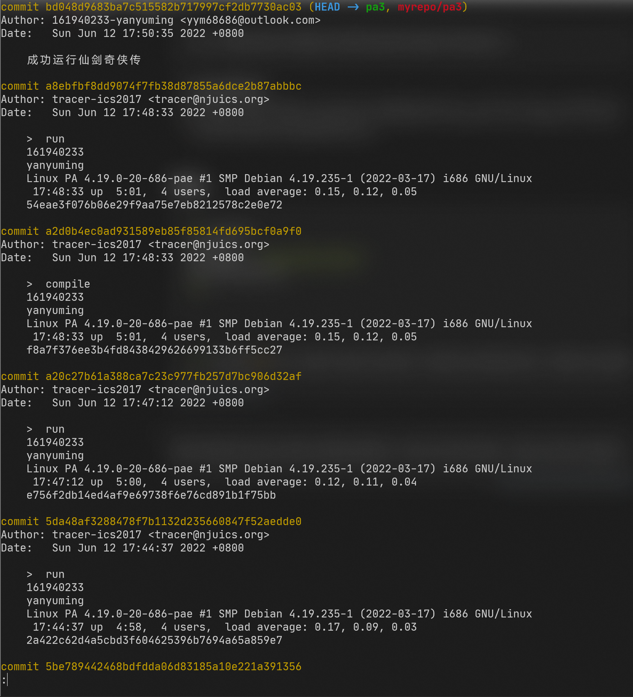
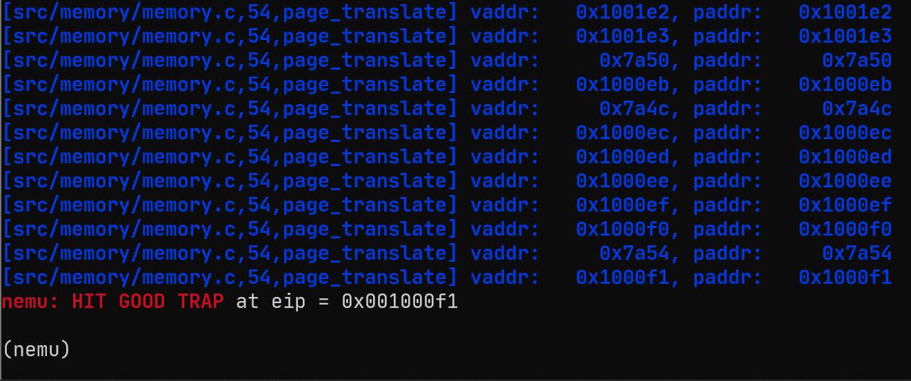
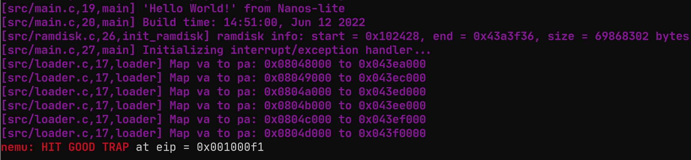

# 南京航空航天大学《计算机组成原理Ⅱ课程设计》报告

* 姓名：颜宇明
* 班级：1819001
* 学号：161940233
* 报告阶段：PA3.2
* 完成日期：2022.6.12
* 本次实验，我完成了所有内容。 

**目录**

[TOC]

# 思考题

## ⼀些问题（25）

- i386 不是一个 32 位的处理器吗, 为什么表项中的基地址信息只有 20 位, 而不是 32 位?
  - 因为一个页面的大小为4KB，刚好12位，所以20位就可以定位表项的起始地址


- 手册上提到表项(包括 CR3)中的基地址都是物理地址, 物理地址是必须的吗? 能否使用虚拟地址?
  - 必须，不能，因为表项的作用本来就是将虚拟地址转换成物理地址
- 为什么不采用一级页表? 或者说采用一级页表会有什么缺点?
  - 一级页表，表项太多，会引起跨页，开销大，所以引入二级页表使表项都在一页里

## 空指针真的是'空'的吗?（15）

程序设计课上老师告诉你, 当一个指针变量的值等于 NULL 时, 代表空, 不指向任何东西. 仔细想想, 真的是这样吗? 

- 不是

当程序对空指针解引用的时候, 计算机内部具体都做了些什么? 你对空指针的本质有什么新的认识?

- 空指针分配的分区。其范围是从0x00000000到0x0000FFFF。这段空间是空闲的，对于空闲的空间而言，没有相应的物理存储器与之相对应，所以对这段空间来说，任何读写操作都是会引起异常的。空指针是程序无论在何时都没有物理存储器与之对应的地址。为了保障“无论何时”这个条件，需要人为划分一个空指针的区域，固有上面NULL指针分区。

## 理解 _map 函数（25）

`_map()` 原本需要同学们实现，但是现在你可以通过更新框架获取到它的代码。之后，请你阅读 `_map()` 函数逇实现过程，根据代码，用自己的语言描述 `_map()` 所做的事情，以及他们的意义。

```c
void _map(_Protect *p, void *va, void *pa) {
    //获取页目录表的基地址
    PDE * pt = (PDE *)p->ptr;
    //获取页目录项的地址
    PDE * pde = &pt[PDX(va)];
    //若该页目录项的present位为0，就通过palloc_f()重新申请一个页并返回页表基地址
    if (!(*pde & PTE_P)) {
        *pde = PTE_P | PTE_W | PTE_U | (uint32_t)palloc_f();
    }
    //获取页表项
    PTE *pte = &((PTE *)PTE_ADDR(*pde))[PTX(va)];
    //若该页表项的present位为0，就将新页的物理地址与几个字段结合，赋给页表项
    if (!(*pte & PTE_P)) {
        *pte = PTE_P | PTE_W | PTE_U | (uint32_t)pa;
    }
}
```

- 该函数将虚拟地址空间`p`中的虚拟地址`va`映射到物理地址`pa`

## 内核映射的作⽤（25）

在 `_protect()` 函数中创建虚拟地址空间的时候, 有一处代码用于拷贝内核映射:

```c
for (int i = 0; i < NR_PDE; i ++) {
  updir[i] = kpdirs[i];
}
```

尝试注释这处代码, 重新编译并运行, 你会看到发生了错误. 请解释为什么会发生这个错误.

- `pd_val.present`报错
- 将内核的页映射加到该进程的页表中从而避免当该进程通过内核的虚拟地址访问内核时得不到物理地址

## git log 和 远程仓库截图（10）



# 实验内容

打开本实验所有涉及到的文件：

```bash
cd ~/ics2022 && vim -p nanos-lite/src/syscall.c nemu/src/cpu/exec/exec.c nemu/src/cpu/exec/all-instr.h nemu/src/cpu/exec/system.c nexus-am/am/arch/x86-nemu/src/pte.c nemu/include/memory/mmu.h nemu/src/monitor/monitor.c nemu/include/cpu/reg.h nemu/src/memory/memory.c nanos-lite/src/main.c nanos-lite/src/loader.c
```

## 1. 添加分⻚控制相关寄存器（10分）

先明确页表项和页目录项各比特位功能：

```
┌──────────┬───────┬───┬─────┬───┬───┬─────┬─────┬────┬────┬───┐
│31      12│11    9│ 8 │  7  │ 6 │ 5 │  4  │  3  │  2 │  1 │ 0 │
├──────────┼───────┼───┼─────┼───┼───┼─────┼─────┼────┼────┼───┤
│ physical │       │   │     │   │   │     │     │    │    │   │
│   page   │  AVL  │ G │ PAT │ D │ A │ PCD │ PWT │ US │ RW │ P │
│ address  │       │   │     │   │   │     │     │    │    │   │
└──────────┴───────┴───┴─────┴───┴───┴─────┴─────┴────┴────┴───┘
```

0~11位的含义如下：

1. P，Present，存在位
   若为1表示该页存在于物理内存中，若为0则表示该表不在物理内存中。
2. RW，Read/Write，读写位
   为1表示可读可写，为0表示可读不可写。
3. US，User/Supervisor，普通用户/超级用户标识位
   为1表示处于User级（0、1、2、3）特权的程序都可以访问该页，为0则表示只有处于Supervisor级（0、1、2）的程序才能访问。
4. PWT，Page-Level Write-Through，页级通写位
   若为1表示此项采用通写方式，即表示该页不仅是普通内存，还是高速缓存，此项与快表有关。
5. PCD：Page-Level Cache Disable，页级告诉缓存禁止位
   若为1表示该页启用高速缓存，为0则表示禁止将该页缓存。
6. A：  Accessed，访问位
   若为1表示该页被CPU访问过，由CPU置1，由操作系统清0。
7. D，Dirty，脏页位
   当CPU对一个页执行写操作时，就会设置对应页表项的D位为1，此项仅针对页表项有效，并不会修改页目录表项的D位。
8. PAT，Page Attribute Table，页属性位
   在页一级的粒度上设置内存属性。
9. G，Global，全局位
   与TLB有关，为1表示该页是全局页，该页在高速缓存TLB中一直保存。
10. AVL，Available，可用位
    为1表示用户进程可用该页，为0则不可用。对操作系统无效。

- CR0, CR3 寄存器的定义

在 `nanos-lite/src/main.c` 中定义宏 `HAS_PTE`，用`find . -name mmu.h`找到mmu.h：

```bash
vim ~/ics2022/nemu/include/memory/mmu.h
```

添加 CR3 寄存器和 CR0 寄存器，以及相应的操作它们的指令。其中 `CR0` 和 `CR3` 的数据结构框架已帮我们定义好，在 `~/ics2022/nemu/include/memory/mmu.h` 中，修改`nemu/include/cpu/reg.h`添加`CR3`寄存器和`CR0`寄存器，注意增加头文件：

```diff
+ #include "memory/mmu.h"
typedef struct {
    union{
        struct {
            union{
                uint32_t _32;
                uint16_t _16;
                uint8_t _8[2];
            };
        } gpr[8];
        struct {
            rtlreg_t eax, ecx, edx, ebx, esp, ebp, esi, edi;
        };
    };

    /* Do NOT change the order of the GPRs' definitions. */

    /* In NEMU, rtlreg_t is exactly uint32_t. This makes RTL instructions
    * in PA2 able to directly access these registers.
    */
    union {
        struct{
            uint32_t CF : 1;
            uint32_t    : 5;
            uint32_t ZF : 1;
            uint32_t SF : 1;
            uint32_t    : 1;
            uint32_t IF : 1;
            uint32_t    : 1;
            uint32_t OF : 1;
            uint32_t    : 20;
        };
        rtlreg_t value;
    } eflags;
    vaddr_t eip;

    struct {
        uint32_t base;  // 32位base
        uint16_t limit; // 16位limit
    }idtr;
    uint16_t cs;
+   CR0 cr0;
+    CR3 cr3;
} CPU_state;
```

- 初始化 CR0, CR3 寄存器

根据讲义，为了让 differential testing 机制正确工作，在 `restart()` 函数中我们需要对 CR0 寄存器初始化为 `0x60000011`，初始化跟初始化eflags的位置一样，在`nemu/src/monitor/monitor.c`中添加：

```diff
static inline void restart() {
    /* Set the initial instruction pointer. */
    cpu.eip = ENTRY_START;
    cpu.eflags.value = 0x2;
    cpu.cs = 0x8;
+    cpu.cr0.val = 0x60000011;

    #ifdef DIFF_TEST
    init_qemu_reg();
    #endif
}
```

## 2. 修改访存函数（20 分）

修改`nemu/src/memory/memory.c`重定义`vaddr_read()`和`vaddr_write()`函数。对 `vaddr_read()` 和 `vaddr_write()` 函数作少量修改。如果是读跨页，则需组合两次读出的数据（位操作实现），如果是写跨页，应注意两个页分别需要写的数据长度是多少，以及写到两页上的内容分别是什么。

- vaddr_read()

根据讲义：i386 是 x86 史上首次引进分页机制的处理器, 它把物理内存划分成以 4KB 为单位的页面, 同时也采用了二级页表的结构。所以页大小为4KB，如果地址超过4KB，即`(addr & 0xfff) + len - 1 > 0xfff`则`data cross the page boundary`。利用讲义给的框架：

```c
uint32_t vaddr_read(vaddr_t addr, int len) {
    if(cpu.cr0.paging) {
        if (data cross the page boundary) {
            /* this is a special case, you can handle it later. */
            assert(0);
        }
        else {
            paddr_t paddr = page_translate(addr);
            return paddr_read(paddr, len);
        }
    }
    else
        return paddr_read(paddr, len);
}
```

补充为：

```c
uint32_t vaddr_read(vaddr_t addr, int len) {
    paddr_t paddr;
    if(cpu.cr0.paging) {
        //跨页访存 0x1000 = 1000000000000 = 2^12 = 4KB
        if ((addr & 0xfff) + len > 0x1000) {
            union {
              uint8_t bytes[4];
              uint32_t dword;
            } data = {0};
            for (int i = 0; i < len; i++) {
              paddr = page_translate(addr + i, false);
              data.bytes[i] = (uint8_t)paddr_read(paddr, 1);
            }
            return data.dword;
        }
        else {
            paddr_t paddr = page_translate(addr, false);
            return paddr_read(paddr, len);
        }
    }
    else
        return paddr_read(addr, len);
}
```

当发生跨页时：一个字节一个字节的读取，从低8位开始读取，并且地址递增。

- vaddr_write()

仿照`vaddr_read`示例函数写出`vaddr_write`函数：

```c
void vaddr_write(vaddr_t addr, int len, uint32_t data) {
    paddr_t paddr;
    if(cpu.cr0.paging) {
        //跨页访存
        if ((addr & 0xfff) + len > 0x1000)
            for (int i = 0; i < len; i++) {
              paddr = page_translate(addr + i, true);
              paddr_write(paddr, 1, data);
              data >>= 8;
            }
        else {
            paddr_t paddr = page_translate(addr, true);
            return paddr_write(paddr, len, data);
        }
    }
    else
        paddr_write(addr, len, data);
}
```

当发生跨页时：一个字节一个字节的写入内存，从低8位开始，并且地址递增。

## 3. page_translate()（30 分）

讲义对于page_translate函数的提示：下面我们来看一下 `page_translate()` 的实现：

- 该函数用于地址转换，传入**虚拟地址**作为参数，函数返回值为**物理地址**；
- 该函数的实现过程即为我们理论课学到的页级转换过程（先找页目录项，然后取出）；
- 注意使用 `assert` 来验证 `present` 位，否则会造成**调试困难**；
- `PDE` 和 `PTE` 的数据结构框架已帮我们定义好，在 `mmu.h` 中；
- 注意每个页目录想和每个页表项存储在内存中的地址均为**物理地址**，使用 `paddr_read` 去读取，如果使用 `vaddr_read` 去读取会造成死递归(为什么？);
- 此外，还需要实现访问位和脏位的功能;
- **需要在 `page_translate` 中插入 `Log` 并截图表示实现成功**（截图后可去除 Log 以免影响性能）;
- 如何编写这个函数？
- 根据 `CR3` 寄存器得到页目录表基址(是个物理地址);
- 用这个基址和从虚拟地址中隐含的`页目录`字段项结合计算出所需页目录项地址(是个物理地址)；
  - 请思考一下这里所谓的“结合”需要经过哪些处理才能得到正确地地址呢？
- 从内存中读出这个页目录项，并对有效位进行检验;
- 将取出的 `PDE` 和虚拟地址的`页表`字段相组合，得到所需页表项地址(是个物理地址);
- 从内存中读出这个页表项，并对有效位进行检验;
- 检验 `PDE` 的 `accessed` 位，如果为 `0` 则需变为 `1`，并写回到页目录项所在地址;
- 检验 `PTE` 的 `accessed` 位如果为 `0`，或者 `PTE` 的脏位为 `0` 且现在正在做写内存操作，满足这两个条件之一时需要将 `accessed` 位置1，然后更新 `dirty` 位，最后并写回到页表项所在地址;
- 页级地址转换结束，返回转换结果(是个物理地址).

编写 `page_translate()` 函数，在 `nemu/src/memory/memory.c` 或者另建一个新文件 `nemu/src/memory/page.c` 中实现

修改`nemu/src/memory/memory.c`定义`page_translate()`函数(在对应头文件增加声明).

```C
paddr_t page_translate(vaddr_t vaddr, bool flag) {
    PDE page_dir_item;
    PTE page_table_item;
    //页目录项的地址 = 页目录表基地址 + (页目录表索引) * 4
    paddr_t page_dir_item_addr = (cpu.cr3.page_directory_base << 12) + ((vaddr >> 22) & 0x3ff) * 4;
    //读取页目录项
    page_dir_item.val = paddr_read(page_dir_item_addr, 4);
    //验证present位
    assert(page_dir_item.present);
    //根据讲义，accessed为1，若为1表示该页被CPU访问过，由CPU置1，由操作系统清0
    page_dir_item.accessed = 1;
    //写回到页目录项所在地址
    paddr_write(page_dir_item_addr, 4, page_dir_item.val);
    //页表项的地址 = 页目录表项对应的页表基址 + 页表索引 * 4
    paddr_t page_table_item_addr = (page_dir_item.page_frame << 12) + ((vaddr >> 12) & 0x3ff) * 4;
    //读取页表项
    page_table_item.val = paddr_read(page_table_item_addr, 4);
    //验证present位
    assert(page_table_item.present);
    page_table_item.accessed = 1;
    //如果是写操作，脏位设为1，当CPU对一个页执行写操作时，设置对应页表项的D位为1，此项仅针对页表项有效，并不会修改页目录表项的D位
    if (flag) page_table_item.dirty = 1;
    //写回到页表项所在地址
    paddr_write(page_table_item_addr, 4, page_table_item.val);
    paddr_t paddr = (page_table_item.page_frame << 12) + (vaddr & 0xfff);
    //Log("vaddr: %#10x, paddr: %#10x", vaddr, paddr);
    return paddr;
}
```

在` ~/ics2022/nemu/include/memory/memory.h`增加头文件：

```diff
#ifndef __MEMORY_H__
#define __MEMORY_H__

#include "common.h"

extern uint8_t pmem[];

/* convert the guest physical address in the guest program to host virtual address in NEMU */
#define guest_to_host(p) ((void *)(pmem + (unsigned)p))
/* convert the host virtual address in NEMU to guest physical address in the guest program */
#define host_to_guest(p) ((paddr_t)((void *)p - (void *)pmem))

uint32_t vaddr_read(vaddr_t, int);
uint32_t paddr_read(paddr_t, int);
+ paddr_t page_translate(vaddr_t vaddr, bool flag);
void vaddr_write(vaddr_t, int, uint32_t);
void paddr_write(paddr_t, int, uint32_t);


#endif
```

修改`nanos-lite/src/main.c`

```diff
+  void load_prog(const char *);
...
-  uintptr_t entry = loader(NULL, "/bin/pal");
-  ((void (*)(void))entry)();
+  load_prog("/bin/dummy");
```

运行指令：

```bash
cd ~/ics2022/nanos-lite/ && make update && make run
```

提示指令未完成：

```apl
[src/mm.c,40,init_mm] free physical pages starting from 0x43e9000
invalid opcode(eip = 0x001016e0): 0f 22 d8 90 5d c3 55 89 ...

There are two cases which will trigger this unexpected exception:
1. The instruction at eip = 0x001016e0 is not implemented.
2. Something is implemented incorrectly.
Find this eip(0x001016e0) in the disassembling result to distinguish which case it is.

If it is the first case, see
 _ ____   ___    __    __  __                         _
(_)___ \ / _ \  / /   |  \/  |                       | |
 _  __) | (_) |/ /_   | \  / | __ _ _ __  _   _  __ _| |
| ||__ < > _ <| '_ \  | |\/| |/ _` | '_ \| | | |/ _` | |
| |___) | (_) | (_) | | |  | | (_| | | | | |_| | (_| | |
|_|____/ \___/ \___/  |_|  |_|\__,_|_| |_|\__,_|\__,_|_|

for more details.

If it is the second case, remember:
* The machine is always right!
* Every line of untested code is always wrong!
```

在双字节操作码表中补全译码函数，执行函数名称：

```c
/* 0x20 */  IDEX(mov_G2E, mov_cr2r), EMPTY, IDEX(mov_E2G, mov_r2cr), EMPTY,
```

修改`nemu/src/cpu/exec/system.c`实现对应函数：

```c
make_EHelper(mov_r2cr) {
    switch (id_dest->reg) {
        case 0:
            cpu.cr0.val = id_src->val;
            break;
        case 3:
            cpu.cr3.val = id_src->val;
            break;
        default:
            assert(0);
    }

    print_asm("movl %%%s,%%cr%d", reg_name(id_src->reg, 4), id_dest->reg);
}

make_EHelper(mov_cr2r) {
    switch (id_src->reg) {
        case 0:
            t0 = cpu.cr0.val;
            break;
        case 3:
            t0 = cpu.cr3.val;
            break;
        default:
            assert(0);
    }
    operand_write(id_dest, &t0);

    print_asm("movl %%cr%d,%%%s", id_src->reg, reg_name(id_dest->reg, 4));

    #ifdef DIFF_TEST
    diff_test_skip_qemu();
    #endif
}
```

在`src/cpu/exec/all-instr.h`加上函数声明，保存后再次编译程序：

```bash
cd ~/ics2022/nanos-lite/ && make update && make run
```

输出结果：

```apl
[src/memory/memory.c,54,page_translate] vaddr:     0x7a68, paddr:     0x7a68
[src/memory/memory.c,54,page_translate] vaddr:   0x1001de, paddr:   0x1001de
[src/memory/memory.c,54,page_translate] vaddr:   0x1001df, paddr:   0x1001df
[src/memory/memory.c,54,page_translate] vaddr:   0x1001e0, paddr:   0x1001e0
[src/memory/memory.c,54,page_translate] vaddr:   0x1001e1, paddr:   0x1001e1
[src/memory/memory.c,54,page_translate] vaddr:     0x7a54, paddr:     0x7a54
[src/memory/memory.c,54,page_translate] vaddr:   0x1001e2, paddr:   0x1001e2
[src/memory/memory.c,54,page_translate] vaddr:   0x1001e3, paddr:   0x1001e3
[src/memory/memory.c,54,page_translate] vaddr:     0x7a50, paddr:     0x7a50
[src/memory/memory.c,54,page_translate] vaddr:   0x1000eb, paddr:   0x1000eb
[src/memory/memory.c,54,page_translate] vaddr:     0x7a4c, paddr:     0x7a4c
[src/memory/memory.c,54,page_translate] vaddr:   0x1000ec, paddr:   0x1000ec
[src/memory/memory.c,54,page_translate] vaddr:   0x1000ed, paddr:   0x1000ed
[src/memory/memory.c,54,page_translate] vaddr:   0x1000ee, paddr:   0x1000ee
[src/memory/memory.c,54,page_translate] vaddr:   0x1000ef, paddr:   0x1000ef
[src/memory/memory.c,54,page_translate] vaddr:   0x1000f0, paddr:   0x1000f0
[src/memory/memory.c,54,page_translate] vaddr:     0x7a54, paddr:     0x7a54
[src/memory/memory.c,54,page_translate] vaddr:   0x1000f1, paddr:   0x1000f1
nemu: HIT GOOD TRAP at eip = 0x001000f1
```



## 4. 修改 loader()（30 分）

- 调⽤ _map() 进行虚拟页映射

将 `navy-apps/Makefile.compile` 中的链接地址 `-Ttext` 参数改为 `0x8048000` 并重新编译，同样的, `nanos-lite/src/loader.c` 中的 `DEFAULT_ENTRY` 也需要作相应的修改。修改`nanoslite/src/loader.c`重定义`loader()`函数：

```c
#define DEFAULT_ENTRY ((void *)0x8048000)
void *new_page();
uintptr_t loader(_Protect *as, const char *filename) {
    int fd = fs_open(filename, 0, 0);
    size_t len = fs_filesz(fd);
    void *fz_end = DEFAULT_ENTRY + len;
    void *va, *pa;
    for(va = DEFAULT_ENTRY; va < fz_end; va += PGSIZE){
        pa = new_page();
        Log("Map va to pa: 0x%08x to 0x%08x", va, pa);
        _map(as, va, pa);
        fs_read(fd, pa, (fz_end - va) < PGSIZE ? (fz_end - va) : PGSIZE);
    }
    fs_close(fd);
    return (uintptr_t)DEFAULT_ENTRY;
}
```

重新编译：

```bash
cd ~/ics2022/nanos-lite/ && make update && make run
```

运行结果：

```apl
[src/mm.c,40,init_mm] free physical pages starting from 0x43e9000
[src/main.c,19,main] 'Hello World!' from Nanos-lite
[src/main.c,20,main] Build time: 14:51:00, Jun 12 2022
[src/ramdisk.c,26,init_ramdisk] ramdisk info: start = 0x102428, end = 0x43a3f36, size = 69868302 bytes
[src/main.c,27,main] Initializing interrupt/exception handler...
[src/loader.c,17,loader] Map va to pa: 0x08048000 to 0x043ea000
[src/loader.c,17,loader] Map va to pa: 0x08049000 to 0x043ec000
[src/loader.c,17,loader] Map va to pa: 0x0804a000 to 0x043ed000
[src/loader.c,17,loader] Map va to pa: 0x0804b000 to 0x043ee000
[src/loader.c,17,loader] Map va to pa: 0x0804c000 to 0x043ef000
[src/loader.c,17,loader] Map va to pa: 0x0804d000 to 0x043f0000
nemu: HIT GOOD TRAP at eip = 0x001000f1
```



## 5. 在分⻚上运⾏仙剑奇侠传（10 分）

修改`nanos-lite/src/syscall.c`中的`SYS_brk`系统调用：

```diff
_RegSet* do_syscall(_RegSet *r) {
    uintptr_t a[4];
    a[0] = SYSCALL_ARG1(r);
    a[1] = SYSCALL_ARG2(r);
    a[2] = SYSCALL_ARG3(r);
    a[3] = SYSCALL_ARG4(r);
    switch (a[0]) {
        case SYS_none:  r->eax = 1; break;
        case SYS_exit:  _halt(a[1]); break;
        case SYS_write: r->eax = fs_write(a[1], (uint8_t *)a[2], a[3]); break;
-        case SYS_brk:   r->eax = 0; break;
+        case SYS_brk:   r->eax = mm_brk(a[1]); break;
        case SYS_read:  r->eax = fs_read(a[1], (uint8_t *)a[2], a[3]); break;
        case SYS_open:  r->eax = fs_open((char *)a[1], a[2], a[3]); break;
        case SYS_close: r->eax = fs_close(a[1]); break;
        case SYS_lseek: r->eax = fs_lseek(a[1], a[2], a[3]); break;
        default: panic("Unhandled syscall ID = %d", a[0]);
    }

    return NULL;
}
```

修改`nanos-lite/src/main.c`

```diff
-  uintptr_t entry = loader(NULL, "/bin/pal");
-  ((void (*)(void))entry)();
-  load_prog("/bin/dummy");
+  load_prog("/bin/pal");
```

下载pal文件，可以在https://github.com/yym68686/ics2022.git下载`pal.tar.bz2`，压缩包在项目根目录，解压到指定目录：

```bash
mkdir -p ~/ics2022/navy-apps/fsimg/share/games && cd ~/ics2022 && tar -xjf pal.tar.bz2 -C ~/ics2022/navy-apps/fsimg/share/games
```

如果要删除游戏：

```bash
rm -rf ~/ics2022/navy-apps/fsimg/share/games/pal
```

运行仙剑奇侠传：

```bash
cd ~/ics2022/nanos-lite/ && make update && make run
```

运行成功：


# 杂项

## push 脚本

```bash
cd ~/ics2022
rm -rf ~/ics2022/navy-apps/fsimg/share/games/pal
git add .
git commit -m "修改访存函数 增加注释"
git push myrepo pa3
cd -

```

## 全局搜索

```bash
:vim /exec_real/ /home/yanyuming/ics2022/nemu/** | copen
```

# References

[NUAA_PA/161730213 - 曹伟思 - PA3.2.md at master · hitworld/NUAA_PA (github.com)](https://github.com/hitworld/NUAA_PA/blob/master/PA3.2/161730213 - 曹伟思 - PA3.2.md)

[PA3.2_一只进小猪的博客-CSDN博客](https://blog.csdn.net/shangjin1210/article/details/124779356)

[3.2 虚拟地址空间 · GitBook (gitee.io)](https://zhong-kangwei.gitee.io/ics-pa-gitbook-2022/pa3/3.2.html)

[qrzbing/ics-pa at pa4 (github.com)](https://github.com/qrzbing/ics-pa/tree/pa4)

[Chen-yuiyui/NUAA-PA-ics2017: 南航计算机组成原理实验PA (github.com)](https://github.com/Chen-yuiyui/NUAA-PA-ics2017)
